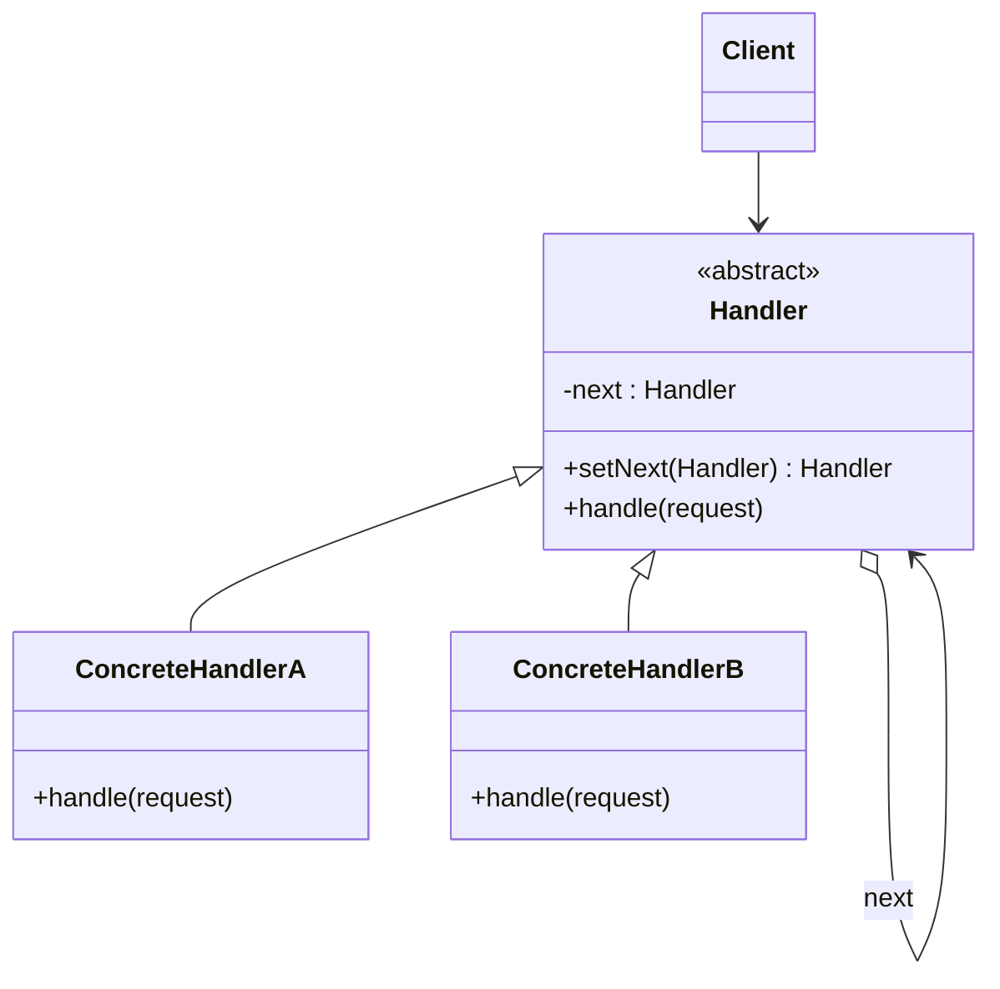

# Chain of Responsibility (Chuỗi trách nhiệm)

## 1. Tên và phân loại
- **Tên:** Chain of Responsibility
- **Phân loại:** Behavioral (Mẫu hành vi) — thuộc nhóm mẫu **đối tượng** (object pattern).

## 2. Mục đích, ý định
Tránh việc **ràng buộc** người gửi yêu cầu (sender) với người nhận (receiver) bằng cách cho **nhiều đối tượng cơ hội xử lý** yêu cầu. Liên kết các đối tượng nhận thành một **chuỗi** và **chuyển yêu cầu dọc theo chuỗi** cho tới khi có đối tượng xử lý.

## 3. Bí danh
Không có bí danh phổ biến.

## 4. Motivation (Động cơ)
Giả sử ta xây dựng hệ thống **phê duyệt chi tiêu**: nhân viên xin duyệt một khoản tiền. Tùy **mức tiền**, người duyệt khác nhau: trưởng nhóm duyệt ≤ 1 triệu, trưởng phòng ≤ 10 triệu, giám đốc ≤ 100 triệu...

Nếu viết một khối `if/else` khổng lồ trong code client để chọn người duyệt, code sẽ **cứng nhắc**: thêm cấp duyệt mới hoặc đổi hạn mức phải sửa client; client phải **biết hết** cấu trúc duyệt.

**Giải pháp Chain of Responsibility:** mỗi cấp duyệt là một **handler** trong chuỗi. Mỗi handler hoặc **tự xử lý** yêu cầu (nếu trong thẩm quyền), hoặc **chuyển tiếp** cho handler kế tiếp. Client chỉ gửi yêu cầu vào **đầu chuỗi**, không cần biết ai sẽ xử lý. Có thể lắp/đổi chuỗi linh hoạt lúc chạy.

## 5. Khả năng ứng dụng
Áp dụng Chain of Responsibility khi:

- **Nhiều đối tượng có thể xử lý** một yêu cầu và người xử lý **không biết trước** — xác định lúc chạy.
- Muốn gửi yêu cầu cho **một trong nhiều đối tượng** mà không chỉ định rõ người nhận.
- Tập hợp đối tượng có thể xử lý cần được **chỉ định động**.

### ✅ Khi nào NÊN dùng
- Khi một yêu cầu có thể được xử lý bởi **một trong nhiều** đối tượng và bạn muốn **tách rời** người gửi khỏi người nhận cụ thể.
- Khi muốn **xử lý theo trình tự ưu tiên** (lọc/middleware: xác thực → phân quyền → giới hạn tần suất → xử lý).
- Khi muốn **thêm/bớt/đổi thứ tự** các bước xử lý linh hoạt lúc chạy mà không sửa client.

### ❌ Khi nào KHÔNG nên dùng
- Khi **luôn xác định được** chính xác đối tượng xử lý → gọi thẳng cho gọn.
- Khi cần **đảm bảo yêu cầu chắc chắn được xử lý** — chuỗi không bảo đảm điều này (có thể đi hết chuỗi mà không ai xử lý).
- Khi chuỗi quá dài làm **khó theo dõi/ debug** đường đi của yêu cầu, ảnh hưởng hiệu năng.

> **Phân biệt nhanh:** *Chain of Responsibility* chuyển yêu cầu **tới khi có người xử lý** (thường một người). *Decorator* cũng nối chuỗi nhưng **mọi** lớp đều tham gia thêm hành vi. *Command* đóng gói yêu cầu thành đối tượng; *Mediator* tập trung điều phối thay vì chuyển tiếp tuần tự.

## 6. Cấu trúc



## 7. Các thành viên
- **Handler** *(abstract/interface)* — định nghĩa giao diện xử lý yêu cầu; (thường) giữ tham chiếu tới `next` và cài cơ chế chuyển tiếp.
- **ConcreteHandler** — xử lý yêu cầu mà nó chịu trách nhiệm; nếu không, chuyển tiếp cho `next`.
- **Client** — khởi tạo chuỗi và gửi yêu cầu vào handler đầu tiên.

## 8. Sự cộng tác
- Client gửi yêu cầu; yêu cầu đi dọc chuỗi cho tới khi một ConcreteHandler xử lý hoặc hết chuỗi. Mỗi handler quyết định **tự xử lý** và/hoặc **chuyển tiếp**.

## 9. Các hệ quả mang lại
**Ưu điểm:**
- **Giảm ghép nối** giữa người gửi và người nhận.
- **Linh hoạt** trong việc phân chia trách nhiệm: thêm/đổi handler, đổi thứ tự lúc chạy (Single Responsibility, Open/Closed).

**Nhược điểm:**
- **Không đảm bảo** yêu cầu được xử lý (có thể rơi khỏi chuỗi).
- **Khó quan sát/ debug** đường đi; có thể ảnh hưởng hiệu năng nếu chuỗi dài.

## 10. Chú ý khi cài đặt
1. **Cài chuỗi:** mỗi handler giữ con trỏ `next`; lớp cha thường cài sẵn logic "không xử lý thì chuyển tiếp".
2. **Biểu diễn yêu cầu:** dùng một đối tượng request (hoặc tham số) đủ thông tin để handler quyết định.
3. **Kết thúc chuỗi:** xử lý trường hợp không ai nhận (mặc định/lỗi/log).
4. **Tận dụng cây sẵn có:** trong [[structural-composite|Composite]], liên kết cha có thể đóng vai chuỗi.

## 11. Mã nguồn minh họa
Ví dụ **phê duyệt chi tiêu** theo hạn mức qua các cấp duyệt.

Mã nguồn đầy đủ trong [src/](src/):
- [Approver.java](src/Approver.java) — Handler trừu tượng.
- [TeamLead.java](src/TeamLead.java), [Manager.java](src/Manager.java), [Director.java](src/Director.java) — ConcreteHandler.
- [Main.java](src/Main.java) — demo dựng chuỗi và gửi yêu cầu.

```java
public abstract class Approver {
    protected Approver next;
    public Approver setNext(Approver next) { this.next = next; return next; }

    public void handle(int amount) {
        if (canApprove(amount)) {
            approve(amount);
        } else if (next != null) {
            next.handle(amount);           // chuyển tiếp
        } else {
            System.out.println("Khong ai du tham quyen duyet " + amount);
        }
    }
    protected abstract boolean canApprove(int amount);
    protected abstract void approve(int amount);
}
```

## 12. Ví dụ thực tế
- **javax.servlet.Filter / FilterChain** — chuỗi filter xử lý request HTTP.
- **java.util.logging.Logger** — log đi lên chuỗi logger cha.
- **Spring Security FilterChain**, **Netty ChannelPipeline**, middleware trong các web framework.
- **java.util.logging Handler** chuỗi, xử lý exception leo theo ngăn xếp lời gọi.

## 13. Các mẫu liên quan
- **Composite:** chuỗi thường đi cùng cây Composite (liên kết cha-con làm chuỗi).
- **Command:** yêu cầu đi trong chuỗi có thể được đóng gói thành Command.
- **Decorator:** cấu trúc nối chuỗi giống nhau, nhưng Decorator để mọi lớp cùng đóng góp, còn CoR thường chỉ một handler xử lý.
- **Mediator:** thay vì chuyển tiếp tuần tự, Mediator tập trung điều phối.
