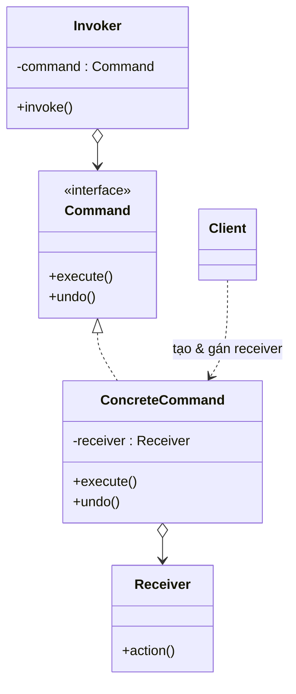

# Command (Mệnh lệnh)

## 1. Tên và phân loại
- **Tên:** Command
- **Phân loại:** Behavioral (Mẫu hành vi) — thuộc nhóm mẫu **đối tượng** (object pattern).

## 2. Mục đích, ý định
**Đóng gói một yêu cầu (request) thành một đối tượng**, nhờ đó có thể **tham số hóa** client với các yêu cầu khác nhau, **xếp hàng** hoặc **ghi log** yêu cầu, và hỗ trợ thao tác **hoàn tác (undo)**.

## 3. Bí danh
- **Action**, **Transaction**.

## 4. Motivation (Động cơ)
Giả sử ta làm một **trình soạn thảo** có thanh công cụ và menu với nhiều nút (Copy, Paste, Open...). Mỗi nút cần thực hiện một hành động, nhưng **nút (widget) không nên biết** chi tiết hành động được thực hiện thế nào — nếu nhồi logic vào nút, ta không tái sử dụng được và khó hỗ trợ undo, macro, phím tắt.

**Giải pháp Command:** đóng gói mỗi hành động thành một đối tượng `Command` có phương thức `execute()`. Nút chỉ giữ một `Command` và gọi `execute()` khi bấm — **không cần biết** việc gì xảy ra. Vì hành động giờ là đối tượng, ta dễ dàng: gán cùng command cho nhiều widget, **xếp hàng**, **ghi log**, và cài **undo()** để hoàn tác.

## 5. Khả năng ứng dụng
Áp dụng Command khi muốn:

- **Tham số hóa đối tượng** bằng một hành động cần thực hiện (như callback hướng đối tượng).
- **Chỉ định, xếp hàng và thực thi** yêu cầu vào các thời điểm khác nhau.
- Hỗ trợ **undo/redo**.
- Hỗ trợ **ghi log** thay đổi để có thể phục hồi sau sự cố.
- Cấu trúc hệ thống quanh các thao tác **mức cao** được xây từ thao tác nguyên thủy (transaction).

### ✅ Khi nào NÊN dùng
- Khi cần **undo/redo**, **macro** (gộp nhiều lệnh), **hàng đợi tác vụ**, **lập lịch**, hoặc **ghi log/replay** thao tác.
- Khi muốn **tách rời** đối tượng gọi hành động (invoker: nút, phím tắt, menu) khỏi đối tượng thực hiện (receiver).
- Khi muốn coi **hành động như dữ liệu**: truyền đi, lưu lại, gửi qua mạng.

### ❌ Khi nào KHÔNG nên dùng
- Khi hành động **đơn giản, gọi một lần**, không cần undo/queue/log → gọi trực tiếp cho gọn, thêm command là thừa.
- Khi việc tạo một lớp command cho mỗi thao tác làm **bùng nổ số lớp** mà không thu lợi ích.
- (Java) khi command chỉ là một hàm không trạng thái → **lambda / `Runnable`** thường đủ, không cần cả hệ phân cấp lớp.

> **Phân biệt nhanh:** *Command* đóng gói **một yêu cầu** (có thể undo, queue). *Strategy* đóng gói **một thuật toán** để hoán đổi. *Chain of Responsibility* chuyển yêu cầu qua chuỗi người xử lý.

## 6. Cấu trúc



## 7. Các thành viên
- **Command** *(interface)* — khai báo `execute()` (và `undo()` nếu hỗ trợ hoàn tác).
- **ConcreteCommand** — liên kết một `Receiver` với một hành động; cài `execute()` bằng cách gọi thao tác trên receiver.
- **Receiver** — biết cách thực hiện công việc thực sự.
- **Invoker** — yêu cầu command thực hiện (giữ và gọi `execute()`).
- **Client** — tạo ConcreteCommand và thiết lập receiver của nó.

## 8. Sự cộng tác
- Client tạo `ConcreteCommand` và gán `Receiver`. `Invoker` lưu command và gọi `execute()`; command gọi thao tác trên `Receiver`. Để undo, command lưu đủ trạng thái để đảo ngược.

## 9. Các hệ quả mang lại
**Ưu điểm:**
- **Tách rời** invoker khỏi receiver (Single Responsibility).
- **Dễ thêm command mới** (Open/Closed) mà không sửa code hiện có.
- Hỗ trợ **undo/redo, macro, hàng đợi, log**; coi hành động như đối tượng hạng nhất.

**Nhược điểm:**
- **Tăng số lượng lớp** (một lớp cho mỗi loại lệnh).
- Có thể là **phức tạp hóa thừa** với hành động đơn giản.

## 10. Chú ý khi cài đặt
1. **Mức "thông minh" của command:** từ chỉ ủy thác cho receiver, tới tự thực hiện hoàn toàn.
2. **Undo/redo:** lưu trạng thái cần thiết trong command; dùng **ngăn xếp lịch sử** các command đã thực hiện.
3. **Macro command:** một command chứa danh sách command con ([[structural-composite|Composite]]).
4. (Java) **lambda / `Runnable`** thay cho lớp command đơn giản.

## 11. Mã nguồn minh họa
Ví dụ điều khiển **đèn** bằng remote, có hỗ trợ **undo**.

Mã nguồn đầy đủ trong [src/](src/):
- [Command.java](src/Command.java) — interface (execute + undo).
- [Light.java](src/Light.java) — Receiver.
- [LightOnCommand.java](src/LightOnCommand.java), [LightOffCommand.java](src/LightOffCommand.java) — ConcreteCommand.
- [RemoteControl.java](src/RemoteControl.java) — Invoker (có nút undo).
- [Main.java](src/Main.java) — Client demo.

```java
public class LightOnCommand implements Command {
    private final Light light;          // Receiver
    public LightOnCommand(Light light) { this.light = light; }
    @Override public void execute() { light.on(); }
    @Override public void undo()    { light.off(); }
}
```

## 12. Ví dụ thực tế
- **java.lang.Runnable**, **java.util.concurrent.Callable** — tác vụ đóng gói để thực thi/đưa vào executor.
- **javax.swing.Action**, **Action listeners** — hành động gắn vào nút/menu.
- **java.util.concurrent.ExecutorService#submit()** — xếp hàng command để chạy.
- Hệ thống undo/redo trong editor; hàng đợi job; transaction CSDL.

## 13. Các mẫu liên quan
- **Composite:** macro command (gộp nhiều lệnh).
- **Memento:** lưu trạng thái để undo.
- **Prototype:** sao chép command để ghi log/replay.
- **Strategy:** cùng "đóng gói hành vi" nhưng mục đích khác (thuật toán vs yêu cầu).
- **Chain of Responsibility:** có thể truyền command dọc chuỗi.
