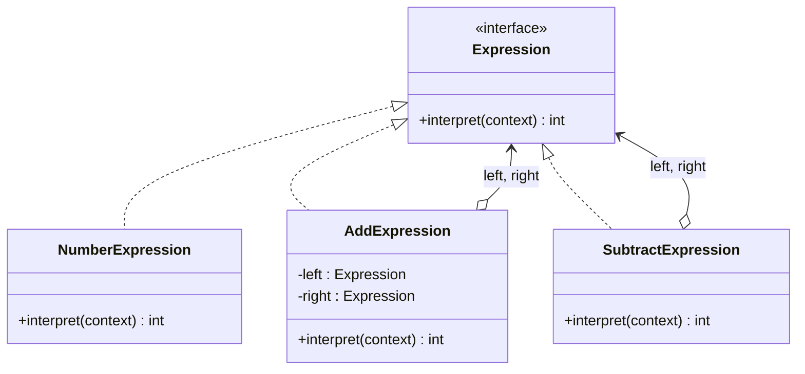

# Interpreter (Thông dịch)

## 1. Tên và phân loại
- **Tên:** Interpreter
- **Phân loại:** Behavioral (Mẫu hành vi) — thuộc nhóm mẫu **lớp** (class pattern).

## 2. Mục đích, ý định
Với một **ngôn ngữ** cho trước, định nghĩa một **biểu diễn cho ngữ pháp** của ngôn ngữ đó cùng một **trình thông dịch** dùng biểu diễn này để **diễn giải (interpret) các câu** trong ngôn ngữ.

## 3. Bí danh
Không có bí danh phổ biến.

## 4. Motivation (Động cơ)
Giả sử ta cần đánh giá các **biểu thức số học** đơn giản nhập dưới dạng chuỗi như `"5 + 3 - 2"`, hoặc các biểu thức logic, mẫu tìm kiếm (regex), truy vấn... Khi cùng một loại bài toán **lặp đi lặp lại** và có thể mô tả bằng một **ngữ pháp**, ta có thể biểu diễn mỗi loại câu bằng một cây cú pháp và diễn giải nó.

**Giải pháp Interpreter:** mỗi **luật ngữ pháp** thành một lớp. Biểu thức được biểu diễn thành một **cây cú pháp trừu tượng (AST)** gồm các `Expression`. Mỗi node có phương thức `interpret(context)`. Diễn giải cả biểu thức = gọi `interpret()` trên gốc cây, đệ quy xuống. Ngữ pháp đơn giản → dễ thêm/đổi luật bằng cách thêm lớp `Expression`.

## 5. Khả năng ứng dụng
Áp dụng Interpreter khi có một **ngôn ngữ cần diễn giải** và bạn có thể biểu diễn câu của nó thành **cây cú pháp trừu tượng**, **đặc biệt khi**:

- **Ngữ pháp đơn giản** — với ngữ pháp phức tạp, cây lớp trở nên khó quản lý (nên dùng parser/compiler generator).
- **Hiệu năng không phải yếu tố then chốt**.

### ✅ Khi nào NÊN dùng
- Khi cần diễn giải một **DSL (ngôn ngữ chuyên biệt) nhỏ**, ngữ pháp **đơn giản, ổn định**: biểu thức số học/logic, luật lọc, mẫu so khớp, công thức.
- Khi muốn **dễ mở rộng/đổi luật** ngữ pháp bằng cách thêm lớp Expression.
- Khi câu của ngôn ngữ có thể biểu diễn tự nhiên thành **cây**.

### ❌ Khi nào KHÔNG nên dùng
- Khi **ngữ pháp phức tạp** (nhiều luật) → số lớp bùng nổ, khó bảo trì → dùng **trình phân tích cú pháp/parser generator** (ANTLR, JavaCC) hoặc thư viện có sẵn.
- Khi **hiệu năng quan trọng** → cây đối tượng + đệ quy thường chậm.
- Khi đã có **thư viện/ngôn ngữ script** đáp ứng (đừng tự viết interpreter).

> **Lưu ý:** Interpreter là mẫu **ít dùng nhất** trong thực tế ứng dụng nghiệp vụ; chủ yếu xuất hiện trong công cụ ngôn ngữ. Hãy cân nhắc kỹ trước khi tự cài.

## 6. Cấu trúc



## 7. Các thành viên
- **AbstractExpression** (`Expression`) — khai báo `interpret(context)`.
- **TerminalExpression** (`NumberExpression`) — luật ngữ pháp đầu cuối (lá), tự diễn giải.
- **NonterminalExpression** (`AddExpression`, `SubtractExpression`) — luật phi đầu cuối; chứa các `Expression` con và diễn giải bằng cách kết hợp kết quả của con.
- **Context** — chứa thông tin toàn cục cho việc diễn giải (vd bảng biến).
- **Client** — dựng cây cú pháp (AST) và gọi `interpret()`.

## 8. Sự cộng tác
- Client xây AST từ các Terminal/Nonterminal Expression rồi gọi `interpret(context)` trên gốc. Mỗi nonterminal gọi `interpret()` trên các con (đệ quy) và kết hợp kết quả.

## 9. Các hệ quả mang lại
**Ưu điểm:**
- **Dễ thay đổi và mở rộng ngữ pháp** (thêm luật = thêm lớp).
- **Dễ cài đặt** với ngữ pháp đơn giản (mỗi lớp đơn giản).

**Nhược điểm:**
- **Ngữ pháp phức tạp khó bảo trì**: số lớp tăng nhanh.
- **Hiệu năng kém** (cây đối tượng + đệ quy).

## 10. Chú ý khi cài đặt
1. **Việc parse không thuộc mẫu:** Interpreter chỉ lo **diễn giải** AST; việc **xây AST** (parse) do client/parser riêng đảm nhiệm.
2. **Context:** dùng để truyền biến/trạng thái cho việc diễn giải.
3. **Chia sẻ terminal:** dùng [[structural-flyweight|Flyweight]] cho các terminal lặp lại.
4. **Visitor:** nếu cần nhiều thao tác trên AST (in, tối ưu, đánh giá), cân nhắc [[behavioral-visitor|Visitor]] để tách thao tác khỏi node.

## 11. Mã nguồn minh họa
Ví dụ diễn giải biểu thức số học hậu tố (RPN) như `"5 3 + 2 -"` thành AST rồi tính.

Mã nguồn đầy đủ trong [src/](src/):
- [Expression.java](src/Expression.java) — AbstractExpression.
- [NumberExpression.java](src/NumberExpression.java) — TerminalExpression.
- [AddExpression.java](src/AddExpression.java), [SubtractExpression.java](src/SubtractExpression.java) — NonterminalExpression.
- [Main.java](src/Main.java) — Client dựng AST + parser RPN nhỏ.

```java
public class AddExpression implements Expression {
    private final Expression left, right;
    public AddExpression(Expression l, Expression r) { left = l; right = r; }
    @Override public int interpret() {
        return left.interpret() + right.interpret();   // kết hợp kết quả con
    }
}
```

## 12. Ví dụ thực tế
- **java.util.regex.Pattern** — diễn giải biểu thức chính quy.
- **java.text.Format** (con: `MessageFormat`, `DecimalFormat`) — diễn giải mẫu định dạng.
- **Spring Expression Language (SpEL)**, **EL** trong JSP.
- Công cụ luật nghiệp vụ, máy tính biểu thức, trình diễn giải DSL nhỏ.

## 13. Các mẫu liên quan
- **Composite:** AST chính là một cây Composite (terminal = lá, nonterminal = node trong).
- **Flyweight:** chia sẻ các ký hiệu terminal.
- **Iterator:** duyệt cây cú pháp.
- **Visitor:** thực hiện nhiều thao tác khác nhau trên AST mà không sửa các lớp Expression.
