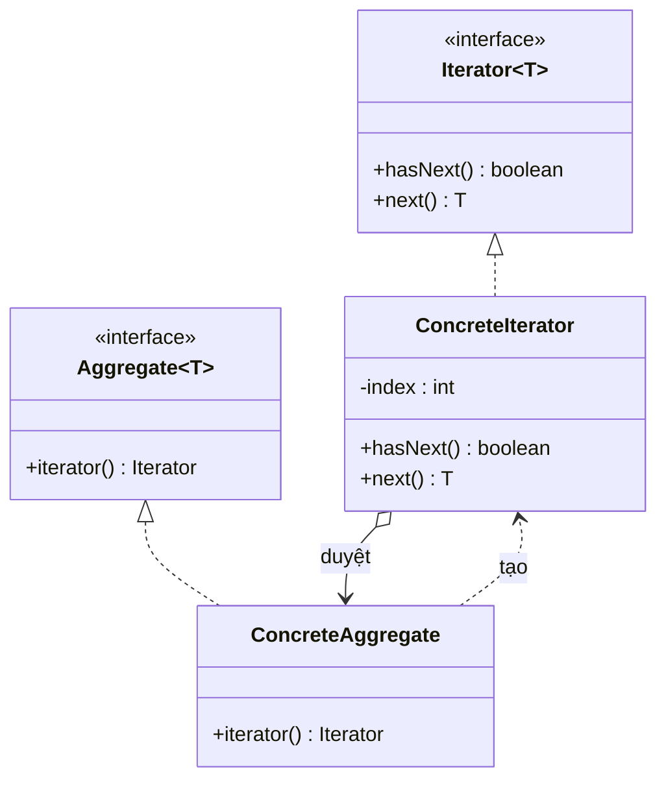

# Iterator (Lặp / Duyệt)

## 1. Tên và phân loại
- **Tên:** Iterator
- **Phân loại:** Behavioral (Mẫu hành vi) — thuộc nhóm mẫu **đối tượng** (object pattern).

## 2. Mục đích, ý định
Cung cấp cách **truy cập tuần tự** các phần tử của một đối tượng tập hợp (aggregate) mà **không để lộ biểu diễn bên trong** của nó.

## 3. Bí danh
- **Cursor** (Con trỏ).

## 4. Motivation (Động cơ)
Giả sử ta có nhiều loại tập hợp: danh sách mảng, danh sách liên kết, cây... Client muốn **duyệt qua các phần tử** mà **không cần biết** tập hợp được cài đặt thế nào (mảng? con trỏ? cây?).

Nếu để chính tập hợp lộ cấu trúc (vd cho client tự đi qua chỉ số mảng), thì: client bị **trói vào cài đặt**, và **không thể có nhiều phép duyệt** đồng thời, mỗi kiểu duyệt lại phình to interface tập hợp.

**Giải pháp Iterator:** tách trách nhiệm **duyệt** ra một đối tượng `Iterator` riêng. Tập hợp cung cấp `iterator()` trả về một iterator biết cách đi qua các phần tử. Client chỉ dùng `hasNext()` / `next()` — **đồng nhất** cho mọi loại tập hợp, **giấu** cấu trúc bên trong, và có thể có **nhiều iterator độc lập** cùng lúc.

## 5. Khả năng ứng dụng
Áp dụng Iterator khi:

- Muốn truy cập nội dung một tập hợp **không để lộ biểu diễn bên trong**.
- Muốn hỗ trợ **nhiều phép duyệt** trên cùng tập hợp.
- Muốn cung cấp **giao diện đồng nhất** để duyệt nhiều loại cấu trúc khác nhau (duyệt đa hình).

### ✅ Khi nào NÊN dùng
- Khi muốn duyệt một tập hợp/cấu trúc **mà không lộ chi tiết** cài đặt của nó.
- Khi cần **nhiều cách duyệt** (xuôi, ngược, theo điều kiện) hoặc **nhiều con trỏ độc lập** chạy đồng thời.
- Khi muốn client dùng **một giao diện duyệt chung** cho nhiều loại tập hợp khác nhau.

### ❌ Khi nào KHÔNG nên dùng
- Khi tập hợp đơn giản và ngôn ngữ đã có sẵn cơ chế duyệt tốt → dùng **`Iterable`/`for-each`** của Java thay vì tự viết.
- Khi việc tách iterator **làm phức tạp hóa** mà không thu lợi (chỉ duyệt một kiểu, một lần).
- Khi cần thao tác **truy cập ngẫu nhiên** theo chỉ số hiệu năng cao → iterator tuần tự không tối ưu.

> **Lưu ý:** Trong Java, nên **tận dụng `java.util.Iterator` / `Iterable`** để hòa nhập với `for-each` và toàn bộ thư viện chuẩn, thay vì định nghĩa interface iterator riêng (trừ khi học thuật).

## 6. Cấu trúc



## 7. Các thành viên
- **Iterator** *(interface)* — định nghĩa giao diện truy cập/duyệt (`hasNext()`, `next()`).
- **ConcreteIterator** — cài đặt Iterator; theo dõi **vị trí hiện tại** trong quá trình duyệt.
- **Aggregate** *(interface)* — định nghĩa phương thức `iterator()` tạo ra iterator.
- **ConcreteAggregate** — cài đặt `iterator()` trả về một ConcreteIterator phù hợp.

## 8. Sự cộng tác
- ConcreteIterator theo dõi phần tử hiện tại và biết phần tử kế tiếp khi duyệt. Client lấy iterator từ aggregate rồi gọi `hasNext()`/`next()`.

## 9. Các hệ quả mang lại
**Ưu điểm:**
- **Đơn giản hóa interface tập hợp** (tách phần duyệt ra).
- **Hỗ trợ nhiều phép duyệt** đồng thời, độc lập.
- **Giấu cấu trúc bên trong**; client duyệt đồng nhất (Single Responsibility, Open/Closed).

**Nhược điểm:**
- **Thừa thãi** với tập hợp đơn giản.
- Iterator có thể trở nên **không nhất quán** nếu tập hợp bị sửa trong lúc duyệt (cần xử lý: fail-fast `ConcurrentModificationException`).

## 10. Chú ý khi cài đặt
1. **Internal vs external iterator:** external (client điều khiển `next()`) linh hoạt hơn; internal (truyền hành động vào, như `forEach`) gọn hơn.
2. **Ai kiểm soát/định nghĩa thuật toán duyệt:** iterator hoặc chính aggregate (cursor).
3. **Fail-fast:** phát hiện sửa đổi đồng thời để báo lỗi sớm.
4. **Java idiom:** cài `Iterable<T>` + `Iterator<T>` để dùng được `for-each`.

## 11. Mã nguồn minh họa
Ví dụ một tập hợp `NameRepository` tự cài iterator (đồng thời cài `Iterable` để dùng `for-each`).

Mã nguồn đầy đủ trong [src/](src/):
- [Iterator.java](src/Iterator.java) — interface Iterator (tự định nghĩa, minh họa).
- [NameRepository.java](src/NameRepository.java) — Aggregate + ConcreteIterator (lớp lồng) + cài `Iterable`.
- [Main.java](src/Main.java) — demo (duyệt thủ công + for-each).

```java
public Iterator<String> getIterator() {
    return new Iterator<String>() {          // ConcreteIterator (lớp ẩn danh)
        private int index = 0;
        @Override public boolean hasNext() { return index < names.length; }
        @Override public String next()     { return names[index++]; }
    };
}
```

## 12. Ví dụ thực tế
- **java.util.Iterator / java.lang.Iterable** — nền tảng của for-each và toàn bộ Collections Framework.
- **java.util.Enumeration** (cũ), **ListIterator** (duyệt hai chiều).
- **java.util.Scanner**, **java.util.stream.Stream** (duyệt theo luồng).
- Mọi `List`, `Set`, `Map` trong Java đều cung cấp iterator.

## 13. Các mẫu liên quan
- **Composite:** Iterator thường dùng để duyệt cây Composite.
- **Factory Method:** `iterator()` chính là một factory method tạo iterator phù hợp.
- **Memento:** có thể dùng để lưu trạng thái duyệt của iterator.
- **Visitor:** kết hợp với Iterator để áp thao tác lên từng phần tử khi duyệt.
