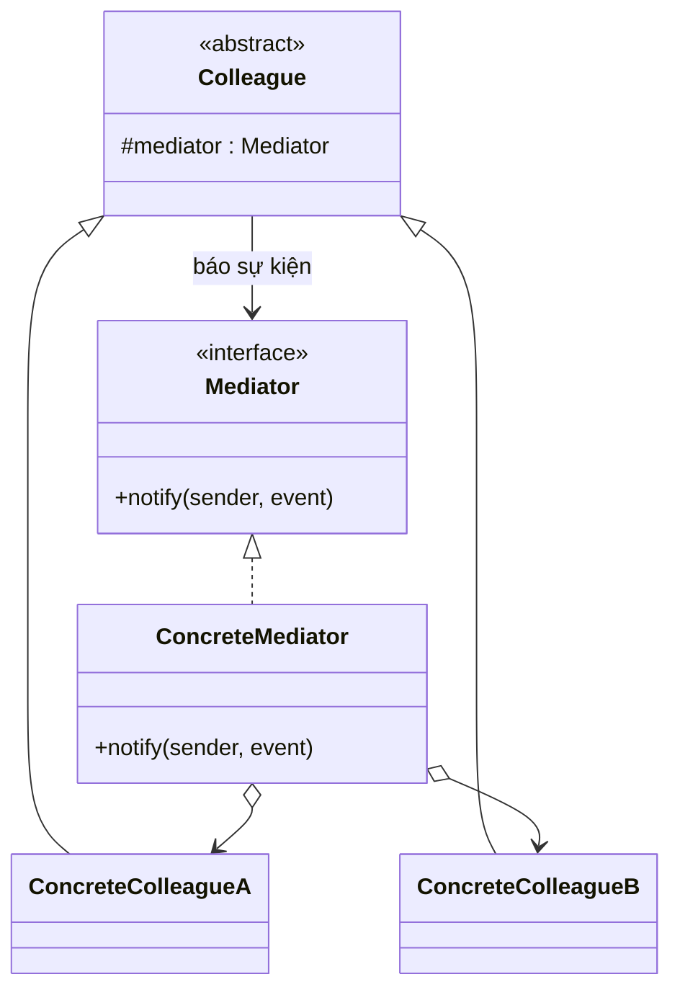

# Mediator (Trung gian / Điều phối)

## 1. Tên và phân loại
- **Tên:** Mediator
- **Phân loại:** Behavioral (Mẫu hành vi) — thuộc nhóm mẫu **đối tượng** (object pattern).

## 2. Mục đích, ý định
Định nghĩa một đối tượng **đóng gói cách một tập hợp đối tượng tương tác** với nhau. Mediator thúc đẩy **liên kết lỏng (loose coupling)** bằng cách **không cho các đối tượng tham chiếu trực tiếp** lẫn nhau, và cho phép thay đổi cách chúng tương tác một cách độc lập.

## 3. Bí danh
Không có bí danh phổ biến.

## 4. Motivation (Động cơ)
Giả sử ta làm một **hộp thoại (dialog)** có nhiều thành phần UI: ô nhập tên, danh sách chọn, nút OK, checkbox... Chúng **phụ thuộc lẫn nhau**: chọn một mục trong danh sách thì điền vào ô nhập; ô nhập rỗng thì khóa nút OK...

Nếu mỗi widget **tham chiếu trực tiếp** tới các widget khác để phối hợp, ta có một mạng lưới quan hệ **chằng chịt (many-to-many)**: mỗi widget bị trói vào nhiều widget khác, **khó tái sử dụng** và **khó sửa** (đổi một quan hệ phải sửa nhiều lớp).

**Giải pháp Mediator:** đưa toàn bộ logic phối hợp vào **một đối tượng trung gian** (`DialogMediator`). Mỗi widget chỉ biết **mediator**, và khi có sự kiện thì **báo cho mediator**; mediator quyết định cần tác động tới widget nào. Quan hệ many-to-many giữa các widget trở thành **one-to-many** giữa mediator và các đồng nghiệp (colleague).

## 5. Khả năng ứng dụng
Áp dụng Mediator khi:

- Một tập đối tượng giao tiếp theo cách **phức tạp, có cấu trúc nhưng rối**; phụ thuộc lẫn nhau khó hiểu.
- **Khó tái sử dụng** một đối tượng vì nó tham chiếu/giao tiếp với nhiều đối tượng khác.
- Một hành vi phân tán giữa nhiều lớp cần **tùy biến mà không muốn đẻ ra nhiều lớp con**.

### ✅ Khi nào NÊN dùng
- Khi có **nhiều đối tượng tương tác chằng chịt (many-to-many)** và bạn muốn **gom logic phối hợp** về một chỗ.
- Khi muốn **tái sử dụng** các thành phần độc lập (chúng không cần biết nhau, chỉ biết mediator).
- Khi muốn **dễ thay đổi** cách phối hợp mà không sửa từng thành phần (UI dialog, điều phối phòng chat, kiểm soát không lưu).

### ❌ Khi nào KHÔNG nên dùng
- Khi tương tác **đơn giản, ít đối tượng** → thêm mediator là phức tạp hóa thừa.
- Khi mediator **phình to** ôm hết logic → trở thành "God object" khó bảo trì (nhược điểm cố hữu).
- Khi các đối tượng vốn đã **độc lập**, không cần phối hợp.

> **Phân biệt nhanh:** *Mediator* tập trung **giao tiếp nhiều chiều** giữa các đồng nghiệp. *Facade* chỉ là cổng **một chiều** đơn giản hóa hệ thống con (colleague không gọi ngược facade). *Observer* thường được Mediator dùng để colleague báo tin cho mediator.

## 6. Cấu trúc



## 7. Các thành viên
- **Mediator** *(interface)* — định nghĩa giao diện để giao tiếp với các đối tượng `Colleague`.
- **ConcreteMediator** — cài đặt phối hợp; biết và quản lý các colleague.
- **Colleague** — mỗi colleague biết mediator của nó; khi cần giao tiếp với colleague khác thì **thông qua mediator**.

## 8. Sự cộng tác
- Colleague gửi/nhận yêu cầu **tới/từ mediator**. Mediator thực hiện việc phối hợp, định tuyến yêu cầu tới đúng (các) colleague.

## 9. Các hệ quả mang lại
**Ưu điểm:**
- **Giảm số lớp con**: gom hành vi phối hợp về mediator thay vì rải rác.
- **Tách rời các colleague** (loose coupling) → dễ tái sử dụng.
- **Tập trung hóa điều khiển**: logic tương tác ở một chỗ, dễ hiểu/đổi (Single Responsibility, Open/Closed).
- Biến quan hệ **many-to-many** thành **one-to-many**.

**Nhược điểm:**
- Mediator có thể **phình to phức tạp** ("God object"), trở thành điểm khó bảo trì.

## 10. Chú ý khi cài đặt
1. **Bỏ lớp Mediator trừu tượng** nếu chỉ có một mediator — colleague có thể tham chiếu trực tiếp.
2. **Giao tiếp colleague → mediator:** có thể dùng [[behavioral-observer|Observer]] (colleague là subject, mediator là observer) hoặc một phương thức `notify(sender, event)` chung.
3. **Tránh God object:** chỉ đặt logic *phối hợp* vào mediator, không nhồi mọi nghiệp vụ.

## 11. Mã nguồn minh họa
Ví dụ **phòng chat**: người dùng không nhắn trực tiếp cho nhau mà gửi qua `ChatRoom` (mediator) để phân phối.

Mã nguồn đầy đủ trong [src/](src/):
- [ChatMediator.java](src/ChatMediator.java) — Mediator.
- [ChatRoom.java](src/ChatRoom.java) — ConcreteMediator.
- [User.java](src/User.java) — Colleague.
- [Main.java](src/Main.java) — demo.

```java
public class ChatRoom implements ChatMediator {
    private final List<User> users = new ArrayList<>();
    @Override public void register(User u) { users.add(u); }
    @Override public void send(String msg, User sender) {
        for (User u : users)
            if (u != sender) u.receive(msg, sender);   // mediator định tuyến
    }
}
```

## 12. Ví dụ thực tế
- **java.util.Timer** — điều phối lập lịch nhiều task.
- **java.util.concurrent.ExecutorService / ScheduledExecutorService** — điều phối thực thi tác vụ.
- **javax.swing** — `MVC controller` đóng vai mediator giữa các thành phần UI.
- Hệ thống điều phối phòng chat, sàn giao dịch, điều khiển không lưu (ATC).

## 13. Các mẫu liên quan
- **Facade:** cả hai trừu tượng hóa hệ thống con; nhưng Mediator giao tiếp **hai chiều** với các đồng nghiệp, Facade là cổng **một chiều**.
- **Observer:** Mediator thường dùng Observer để các colleague thông báo cho nó.
- **Command:** yêu cầu giữa colleague–mediator có thể đóng gói thành Command.
