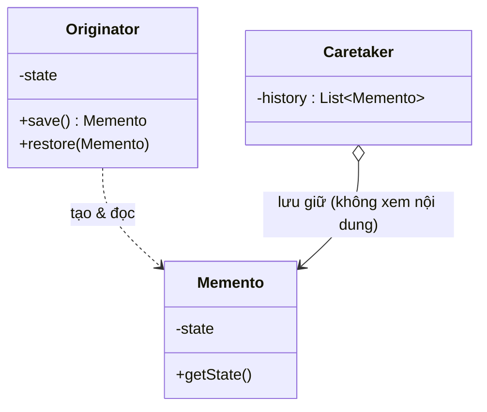

# Memento (Vật lưu niệm / Bản chụp trạng thái)

## 1. Tên và phân loại
- **Tên:** Memento
- **Phân loại:** Behavioral (Mẫu hành vi) — thuộc nhóm mẫu **đối tượng** (object pattern).

## 2. Mục đích, ý định
**Không vi phạm tính đóng gói (encapsulation)**, chụp lại và externalize **trạng thái nội tại** của một đối tượng để sau này có thể **khôi phục** đối tượng về trạng thái đó.

## 3. Bí danh
- **Token**.

## 4. Motivation (Động cơ)
Giả sử một **trình soạn thảo** cần chức năng **Undo**: hoàn tác về trạng thái trước đó. Để undo, ta cần **lưu lại trạng thái** của đối tượng tại các thời điểm.

Vấn đề: trạng thái nội tại của đối tượng thường là **private** (đóng gói). Nếu ta phơi bày hết các trường ra ngoài để lưu, ta **phá vỡ đóng gói** và biến mọi thứ thành công khai — rất tệ.

**Giải pháp Memento:** đối tượng (`Originator`) tự tạo một **memento** chứa bản chụp trạng thái nội tại của nó, và biết cách **khôi phục** từ một memento. Một đối tượng khác (`Caretaker`) **giữ** các memento (để undo) nhưng **không được nhìn vào hay sửa** nội dung bên trong — bảo toàn đóng gói. Chỉ Originator mới hiểu nội dung memento.

## 5. Khả năng ứng dụng
Áp dụng Memento khi:

- Cần **lưu (một phần) trạng thái** của đối tượng để **khôi phục về sau** (undo, checkpoint, rollback).
- Việc lấy trạng thái trực tiếp sẽ **phơi bày chi tiết cài đặt** và **phá vỡ đóng gói**.

### ✅ Khi nào NÊN dùng
- Khi cần **undo/redo**, **checkpoint/rollback**, **lưu & khôi phục** trạng thái (editor, game save, transaction, wizard nhiều bước).
- Khi muốn lưu trạng thái mà **vẫn giữ đóng gói** (không phơi bày nội bộ của đối tượng ra ngoài).

### ❌ Khi nào KHÔNG nên dùng
- Khi trạng thái **lớn** và lưu nhiều bản chụp **tốn bộ nhớ** đáng kể → cân nhắc lưu **delta (chênh lệch)** thay vì toàn bộ, hoặc giới hạn lịch sử.
- Khi việc tạo/khôi phục trạng thái **quá tốn kém** so với lợi ích.
- Khi có thể tái tạo trạng thái bằng cách khác rẻ hơn (vd ghi log thao tác — kết hợp [[behavioral-command|Command]]).

> **Phân biệt nhanh:** *Memento* lưu **trạng thái** để khôi phục. *Command* lưu **hành động** (và thường tự biết cách undo bằng đảo nghịch). Nhiều hệ undo kết hợp cả hai.

## 6. Cấu trúc



## 7. Các thành viên
- **Originator** — đối tượng có trạng thái cần lưu; tạo memento chụp trạng thái và dùng memento để khôi phục.
- **Memento** — lưu trạng thái nội tại của Originator. **Chỉ Originator** được truy cập nội dung (giao diện "rộng"); Caretaker chỉ thấy giao diện "hẹp" (không đọc/sửa nội dung).
- **Caretaker** — giữ các memento (vd ngăn xếp lịch sử để undo); **không** thao tác lên nội dung memento.

## 8. Sự cộng tác
- Caretaker yêu cầu Originator tạo memento, giữ nó, và (khi undo) trả lại memento cho Originator để khôi phục. Caretaker **không mở** memento ra.

## 9. Các hệ quả mang lại
**Ưu điểm:**
- **Bảo toàn đóng gói**: không phơi bày trạng thái nội tại ra ngoài.
- **Đơn giản hóa Originator**: không phải tự quản lý lịch sử trạng thái (Caretaker lo).
- Hỗ trợ **undo/redo, snapshot** sạch sẽ.

**Nhược điểm:**
- **Tốn bộ nhớ** nếu trạng thái lớn / lưu nhiều bản chụp.
- Caretaker phải **quản lý vòng đời** memento (dọn dẹp khi không cần).
- Trong một số ngôn ngữ khó đảm bảo **chỉ Originator** truy cập nội dung memento.

## 10. Chú ý khi cài đặt
1. **Hai giao diện:** memento nên có giao diện "rộng" cho Originator và "hẹp" cho Caretaker. Trong Java thường dùng **lớp lồng (nested class)** + memento **bất biến** để bảo toàn đóng gói.
2. **Lưu gia tăng (incremental):** với trạng thái lớn, lưu delta thay vì toàn bộ.
3. **Memento bất biến:** sau khi tạo không cho sửa, tránh hỏng lịch sử.
4. **Giới hạn lịch sử:** Caretaker nên giới hạn số bản chụp để tránh phình bộ nhớ.

## 11. Mã nguồn minh họa
Ví dụ trình soạn thảo văn bản có **undo** nhiều bước.

Mã nguồn đầy đủ trong [src/](src/):
- [Editor.java](src/Editor.java) — Originator (tạo/khôi phục memento; chứa lớp lồng `Memento`).
- [History.java](src/History.java) — Caretaker (ngăn xếp memento).
- [Main.java](src/Main.java) — demo.

```java
public class Editor {                       // Originator
    private String content = "";
    public Memento save()              { return new Memento(content); }
    public void restore(Memento m)     { this.content = m.getState(); }

    public static class Memento {           // memento bất biến, lớp lồng
        private final String state;
        private Memento(String state) { this.state = state; }
        private String getState()     { return state; }
    }
}
```

## 12. Ví dụ thực tế
- **java.io.Serializable** — chụp/khôi phục trạng thái đối tượng (một dạng memento thô).
- **java.util.Date** (giữ trạng thái thời điểm có thể khôi phục qua `getTime()/setTime()`).
- Chức năng **Undo/Redo** trong editor; **save game**; **transaction rollback** trong CSDL.
- **javax.faces** lưu/khôi phục view state.

## 13. Các mẫu liên quan
- **Command:** memento thường lưu trạng thái để command thực hiện undo.
- **Iterator:** memento có thể lưu trạng thái duyệt của iterator.
- **Prototype:** một cách lưu trạng thái khác là clone đối tượng (nhưng không giấu đóng gói như memento).
