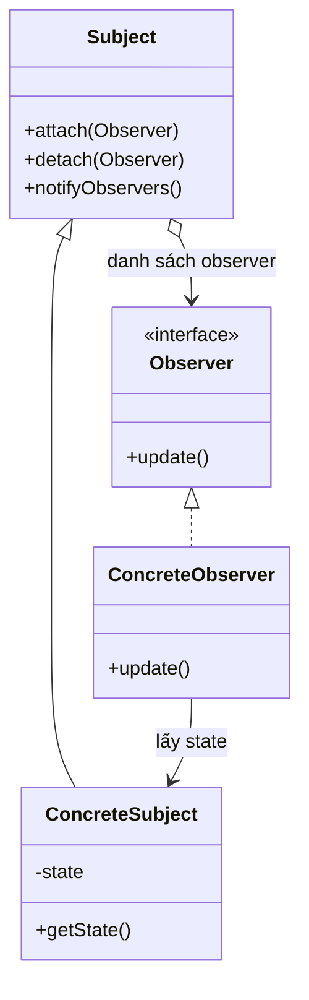

# Observer (Người quan sát)

## 1. Tên và phân loại
- **Tên:** Observer
- **Phân loại:** Behavioral (Mẫu hành vi) — thuộc nhóm mẫu **đối tượng** (object pattern).

## 2. Mục đích, ý định
Định nghĩa một **quan hệ phụ thuộc một-nhiều** giữa các đối tượng, sao cho khi **một đối tượng (subject) đổi trạng thái**, **tất cả** các đối tượng phụ thuộc (observer) được **thông báo và cập nhật tự động**.

## 3. Bí danh
- **Dependents**, **Publish-Subscribe** (Pub-Sub).

## 4. Motivation (Động cơ)
Giả sử có một **bảng dữ liệu (subject)** và nhiều **khung nhìn (view)** hiển thị nó dưới dạng biểu đồ cột, biểu đồ tròn, bảng số... Khi dữ liệu thay đổi, **mọi view phải cập nhật** để nhất quán.

Nếu subject **gọi trực tiếp** từng view để cập nhật, nó bị **trói cứng** vào danh sách view cụ thể: thêm/bớt loại view phải sửa subject, không tái sử dụng được.

**Giải pháp Observer:** subject giữ một danh sách **observer** đã đăng ký (chỉ biết qua interface `Observer`). Khi trạng thái đổi, subject **lặp qua danh sách và gọi `update()`** trên mỗi observer. Observer tự lấy dữ liệu mới và cập nhật. Subject và observer **ghép lỏng**: có thể thêm/bớt observer lúc chạy mà subject không cần biết lớp cụ thể.

## 5. Khả năng ứng dụng
Áp dụng Observer khi:

- Một trừu tượng có **hai khía cạnh phụ thuộc nhau**; đóng gói riêng để thay đổi/tái sử dụng độc lập.
- Thay đổi một đối tượng cần **kéo theo thay đổi** ở các đối tượng khác mà **không biết trước** có bao nhiêu/loại nào.
- Một đối tượng cần **thông báo** cho các đối tượng khác mà **không muốn ghép chặt** với chúng.

### ✅ Khi nào NÊN dùng
- Khi nhiều đối tượng cần **phản ứng với sự thay đổi** của một đối tượng khác, và bạn muốn **ghép lỏng** (event/listener, UI binding, pub-sub, thông báo).
- Khi số lượng/loại "người nghe" **thay đổi linh hoạt lúc chạy** (đăng ký/hủy đăng ký).
- Khi muốn tách phần **phát sự kiện** khỏi phần **xử lý sự kiện**.

### ❌ Khi nào KHÔNG nên dùng
- Khi chỉ có **một người nghe cố định** → gọi trực tiếp đơn giản hơn.
- Khi chuỗi cập nhật **lan truyền phức tạp** (observer này lại là subject của observer khác) → khó lần, dễ **vòng lặp cập nhật** vô tận và rò rỉ bộ nhớ (quên hủy đăng ký).
- Khi thứ tự thông báo **quan trọng** nhưng khó đảm bảo, hoặc cần **giao dịch nhất quán** giữa nhiều cập nhật.

> **Phân biệt nhanh:** *Observer* là phát-tin một-nhiều ẩn danh. *Mediator* tập trung điều phối nhiều chiều (thường **dùng** Observer). *Chain of Responsibility* chuyển một yêu cầu tới **một** người xử lý, còn Observer thông báo cho **tất cả**.

## 6. Cấu trúc



## 7. Các thành viên
- **Subject** — biết các observer của nó; cung cấp `attach()`/`detach()`; gọi `notify()` để thông báo.
- **Observer** *(interface)* — định nghĩa `update()` để nhận thông báo.
- **ConcreteSubject** — lưu trạng thái; khi đổi thì gọi `notify()`.
- **ConcreteObserver** — cài `update()`; (thường) giữ tham chiếu tới subject để lấy trạng thái mới.

## 8. Sự cộng tác
- ConcreteSubject thông báo cho các observer khi trạng thái đổi. Sau khi nhận thông báo, observer có thể **truy vấn** subject để đồng bộ trạng thái của mình.

## 9. Các hệ quả mang lại
**Ưu điểm:**
- **Ghép lỏng** giữa subject và observer; có thể thay đổi độc lập (Open/Closed).
- **Hỗ trợ broadcast**: thêm/bớt observer lúc chạy mà subject không cần biết lớp cụ thể.

**Nhược điểm:**
- **Cập nhật lan truyền** có thể tốn kém/khó dự đoán; dễ gây **vòng lặp cập nhật**.
- Observer **không biết các observer khác**, có thể dẫn tới cập nhật thừa.
- **Rò rỉ bộ nhớ** (lapsed listener) nếu quên hủy đăng ký.
- Thứ tự thông báo thường **không đảm bảo**.

## 10. Chú ý khi cài đặt
1. **Push vs Pull:** *push* — subject gửi kèm dữ liệu trong `update(data)`; *pull* — chỉ báo "có thay đổi", observer tự truy vấn. Pull linh hoạt hơn, push tiện hơn.
2. **Quản lý đăng ký:** nhớ `detach()` để tránh rò rỉ bộ nhớ.
3. **An toàn luồng:** cẩn thận khi attach/detach trong lúc đang notify (sao chép danh sách trước khi lặp).
4. **Tránh `java.util.Observer/Observable`:** đã **deprecated** từ Java 9 — nên tự định nghĩa interface hoặc dùng `PropertyChangeListener`/thư viện reactive.

## 11. Mã nguồn minh họa
Ví dụ **trạm thời tiết**: `WeatherStation` (subject) thông báo nhiệt độ cho các bảng hiển thị (observer).

Mã nguồn đầy đủ trong [src/](src/):
- [Observer.java](src/Observer.java) — interface Observer.
- [Subject.java](src/Subject.java) — interface Subject.
- [WeatherStation.java](src/WeatherStation.java) — ConcreteSubject.
- [PhoneDisplay.java](src/PhoneDisplay.java), [WindowDisplay.java](src/WindowDisplay.java) — ConcreteObserver.
- [Main.java](src/Main.java) — demo.

```java
public class WeatherStation implements Subject {
    private final List<Observer> observers = new ArrayList<>();
    private float temperature;

    public void setTemperature(float t) {
        this.temperature = t;
        notifyObservers();                 // báo cho mọi observer
    }
    @Override public void notifyObservers() {
        for (Observer o : observers) o.update(temperature);
    }
}
```

## 12. Ví dụ thực tế
- **java.util.EventListener** và toàn bộ cơ chế listener của Swing/AWT (`ActionListener`...).
- **java.beans.PropertyChangeListener**.
- **RxJava / Reactor** (Reactive Streams) — pub-sub mở rộng.
- Cơ chế **event** của các framework UI (DOM events), hệ thống thông báo, message bus.

## 13. Các mẫu liên quan
- **Mediator:** đóng gói cập nhật phức tạp; thường dùng Observer để colleague báo cho mediator.
- **Singleton:** subject/đối tượng quản lý sự kiện thường là Singleton.
- **Command:** cập nhật có thể được đóng gói; trong một số kiến trúc event là command.
