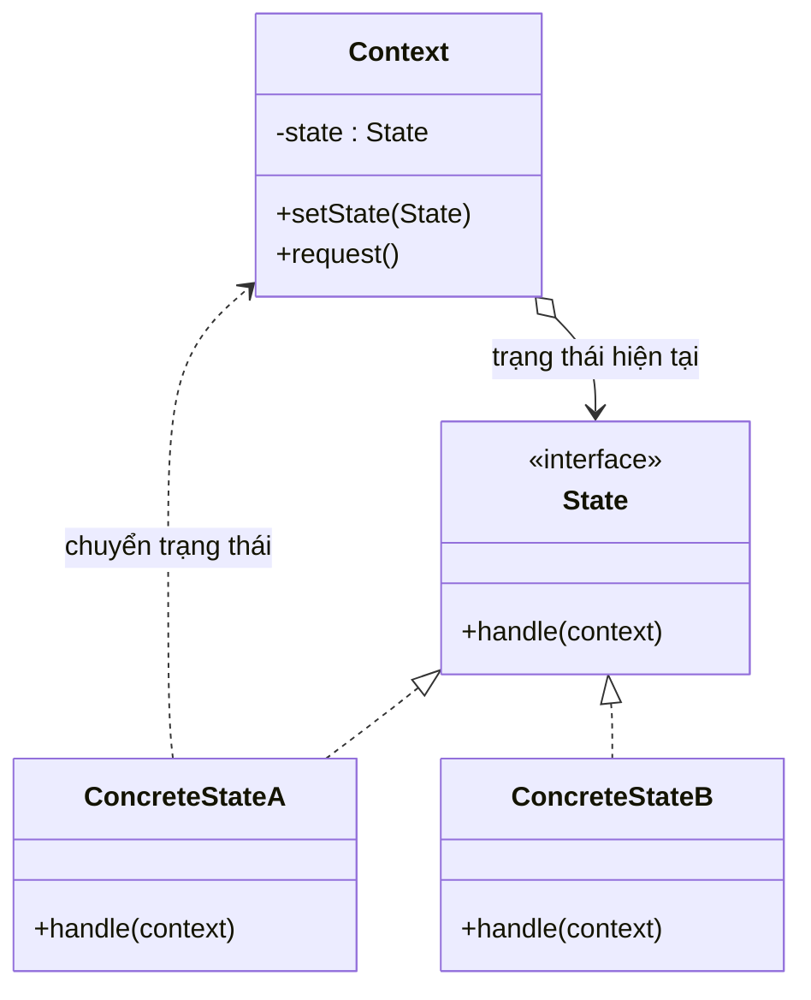

# State (Trạng thái)

## 1. Tên và phân loại
- **Tên:** State
- **Phân loại:** Behavioral (Mẫu hành vi) — thuộc nhóm mẫu **đối tượng** (object pattern).

## 2. Mục đích, ý định
Cho phép một đối tượng **thay đổi hành vi của nó khi trạng thái nội tại thay đổi**. Đối tượng trông như thể **đổi sang lớp khác**.

## 3. Bí danh
- **Objects for States**.

## 4. Motivation (Động cơ)
Giả sử một **máy bán hàng tự động** (vending machine) có nhiều trạng thái: "chờ tiền", "đã có tiền", "hết hàng", "đang nhả hàng". Cùng một thao tác (vd bấm nút mua) **cho kết quả khác nhau** tùy trạng thái hiện tại.

Nếu cài bằng một biến `state` và **khối `if/else`/`switch` khổng lồ** trong mỗi phương thức (`insertCoin()`, `pressButton()`...), code sẽ: rối, **lặp điều kiện** ở nhiều phương thức, và **khó thêm trạng thái mới** (phải sửa mọi phương thức).

**Giải pháp State:** mỗi trạng thái thành **một lớp riêng** cài interface `State` chung. Đối tượng ngữ cảnh (`VendingMachine`) giữ một tham chiếu tới đối tượng `State` hiện tại và **ủy thác** các thao tác cho nó. Mỗi lớp trạng thái cài hành vi của riêng mình và **quyết định chuyển sang trạng thái nào** tiếp theo. Thêm trạng thái mới = thêm một lớp, không sửa các lớp khác.

## 5. Khả năng ứng dụng
Áp dụng State khi:

- Hành vi của một đối tượng **phụ thuộc trạng thái** của nó, và nó phải **đổi hành vi lúc chạy** theo trạng thái.
- Các phương thức có **nhiều câu điều kiện lớn** rẽ nhánh theo trạng thái của đối tượng — chuyển mỗi nhánh thành một lớp trạng thái.

### ✅ Khi nào NÊN dùng
- Khi đối tượng có một **máy trạng thái (state machine)** rõ ràng với nhiều trạng thái và **chuyển tiếp** giữa chúng (đơn hàng, kết nối TCP, máy bán hàng, trình phát media).
- Khi muốn **loại bỏ if/else/switch theo trạng thái** rải rác, gom hành vi mỗi trạng thái về một lớp.
- Khi việc **thêm trạng thái mới** xảy ra thường xuyên và muốn tuân thủ Open/Closed.

### ❌ Khi nào KHÔNG nên dùng
- Khi chỉ có **vài trạng thái đơn giản, ít đổi** → một biến enum + if/else là đủ, thêm lớp là thừa.
- Khi các trạng thái **gần như không có hành vi riêng** (chỉ là cờ dữ liệu) → không cần mẫu.
- Khi việc tách lớp làm **tăng số lớp** mà lợi ích rõ ràng không tương xứng.

> **Phân biệt nhanh:** *State* và *Strategy* có **cấu trúc UML giống hệt** (ủy thác cho một đối tượng), nhưng **ý định khác**: State biểu diễn **trạng thái** và các trạng thái **tự biết chuyển sang nhau** (máy trạng thái); Strategy là **client chọn thuật toán**, các strategy **không biết nhau**.

## 6. Cấu trúc



## 7. Các thành viên
- **Context** — định nghĩa giao diện cho client; giữ một thể hiện `State` mô tả trạng thái hiện tại; ủy thác các yêu cầu cho nó.
- **State** *(interface)* — định nghĩa giao diện cho hành vi gắn với một trạng thái.
- **ConcreteState** — mỗi lớp cài hành vi của một trạng thái cụ thể và (thường) quyết định **chuyển tiếp** sang trạng thái khác.

## 8. Sự cộng tác
- Context ủy thác các yêu cầu phụ thuộc trạng thái cho đối tượng `ConcreteState` hiện tại. Trạng thái có thể **đổi context sang trạng thái khác** (chuyển tiếp). Client thường chỉ làm việc với Context.

## 9. Các hệ quả mang lại
**Ưu điểm:**
- **Khu trú hành vi theo trạng thái** vào từng lớp riêng (Single Responsibility).
- **Loại bỏ điều kiện lớn**; làm chuyển tiếp trạng thái **tường minh**.
- **Dễ thêm trạng thái mới** (Open/Closed); các đối tượng trạng thái có thể chia sẻ (Flyweight) nếu không trạng thái.

**Nhược điểm:**
- **Tăng số lượng lớp** (mỗi trạng thái một lớp).
- Có thể **thừa** nếu ít trạng thái; logic chuyển tiếp **phân tán** trong các lớp trạng thái (khó nhìn tổng thể máy trạng thái).

## 10. Chú ý khi cài đặt
1. **Ai định nghĩa chuyển tiếp:** đặt logic chuyển trong các ConcreteState (phân tán nhưng dễ mở rộng) hoặc tập trung ở Context/bảng chuyển.
2. **Tạo & huỷ đối tượng trạng thái:** tạo sẵn (nếu chia sẻ được, không trạng thái) hay tạo theo nhu cầu.
3. **Trạng thái không lưu dữ liệu riêng** thì có thể là [[creational-singleton|Singleton]]/Flyweight, dùng chung.
4. **Context truyền `this`** cho state để state đọc/đổi dữ liệu và chuyển trạng thái.

## 11. Mã nguồn minh họa
Ví dụ **máy bán nước**: trạng thái `NoCoin` ↔ `HasCoin` → `Sold`, chuyển tiếp theo thao tác.

Mã nguồn đầy đủ trong [src/](src/):
- [State.java](src/State.java) — interface State.
- [NoCoinState.java](src/NoCoinState.java), [HasCoinState.java](src/HasCoinState.java), [SoldState.java](src/SoldState.java) — ConcreteState.
- [VendingMachine.java](src/VendingMachine.java) — Context.
- [Main.java](src/Main.java) — demo.

```java
public class HasCoinState implements State {
    private final VendingMachine machine;
    @Override public void pressButton() {
        System.out.println("Nha hang...");
        machine.setState(machine.getSoldState());   // chuyển trạng thái
    }
}
```

## 12. Ví dụ thực tế
- **java.lang.Thread** — vòng đời trạng thái (NEW, RUNNABLE, BLOCKED, TERMINATED...).
- **javax.faces.lifecycle** — vòng đời xử lý request theo trạng thái.
- Máy trạng thái giao thức (TCP connection), đơn hàng e-commerce (chờ → đã thanh toán → đang giao → hoàn tất), trình phát media (play/pause/stop).
- **Spring StateMachine**.

## 13. Các mẫu liên quan
- **Strategy:** cùng cấu trúc nhưng khác ý định (xem mục 5).
- **Singleton/Flyweight:** các đối tượng trạng thái không trạng thái thường được chia sẻ.
- **Bridge:** cũng ủy thác cho một đối tượng khác nhưng nhằm tách phân cấp, không phải đổi hành vi theo trạng thái.
