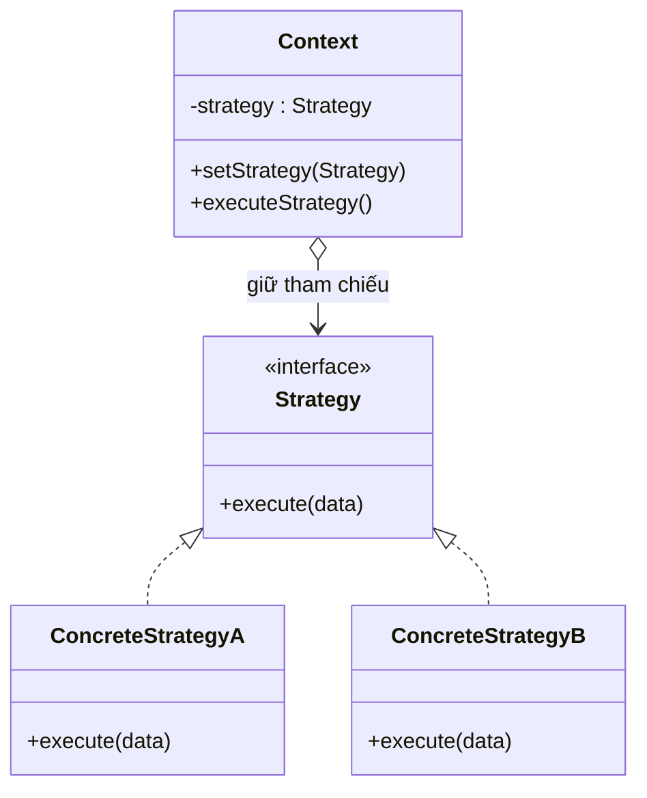

# Strategy (Chiến lược)

## 1. Tên và phân loại
- **Tên:** Strategy
- **Phân loại:** Behavioral (Mẫu hành vi) — thuộc nhóm mẫu **đối tượng** (object pattern).

## 2. Mục đích, ý định
Định nghĩa một **họ các thuật toán**, đóng gói từng thuật toán thành một lớp riêng và làm cho chúng **có thể hoán đổi cho nhau**. Strategy cho phép thuật toán **thay đổi độc lập** với phía client sử dụng nó.

## 3. Bí danh
- **Policy** (Chính sách).

## 4. Motivation (Động cơ)
Giả sử ta xây dựng một **giỏ hàng thương mại điện tử** cần tính phí khi thanh toán. Có nhiều **cách tính** khác nhau: thanh toán bằng thẻ tín dụng (phí 2%), bằng ví điện tử (phí 0%), bằng chuyển khoản (phí cố định)...

Nếu nhồi tất cả vào một phương thức với chuỗi `if/else` hoặc `switch` theo loại thanh toán, lớp giỏ hàng sẽ:
- **Phình to và khó đọc** khi số cách thanh toán tăng.
- **Vi phạm Open/Closed:** mỗi lần thêm cách thanh toán mới lại phải sửa trực tiếp lớp giỏ hàng (dễ gây lỗi vùng khác).
- **Khó tái sử dụng** một thuật toán riêng lẻ ở nơi khác.

**Giải pháp Strategy:** tách mỗi cách tính thành một lớp riêng cùng cài đặt một interface chung `PaymentStrategy`. Giỏ hàng (`Context`) chỉ giữ một tham chiếu tới `PaymentStrategy` và **ủy thác (delegate)** việc tính phí cho nó. Muốn đổi cách thanh toán, chỉ cần "cắm" một strategy khác vào lúc chạy — không sửa code giỏ hàng.

## 5. Khả năng ứng dụng
Áp dụng Strategy khi:

- Có **nhiều lớp/tình huống chỉ khác nhau ở hành vi** (thuật toán) thực hiện.
- Cần **nhiều biến thể** của một thuật toán (ví dụ: nhiều cách sắp xếp, nhiều cách nén, nhiều cách tính giá).
- Muốn **giấu dữ liệu/cấu trúc phức tạp** của thuật toán khỏi client.
- Một lớp có nhiều hành vi được chọn qua nhiều câu lệnh điều kiện `if/switch` — chuyển các nhánh đó thành các strategy.

### ✅ Khi nào NÊN dùng
- Khi có **nhiều thuật toán/biến thể** cho cùng một công việc và muốn **chọn / đổi lúc chạy** (runtime) tùy ngữ cảnh, cấu hình, hoặc lựa chọn người dùng.
- Khi muốn **loại bỏ các khối if/else (switch) lớn** chọn hành vi — thay bằng các đối tượng strategy độc lập.
- Khi muốn **tuân thủ Open/Closed**: thêm thuật toán mới chỉ cần thêm một lớp strategy, không sửa Context.
- Khi muốn **tách biệt phần thuật toán có thể thay đổi** khỏi phần ổn định để dễ kiểm thử từng thuật toán riêng.

### ❌ Khi nào KHÔNG nên dùng
- Khi chỉ có **một vài thuật toán cố định, hiếm khi đổi** → một câu `if/else` đơn giản gọn hơn, thêm strategy là phức tạp hóa thừa.
- Khi các thuật toán **gần như giống nhau, chỉ khác một bước nhỏ** → cân nhắc **Template Method** (kế thừa, chỉ override bước khác biệt) thay vì nhiều lớp strategy.
- Khi client **không muốn/không thể biết về sự khác nhau** giữa các strategy để chọn đúng cái → cần che giấu thêm (Factory) hoặc cân nhắc cách khác.
- Khi việc tách lớp làm **tăng số lớp** mà lợi ích linh hoạt không đáng kể.

> **Phân biệt nhanh:** *Strategy* đổi **thuật toán** (cách làm), *State* đổi **hành vi theo trạng thái** (và state thường tự chuyển trạng thái). Cấu trúc UML giống nhau nhưng **ý định khác nhau**.

## 6. Cấu trúc



Mô tả dạng văn bản:

```
   Context ──(giữ)──► Strategy (interface)
   + setStrategy()            △  + execute()
   + executeStrategy()        │
        │ ủy thác             ├── ConcreteStrategyA  (thuật toán 1)
        └───────────────────► └── ConcreteStrategyB  (thuật toán 2)
```

## 7. Các thành viên
- **Strategy** *(interface)* — khai báo giao diện chung cho tất cả thuật toán. `Context` dùng giao diện này để gọi thuật toán.
- **ConcreteStrategy** — hiện thực một thuật toán cụ thể theo giao diện `Strategy`.
- **Context** — giữ một tham chiếu tới đối tượng `Strategy`; có thể cho phép client đặt/đổi strategy. Khi cần, nó **ủy thác** công việc cho strategy hiện tại thay vì tự làm.

## 8. Sự cộng tác
- `Context` và `Strategy` phối hợp để thực hiện thuật toán đã chọn. `Context` có thể truyền dữ liệu cần thiết cho strategy (qua tham số), hoặc truyền chính nó (`this`) để strategy gọi ngược lấy dữ liệu.
- **Client** thường tạo một `ConcreteStrategy` và "cắm" vào `Context`. Sau đó client chỉ tương tác với `Context`.

## 9. Các hệ quả mang lại
**Ưu điểm:**
- **Họ thuật toán có thể tái sử dụng** và hoán đổi linh hoạt lúc chạy.
- **Loại bỏ câu lệnh điều kiện** phức tạp chọn hành vi.
- **Tách biệt** phần hiện thực thuật toán khỏi phần dùng nó (loose coupling, dễ kiểm thử).
- **Tuân thủ Open/Closed:** thêm strategy mới không sửa Context.

**Nhược điểm:**
- **Client phải biết về các strategy** để chọn cái phù hợp.
- **Tăng số lượng đối tượng/lớp** trong hệ thống.
- Chi phí **giao tiếp Context–Strategy**: đôi khi strategy cần dữ liệu mà Context phải truyền dù strategy không dùng hết.

## 10. Chú ý khi cài đặt
1. **Cách truyền dữ liệu cho strategy:**
   - Truyền tham số trực tiếp vào `execute(data)` (gọn, strategy độc lập với Context).
   - Truyền `Context` (`this`) để strategy tự lấy dữ liệu nó cần (linh hoạt nhưng ghép chặt hơn).
2. **Strategy là đối tượng không trạng thái (stateless)** thì có thể **chia sẻ dùng chung** (kết hợp [[creational-singleton|Singleton]]/Flyweight) để tiết kiệm.
3. **Strategy mặc định:** `Context` nên có một strategy mặc định để client không bắt buộc phải đặt.
4. **Trong Java hiện đại:** một strategy chỉ có một phương thức có thể biểu diễn bằng **lambda / method reference** thay vì tạo lớp riêng — rất gọn (ví dụ `Comparator`).

## 11. Mã nguồn minh họa
Ví dụ **tính phí thanh toán** trong giỏ hàng: `ShoppingCart` (Context) ủy thác cách tính phí cho `PaymentStrategy`.

Mã nguồn đầy đủ trong [src/](src/):
- [PaymentStrategy.java](src/PaymentStrategy.java) — interface `Strategy`.
- [CreditCardPayment.java](src/CreditCardPayment.java), [EWalletPayment.java](src/EWalletPayment.java), [BankTransferPayment.java](src/BankTransferPayment.java) — `ConcreteStrategy`.
- [ShoppingCart.java](src/ShoppingCart.java) — `Context`.
- [Main.java](src/Main.java) — demo (gồm cả strategy dạng lambda).

```java
// Strategy: giao diện chung cho mọi cách tính phí
public interface PaymentStrategy {
    double calculateFee(double amount);
    String name();
}

// Context: ủy thác việc tính phí cho strategy hiện tại
public class ShoppingCart {
    private PaymentStrategy strategy;

    public void setStrategy(PaymentStrategy strategy) {
        this.strategy = strategy;            // đổi thuật toán lúc chạy
    }

    public double checkout(double amount) {
        double fee = strategy.calculateFee(amount);   // <- ủy thác
        return amount + fee;
    }
}
```

## 12. Ví dụ thực tế
- **java.util.Comparator** — truyền vào `Collections.sort()` / `List.sort()` là một strategy so sánh; đổi `Comparator` là đổi cách sắp xếp.
- **java.util.concurrent** — `RejectedExecutionHandler` của `ThreadPoolExecutor` là strategy xử lý khi hàng đợi đầy.
- **javax.servlet.Filter / Spring** — nhiều chiến lược (validation, mã hóa mật khẩu `PasswordEncoder`, `Resource` loading) cấu hình theo strategy.
- **Thanh toán / vận chuyển** trong hệ thống e-commerce: chọn cổng thanh toán, cách tính phí ship lúc chạy.
- **Nén dữ liệu**: chọn thuật toán ZIP/RAR/GZIP qua một interface chung.

## 13. Các mẫu liên quan
- **State:** cấu trúc gần giống Strategy nhưng **ý định khác** — State biểu diễn trạng thái và cho phép đối tượng đổi hành vi khi trạng thái đổi (state thường tự chuyển trạng thái); Strategy là client chọn thuật toán.
- **Template Method:** giải quyết cùng vấn đề "thay đổi một phần thuật toán" nhưng bằng **kế thừa** (override bước) thay vì **ủy thác** cho đối tượng — Strategy linh hoạt hơn lúc chạy, Template Method gọn hơn khi khác biệt nhỏ.
- **Flyweight / Singleton:** strategy không trạng thái thường được chia sẻ dùng chung.
- **Decorator:** đổi "lớp vỏ"/hành vi bằng cách bọc; Strategy đổi "ruột" thuật toán.
- **Factory Method / Abstract Factory:** thường dùng để **tạo** strategy phù hợp che giấu khỏi client.
