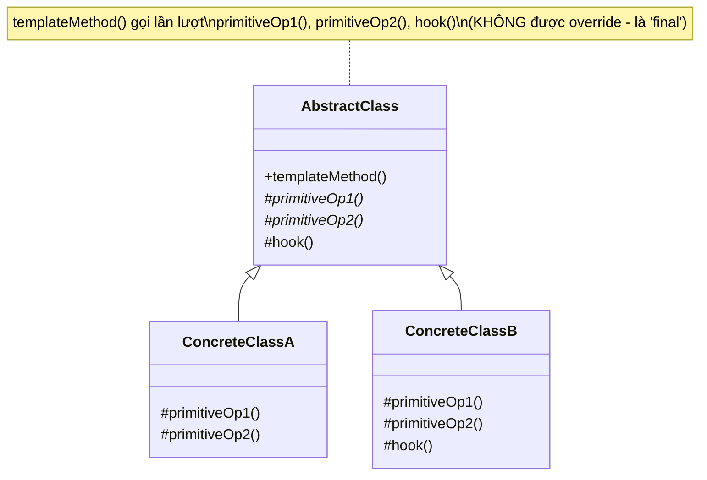

# Template Method (Phương thức khuôn mẫu)

## 1. Tên và phân loại
- **Tên:** Template Method
- **Phân loại:** Behavioral (Mẫu hành vi) — thuộc nhóm mẫu **lớp** (class pattern, dựa trên kế thừa).

## 2. Mục đích, ý định
Định nghĩa **bộ khung (skeleton) của một thuật toán** trong một phương thức, nhưng **hoãn (defer) một số bước** xuống cho lớp con. Template Method cho phép lớp con **định nghĩa lại (override) một số bước** của thuật toán mà **không thay đổi cấu trúc tổng thể** của thuật toán đó.

## 3. Bí danh
Không có bí danh phổ biến.

## 4. Motivation (Động cơ)
Giả sử ta viết một thư viện **xử lý/khai thác dữ liệu** từ nhiều định dạng file: CSV, JSON, XML... Quy trình tổng thể luôn **giống nhau**:

1. Mở file.
2. Đọc & phân tích (parse) dữ liệu thô.
3. Xử lý/phân tích dữ liệu.
4. Đóng file & xuất kết quả.

Chỉ có **bước 2 (cách parse)** là khác nhau giữa các định dạng. Nếu viết mỗi định dạng thành một lớp riêng và lặp lại toàn bộ 4 bước, ta sẽ **lặp code** ở bước 1, 3, 4 và dễ làm quy trình bị lệch nhau theo thời gian.

**Giải pháp Template Method:** đặt **toàn bộ khung 4 bước** vào một phương thức `process()` (template method) trong lớp cha trừu tượng, và để bước hay thay đổi (`parse()`) là **phương thức trừu tượng** cho lớp con cài đặt. Lớp cha **giữ quyền điều khiển trình tự**; lớp con chỉ "điền vào chỗ trống". Đây là nguyên lý **"Hollywood Principle": "Đừng gọi chúng tôi, chúng tôi sẽ gọi bạn"** — lớp cha gọi xuống lớp con, không phải ngược lại.

## 5. Khả năng ứng dụng
Áp dụng Template Method khi:

- Muốn **hiện thực phần bất biến** của một thuật toán một lần ở lớp cha, để lớp con lo phần **có thể thay đổi**.
- Có **hành vi lặp lại giữa nhiều lớp con** — gom phần chung lên lớp cha để tránh trùng lặp (refactor "code chung").
- Muốn **kiểm soát điểm mở rộng** của lớp con: chỉ cho phép override tại các "hook" định trước.

### ✅ Khi nào NÊN dùng
- Khi nhiều lớp có **cùng một quy trình tổng thể nhưng khác ở vài bước** cụ thể → đặt khung ở lớp cha, override bước khác biệt.
- Khi muốn **chống lặp code** (DRY): gom các bước giống nhau lên một chỗ duy nhất.
- Khi muốn **giữ chặt trình tự thuật toán** (lớp con không được phép đổi thứ tự các bước), chỉ cho tùy biến nội dung từng bước.
- Khi cần cung cấp các **"hook" tùy chọn** để lớp con can thiệp vào những điểm nhất định mà mặc định không làm gì.

### ❌ Khi nào KHÔNG nên dùng
- Khi cần **đổi thuật toán lúc chạy (runtime)** hoặc hoán đổi linh hoạt → dùng **Strategy** (ủy thác cho đối tượng) thay vì kế thừa cứng.
- Khi các bước khác nhau **quá nhiều**, khung chung gần như rỗng → kế thừa không còn lợi ích, dễ thành ràng buộc thừa.
- Khi muốn **tránh ràng buộc kế thừa** (lớp con bị trói vào lớp cha, chỉ kế thừa được một lớp) → ưu tiên **composition** (Strategy).
- Khi việc override dễ **phá vỡ bất biến** của thuật toán nếu lập trình viên không cẩn thận → cân nhắc đóng gói chặt hơn.

> **Phân biệt nhanh:** *Template Method* dùng **kế thừa** — cố định ở thời điểm biên dịch. *Strategy* dùng **ủy thác (composition)** — đổi được lúc chạy. Cả hai đều giải bài toán "thay đổi một phần thuật toán".

## 6. Cấu trúc



Mô tả dạng văn bản:

```
   AbstractClass (abstract)
   + templateMethod()  ──► gọi: step1(); step2(); hook();   (final - khung cố định)
   # step1()  (abstract - lớp con cài)
   # step2()  (abstract - lớp con cài)
   # hook()   (mặc định rỗng - lớp con override nếu cần)
        △
        ├── ConcreteClassA: cài step1(), step2()
        └── ConcreteClassB: cài step1(), step2(), override hook()
```

## 7. Các thành viên
- **AbstractClass** *(lớp trừu tượng)* —
  - Định nghĩa **template method** chứa bộ khung thuật toán (gọi lần lượt các bước).
  - Khai báo các **primitive operation** (bước nguyên thủy) trừu tượng để lớp con cài đặt.
  - Có thể cung cấp các **hook** (phương thức có cài đặt mặc định, thường rỗng) để lớp con tùy chọn override.
- **ConcreteClass** —
  - Cài đặt các primitive operation để thực hiện phần thuật toán đặc thù của mình.
  - Có thể override các hook khi cần.

## 8. Sự cộng tác
- `ConcreteClass` dựa vào `AbstractClass` để cài đặt **các bước bất biến** của thuật toán; ngược lại, `AbstractClass` gọi xuống các bước do `ConcreteClass` cung cấp (**đảo ngược điều khiển** — Hollywood Principle).

## 9. Các hệ quả mang lại
**Ưu điểm:**
- **Tái sử dụng code** ở mức cao: phần chung viết một lần ở lớp cha.
- **Kiểm soát điểm mở rộng**: lớp con chỉ tùy biến được ở những chỗ cho phép.
- **Tránh trùng lặp**: gom hành vi chung lên lớp cha (một kỹ thuật refactor phổ biến).

**Nhược điểm:**
- **Ràng buộc kế thừa**: lớp con bị trói vào lớp cha; Java chỉ kế thừa được một lớp.
- **Khó đổi lúc chạy**: cấu trúc cố định ở thời điểm biên dịch.
- **Rủi ro vi phạm LSP**: lớp con override sai có thể phá vỡ bất biến của thuật toán.
- Số bước tăng làm template khó theo dõi; lớp con phải hiểu "khung" để cài đúng.

## 10. Chú ý khi cài đặt
1. **Khóa template method:** trong Java nên để template method là **`final`** để lớp con không vô tình override làm hỏng khung thuật toán.
2. **Hạn chế phạm vi:** đặt các primitive operation ở mức **`protected`** (chỉ lớp con thấy), không công khai ra ngoài nếu không cần.
3. **Phân biệt hai loại bước:**
   - **Bắt buộc** (`abstract`): lớp con *phải* cài.
   - **Hook** (có thân mặc định, thường rỗng hoặc trả về giá trị mặc định): lớp con *tùy chọn* override.
4. **Đặt tên rõ ràng:** quy ước tiền tố như `doXxx()` để nhận diện các bước do lớp con cài.
5. **Giảm số primitive operation**: càng ít bước trừu tượng, lớp con càng dễ cài đúng.

## 11. Mã nguồn minh họa
Ví dụ **pha đồ uống nóng**: quy trình pha trà và pha cà phê giống nhau (đun nước → cho nguyên liệu → rót ra cốc → thêm phụ liệu), chỉ khác ở **bước cho nguyên liệu** và **phụ liệu**.

Mã nguồn đầy đủ trong [src/](src/):
- [CaffeineBeverage.java](src/CaffeineBeverage.java) — `AbstractClass` chứa template method `prepare()`.
- [Tea.java](src/Tea.java), [Coffee.java](src/Coffee.java) — `ConcreteClass`.
- [Main.java](src/Main.java) — demo.

```java
public abstract class CaffeineBeverage {

    // TEMPLATE METHOD: khung cố định của thuật toán - để 'final'.
    public final void prepare() {
        boilWater();          // bước chung
        brew();               // bước riêng (abstract)
        pourInCup();          // bước chung
        if (wantsCondiments()) {   // hook quyết định có thêm phụ liệu không
            addCondiments();  // bước riêng (abstract)
        }
    }

    protected abstract void brew();          // lớp con phải cài
    protected abstract void addCondiments(); // lớp con phải cài

    // HOOK: mặc định luôn thêm phụ liệu; lớp con có thể override.
    protected boolean wantsCondiments() {
        return true;
    }

    private void boilWater()  { System.out.println("Dun soi nuoc"); }
    private void pourInCup()  { System.out.println("Rot ra coc"); }
}
```

## 12. Ví dụ thực tế
- **java.util.AbstractList / AbstractMap / AbstractSet** — cài sẵn khung, để lớp con cài vài phương thức nguyên thủy (`get()`, `size()`...).
- **java.io.InputStream#read(byte[], int, int)** gọi `read()` trừu tượng.
- **javax.servlet.http.HttpServlet#service()** — gọi `doGet()`, `doPost()`... do lớp con override.
- **Spring** `AbstractApplicationContext#refresh()` — khung khởi tạo context gọi các bước con.
- **JUnit** — vòng đời test (`setUp()` → test → `tearDown()`) là một template method.

## 13. Các mẫu liên quan
- **Strategy:** cùng giải quyết "thay đổi một phần thuật toán" nhưng Template Method dùng **kế thừa** (cố định lúc biên dịch), Strategy dùng **ủy thác** (đổi lúc chạy). Template Method tùy biến *một phần*, Strategy thường thay *cả thuật toán*.
- **Factory Method:** thường được **gọi bên trong** một Template Method (một trong các bước của khung chính là factory method tạo đối tượng).
- **Hook & Inversion of Control:** Template Method là minh họa kinh điển của nguyên lý Hollywood ("đừng gọi chúng tôi...").
- **Abstract Class vs Interface mặc định:** Java 8+ có `default method` cũng có thể đóng vai khung nhẹ, nhưng không giữ trạng thái như lớp trừu tượng.
