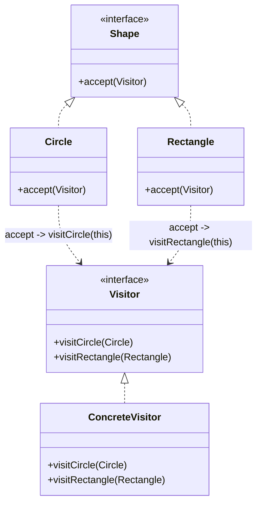

# Visitor (Người thăm viếng)

## 1. Tên và phân loại
- **Tên:** Visitor
- **Phân loại:** Behavioral (Mẫu hành vi) — thuộc nhóm mẫu **đối tượng** (object pattern).

## 2. Mục đích, ý định
Biểu diễn một **thao tác (operation)** cần thực hiện trên các phần tử của một **cấu trúc đối tượng**. Visitor cho phép **định nghĩa thao tác mới** mà **không phải thay đổi các lớp** của những phần tử mà nó thao tác lên.

## 3. Bí danh
Không có bí danh phổ biến.

## 4. Motivation (Động cơ)
Giả sử ta có một **cây cú pháp (AST)** gồm nhiều loại node, hoặc một tập **hình học** (`Circle`, `Rectangle`...). Ta muốn thực hiện **nhiều thao tác khác nhau** trên chúng: tính diện tích, xuất ra XML, vẽ, tính chu vi...

Nếu nhét mỗi thao tác thành một phương thức trong **mỗi lớp phần tử**, thì: mỗi lần thêm thao tác mới phải **sửa tất cả các lớp phần tử**, và các lớp phần tử bị "ô nhiễm" bởi đủ loại logic không liên quan tới bản chất của chúng.

**Giải pháp Visitor:** gom mỗi thao tác vào **một lớp visitor riêng**. Mỗi phần tử có một phương thức `accept(visitor)` gọi ngược lại `visitor.visitXxx(this)` (kỹ thuật **double dispatch**). Thêm thao tác mới = thêm một lớp Visitor, **không sửa** các lớp phần tử. Đổi lại: thêm **loại phần tử mới** thì phải sửa mọi visitor.

## 5. Khả năng ứng dụng
Áp dụng Visitor khi:

- Một cấu trúc đối tượng chứa **nhiều lớp phần tử** với giao diện khác nhau, và bạn muốn thực hiện **các thao tác phụ thuộc lớp cụ thể** của chúng.
- Cần thực hiện **nhiều thao tác khác nhau, không liên quan** trên các phần tử và muốn **tránh làm bẩn** các lớp phần tử.
- Các lớp phần tử **ít khi thay đổi**, nhưng bạn **thường xuyên thêm thao tác mới**.

### ✅ Khi nào NÊN dùng
- Khi tập **lớp phần tử ổn định** nhưng cần **thêm nhiều thao tác** mới theo thời gian (AST của compiler, cấu trúc tài liệu, đồ hình).
- Khi muốn **tách các thao tác** ra khỏi cấu trúc dữ liệu, gom logic cùng loại (in, xuất, kiểm tra) vào một chỗ.
- Khi cần **tích lũy trạng thái** khi duyệt nhiều phần tử (visitor giữ trạng thái tổng hợp).

### ❌ Khi nào KHÔNG nên dùng
- Khi **tập lớp phần tử hay thay đổi** (thêm loại phần tử mới thường xuyên) → mỗi lần thêm phải sửa **mọi** visitor → rất tốn công (nhược điểm cốt lõi).
- Khi chỉ có **một vài thao tác đơn giản** → đặt thẳng vào lớp phần tử gọn hơn.
- Khi visitor cần truy cập **trạng thái private** của phần tử → phá vỡ đóng gói.

> **Phân biệt nhanh:** Visitor đánh đổi **ngược với** cách OOP thông thường: dễ thêm **thao tác** (visitor mới), khó thêm **kiểu** (phần tử mới). Nếu bài toán hay thêm *kiểu* hơn thì **đừng** dùng Visitor.

## 6. Cấu trúc



## 7. Các thành viên
- **Visitor** *(interface)* — khai báo một phương thức `visitX()` cho **mỗi lớp** ConcreteElement.
- **ConcreteVisitor** — cài đặt từng `visitX()`: định nghĩa một thao tác cụ thể trên cấu trúc.
- **Element** *(interface)* — khai báo `accept(Visitor)`.
- **ConcreteElement** — cài `accept()` gọi `visitor.visitThis(this)` (double dispatch).
- **ObjectStructure** — chứa các phần tử; cho phép visitor duyệt qua chúng.

## 8. Sự cộng tác
- Client tạo một ConcreteVisitor rồi duyệt cấu trúc, gọi `accept(visitor)` trên từng phần tử. Mỗi phần tử gọi lại đúng `visitX()` của visitor (theo lớp thật của nó) → visitor thực hiện thao tác.

## 9. Các hệ quả mang lại
**Ưu điểm:**
- **Dễ thêm thao tác mới** (chỉ thêm một visitor) mà không sửa lớp phần tử (Open/Closed cho thao tác).
- **Gom các thao tác liên quan** vào một chỗ; tách khỏi cấu trúc dữ liệu (Single Responsibility).
- Visitor có thể **tích lũy trạng thái** khi duyệt.

**Nhược điểm:**
- **Khó thêm lớp phần tử mới**: phải sửa interface Visitor và mọi ConcreteVisitor.
- Có thể **phá vỡ đóng gói** (visitor cần truy cập nội bộ phần tử).
- Phụ thuộc **double dispatch** — dài dòng, khó với người mới.

## 10. Chú ý khi cài đặt
1. **Double dispatch:** `accept()` chọn đúng `visitX()` dựa trên **lớp thật** của phần tử — đây là điểm cốt lõi (Java không có multiple dispatch sẵn).
2. **Duyệt cấu trúc:** trách nhiệm duyệt có thể đặt ở ObjectStructure, ở visitor, hay ở một iterator riêng.
3. **Đóng gói:** cân nhắc cung cấp đủ getter cho visitor mà không lộ quá nhiều nội bộ.
4. **Nhóm thao tác:** dùng Visitor khi thao tác nhiều và phần tử ổn định; ngược lại đặt method vào phần tử.

## 11. Mã nguồn minh họa
Ví dụ các hình (`Circle`, `Rectangle`): hai visitor khác nhau — tính **diện tích** và **xuất XML** — mà không sửa lớp hình.

Mã nguồn đầy đủ trong [src/](src/):
- [Shape.java](src/Shape.java) — Element.
- [Circle.java](src/Circle.java), [Rectangle.java](src/Rectangle.java) — ConcreteElement.
- [ShapeVisitor.java](src/ShapeVisitor.java) — Visitor.
- [AreaVisitor.java](src/AreaVisitor.java), [XmlExportVisitor.java](src/XmlExportVisitor.java) — ConcreteVisitor.
- [Main.java](src/Main.java) — demo.

```java
public class Circle implements Shape {
    @Override public void accept(ShapeVisitor v) {
        v.visitCircle(this);          // double dispatch
    }
}

public class AreaVisitor implements ShapeVisitor {
    @Override public void visitCircle(Circle c)       { /* tính diện tích tròn */ }
    @Override public void visitRectangle(Rectangle r) { /* tính diện tích chữ nhật */ }
}
```

## 12. Ví dụ thực tế
- **javax.lang.model.element.ElementVisitor**, **javax.lang.model.type.TypeVisitor** — xử lý AST trong annotation processing.
- **java.nio.file.FileVisitor** (`Files.walkFileTree`) — duyệt cây thư mục.
- **ASM / bytecode** `ClassVisitor`, **trình biên dịch** duyệt AST.
- **DOM** `NodeVisitor`, các công cụ phân tích/biến đổi cú pháp.

## 13. Các mẫu liên quan
- **Composite:** Visitor thường được dùng để áp thao tác lên cây Composite.
- **Iterator:** dùng để duyệt cấu trúc đối tượng và áp visitor lên từng phần tử.
- **Interpreter:** Visitor có thể thực hiện việc diễn giải/thao tác trên AST của Interpreter.
