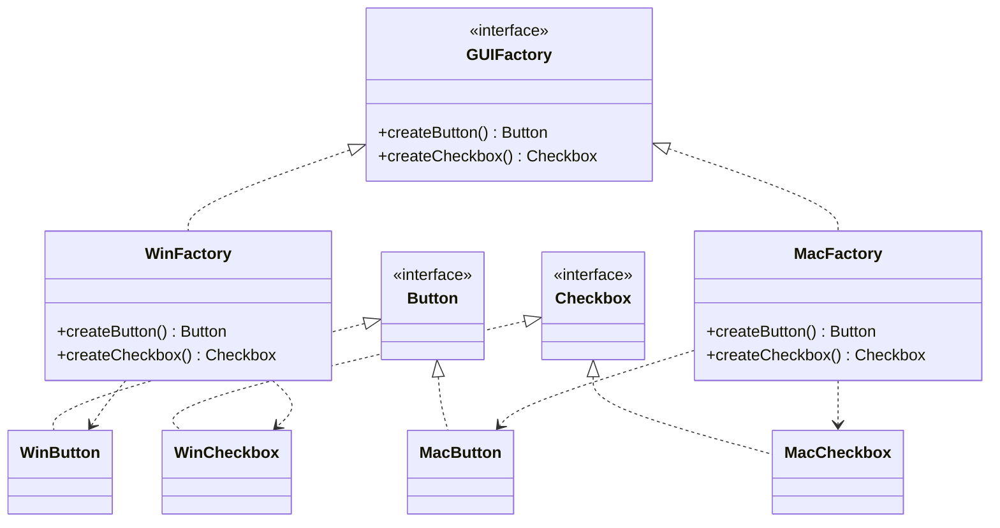

# Abstract Factory (Nhà máy trừu tượng)

## 1. Tên và phân loại
- **Tên:** Abstract Factory
- **Phân loại:** Creational (Mẫu khởi tạo) — thuộc nhóm mẫu **đối tượng** (object pattern).

## 2. Mục đích, ý định
Cung cấp một **giao diện để tạo ra các họ (family) đối tượng liên quan hoặc phụ thuộc nhau**, mà **không cần chỉ định lớp cụ thể** của chúng.

## 3. Bí danh
- **Kit**.

## 4. Motivation (Động cơ)
Giả sử ta xây dựng một **bộ giao diện đồ họa (UI toolkit)** chạy trên nhiều "look-and-feel": Windows, macOS. Mỗi giao diện có **một họ widget liên quan**: `Button`, `Checkbox`, `Scrollbar`... và các widget của Windows phải đi cùng nhau (không thể trộn `WinButton` với `MacCheckbox`).

Nếu code rải rác `new WinButton()`, `new MacCheckbox()` khắp nơi thì việc đổi look-and-feel sẽ phải sửa rất nhiều chỗ và dễ trộn nhầm các họ.

**Giải pháp Abstract Factory:** định nghĩa một interface `GUIFactory` với các phương thức `createButton()`, `createCheckbox()`. Mỗi look-and-feel có một factory cụ thể (`WinFactory`, `MacFactory`) tạo ra **đúng họ widget của nó**. Client chỉ làm việc với `GUIFactory` và các interface widget trừu tượng → đổi cả họ chỉ bằng cách đổi factory.

## 5. Khả năng ứng dụng
Áp dụng Abstract Factory khi:

- Hệ thống cần **độc lập** với cách các sản phẩm được tạo, kết hợp và biểu diễn.
- Hệ thống cần được cấu hình với **một trong nhiều họ sản phẩm**.
- Một **họ đối tượng liên quan** được thiết kế để dùng **cùng nhau** và bạn cần đảm bảo ràng buộc đó.
- Muốn cung cấp một thư viện các lớp sản phẩm và chỉ lộ **interface**, giấu phần cài đặt.

### ✅ Khi nào NÊN dùng
- Khi cần tạo **nhiều nhóm sản phẩm liên quan** mà các sản phẩm trong cùng nhóm phải **tương thích/đi cùng nhau** (UI theme, bộ driver CSDL, bộ phụ kiện cùng hãng).
- Khi muốn **đổi cả họ sản phẩm** chỉ bằng cách thay một đối tượng factory, không sửa client.
- Khi muốn **đảm bảo tính nhất quán** giữa các sản phẩm được dùng chung.
- Khi muốn **giấu lớp cụ thể** khỏi client, chỉ lộ interface.

### ❌ Khi nào KHÔNG nên dùng
- Khi chỉ có **một họ sản phẩm** hoặc sản phẩm không liên quan nhau → dùng **Factory Method** đơn lẻ cho gọn.
- Khi **danh sách sản phẩm trong họ hay thay đổi** (thêm loại sản phẩm mới): phải sửa interface factory và **mọi** factory cụ thể → chi phí cao (đây là nhược điểm lớn nhất).
- Khi việc thêm tầng factory làm **phức tạp hóa** mà không thu được lợi ích nhất quán họ sản phẩm.

> **Phân biệt nhanh:** *Factory Method* tạo **một** sản phẩm qua kế thừa/override. *Abstract Factory* tạo **cả họ nhiều** sản phẩm, thường được hiện thực **bằng nhiều Factory Method** bên trong.

## 6. Cấu trúc



## 7. Các thành viên
- **AbstractFactory** (`GUIFactory`) — khai báo giao diện tạo từng sản phẩm trừu tượng.
- **ConcreteFactory** (`WinFactory`, `MacFactory`) — cài đặt các phương thức tạo, sinh ra các sản phẩm cụ thể của **một họ**.
- **AbstractProduct** (`Button`, `Checkbox`) — interface cho một loại sản phẩm.
- **ConcreteProduct** (`WinButton`, `MacCheckbox`...) — sản phẩm cụ thể do một factory tạo.
- **Client** — chỉ dùng qua interface `AbstractFactory` và `AbstractProduct`.

## 8. Sự cộng tác
- Thường chỉ tạo **một** thể hiện `ConcreteFactory` lúc chạy (hay là [[creational-singleton|Singleton]]), được chọn theo cấu hình. Factory này tạo ra toàn bộ họ sản phẩm.
- Client gọi factory để lấy sản phẩm và chỉ tương tác với chúng qua interface trừu tượng.

## 9. Các hệ quả mang lại
**Ưu điểm:**
- **Đảm bảo tính tương thích** giữa các sản phẩm trong cùng một họ.
- **Tách rời** client khỏi lớp cụ thể (loose coupling).
- **Dễ đổi cả họ sản phẩm**: chỉ thay factory.
- Tuân thủ **Single Responsibility** và **Open/Closed** (với việc thêm họ mới).

**Nhược điểm:**
- **Khó thêm loại sản phẩm mới** vào họ: phải sửa interface `AbstractFactory` và mọi factory cụ thể.
- **Tăng số lượng lớp/interface** đáng kể.

## 10. Chú ý khi cài đặt
1. **Factory thường là Singleton** — chỉ cần một thể hiện cho mỗi họ.
2. **Tạo sản phẩm:** mỗi phương thức `createX()` thường là một **Factory Method**; hoặc dùng **Prototype** (clone các nguyên mẫu) nếu có nhiều họ.
3. **Mở rộng họ sản phẩm:** vì khó thêm loại sản phẩm, cân nhắc factory có một phương thức `make(kind)` chung (đánh đổi an toàn kiểu).
4. **Chọn factory lúc chạy:** thường đọc cấu hình / môi trường để khởi tạo đúng `ConcreteFactory`.

## 11. Mã nguồn minh họa
Ví dụ **UI đa nền tảng**: `GUIFactory` tạo họ `Button` + `Checkbox` theo từng hệ điều hành.

Mã nguồn đầy đủ trong [src/](src/):
- [Button.java](src/Button.java), [Checkbox.java](src/Checkbox.java) — AbstractProduct.
- [WinButton.java](src/WinButton.java), [WinCheckbox.java](src/WinCheckbox.java), [MacButton.java](src/MacButton.java), [MacCheckbox.java](src/MacCheckbox.java) — ConcreteProduct.
- [GUIFactory.java](src/GUIFactory.java), [WinFactory.java](src/WinFactory.java), [MacFactory.java](src/MacFactory.java) — factory.
- [Main.java](src/Main.java) — demo.

```java
public interface GUIFactory {
    Button createButton();
    Checkbox createCheckbox();
}

public class WinFactory implements GUIFactory {
    public Button createButton()     { return new WinButton(); }
    public Checkbox createCheckbox() { return new WinCheckbox(); }
}
```

## 12. Ví dụ thực tế
- **javax.xml.parsers.DocumentBuilderFactory**, **TransformerFactory** — tạo họ đối tượng xử lý XML.
- **java.awt.Toolkit** — tạo các thành phần peer theo nền tảng.
- **JDBC** — `Connection` tạo ra họ `Statement`, `PreparedStatement`... tương thích với driver đó.
- Các thư viện UI đa theme (look-and-feel).

## 13. Các mẫu liên quan
- **Factory Method:** Abstract Factory thường được hiện thực bằng nhiều Factory Method.
- **Prototype:** factory có thể tạo sản phẩm bằng cách clone nguyên mẫu thay vì `new`.
- **Singleton:** ConcreteFactory thường là Singleton.
- **Builder:** Builder tập trung xây *một* đối tượng phức tạp theo từng bước; Abstract Factory tạo *họ nhiều* đối tượng.
