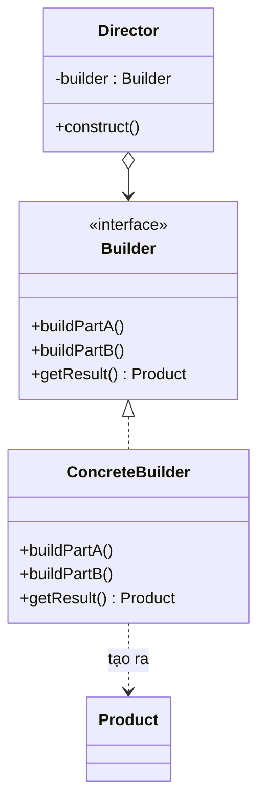

# Builder (Người xây dựng)

## 1. Tên và phân loại
- **Tên:** Builder
- **Phân loại:** Creational (Mẫu khởi tạo) — thuộc nhóm mẫu **đối tượng** (object pattern).

## 2. Mục đích, ý định
**Tách rời** quá trình **xây dựng** (construction) một đối tượng phức tạp khỏi **biểu diễn** (representation) của nó, nhờ đó cùng một quá trình xây dựng có thể tạo ra **nhiều biểu diễn khác nhau**.

## 3. Bí danh
Không có bí danh phổ biến.

## 4. Motivation (Động cơ)
Giả sử ta cần tạo đối tượng `Pizza` có **rất nhiều thuộc tính**: kích cỡ (bắt buộc), loại đế, sốt, phô mai, danh sách topping, có nướng kỹ không... Nhiều thuộc tính là **tùy chọn**.

Nếu dùng **constructor lồng (telescoping constructor)** — tạo nhiều constructor với số tham số tăng dần — code sẽ:
- **Khó đọc**: `new Pizza("L", "mong", true, false, ...)` — không rõ tham số nào là gì.
- **Dễ sai thứ tự** các tham số cùng kiểu.
- **Bùng nổ số constructor** khi số tùy chọn tăng.

Dùng **setter** (JavaBean) thì đối tượng có thể ở **trạng thái dở dang** (chưa set xong đã dùng) và **không thể bất biến (immutable)**.

**Giải pháp Builder:** dùng một đối tượng `Builder` cung cấp các phương thức `setXxx()` trả về chính nó (method chaining) để cấu hình từng phần, rồi `build()` tạo ra đối tượng hoàn chỉnh. Code đọc rõ như văn xuôi và đối tượng kết quả có thể bất biến.

## 5. Khả năng ứng dụng
Áp dụng Builder khi:

- Thuật toán tạo đối tượng phức tạp cần **độc lập** với các phần cấu thành và cách lắp ghép chúng.
- Quá trình xây dựng cần cho phép tạo ra **nhiều biểu diễn khác nhau** của cùng đối tượng.
- Đối tượng có **nhiều tham số** (nhất là nhiều tham số tùy chọn) cần khởi tạo từng bước.

### ✅ Khi nào NÊN dùng
- Khi đối tượng có **nhiều thuộc tính**, đặc biệt nhiều thuộc tính **tùy chọn** → tránh telescoping constructor.
- Khi muốn tạo đối tượng **bất biến (immutable)** mà vẫn cấu hình linh hoạt.
- Khi muốn code khởi tạo **dễ đọc** (gọi tên từng thuộc tính qua method chaining).
- Khi cùng một **trình tự xây dựng** có thể tạo ra các **biểu diễn khác nhau** (ví dụ xuất cùng tài liệu ra HTML / PDF qua các builder khác nhau — vai trò Director).

### ❌ Khi nào KHÔNG nên dùng
- Khi đối tượng **đơn giản, ít thuộc tính** → constructor thường gọn hơn, thêm builder là thừa.
- Khi cần **đổi/khởi tạo lại** đối tượng thường xuyên với chi phí thấp → builder thêm tầng không cần thiết.
- Khi sự phức tạp chủ yếu nằm ở **chọn lớp con nào** (chứ không phải lắp ghép phần) → dùng **Factory Method / Abstract Factory**.

> **Phân biệt nhanh:** *Builder* xây **một** đối tượng phức tạp theo **từng bước**. *Abstract Factory* tạo **họ nhiều** đối tượng và trả về ngay. *Factory Method* tạo một đối tượng qua override.

## 6. Cấu trúc



> Ghi chú: trong Java hiện đại, biến thể phổ biến nhất là **Builder lồng tĩnh (static nested builder)** với method chaining, thường **không cần Director**.

## 7. Các thành viên
- **Builder** — khai báo giao diện tạo từng phần của Product.
- **ConcreteBuilder** — cài đặt Builder, lắp ráp và lưu phần đã tạo; cung cấp `getResult()` để lấy sản phẩm.
- **Director** *(tùy chọn)* — biết **trình tự** gọi các bước build để tạo một biểu diễn cụ thể.
- **Product** — đối tượng phức tạp được tạo ra.

## 8. Sự cộng tác
- Client tạo `ConcreteBuilder` (và Director nếu có).
- Director (hoặc client) gọi lần lượt các bước `buildPartX()`.
- Sau khi xong, client lấy sản phẩm qua `getResult()` / `build()`.

## 9. Các hệ quả mang lại
**Ưu điểm:**
- **Tạo đối tượng theo từng bước**, có thể trì hoãn/đổi bước.
- **Cô lập** code lắp ghép khỏi biểu diễn; cùng quá trình tạo nhiều biểu diễn.
- Code khởi tạo **dễ đọc**, hỗ trợ đối tượng **bất biến** và **kiểm tra hợp lệ** tập trung trong `build()`.

**Nhược điểm:**
- **Tăng số lượng lớp** (mỗi product thêm một builder).
- **Dài dòng hơn** với đối tượng đơn giản.

## 10. Chú ý khi cài đặt
1. **Static nested builder (Java idiom):** đặt `Builder` là lớp tĩnh lồng trong Product; constructor Product nhận builder và sao chép giá trị → Product bất biến.
2. **Method chaining:** mỗi `setXxx()` trả về `this` để gọi nối tiếp.
3. **Kiểm tra hợp lệ trong `build()`:** đảm bảo các trường bắt buộc đã được set, ràng buộc được thỏa.
4. **Director** chỉ cần khi có nhiều **trình tự xây dựng** chuẩn lặp lại nhiều nơi.

## 11. Mã nguồn minh họa
Ví dụ xây dựng đối tượng `Pizza` bất biến bằng **static nested builder**.

Mã nguồn đầy đủ trong [src/](src/):
- [Pizza.java](src/Pizza.java) — Product + Builder lồng tĩnh.
- [Main.java](src/Main.java) — demo.

```java
Pizza pizza = new Pizza.Builder("L")   // kích cỡ bắt buộc
        .crust("mong")
        .sauce("ca chua")
        .addTopping("Nam")
        .addTopping("Pho mai")
        .build();
```

## 12. Ví dụ thực tế
- **java.lang.StringBuilder / StringBuffer** — `append()...toString()`.
- **java.util.stream.Stream.Builder**.
- **java.util.Calendar.Builder**, **Locale.Builder**.
- **OkHttp** `Request.Builder`, **Lombok** `@Builder`.
- **Spring** `UriComponentsBuilder`.

## 13. Các mẫu liên quan
- **Abstract Factory:** cùng nhóm tạo đối tượng nhưng Abstract Factory tạo *họ* sản phẩm và trả ngay; Builder tạo *một* đối tượng phức tạp qua nhiều bước rồi trả ở cuối.
- **Composite:** Builder thường được dùng để dựng các cây Composite phức tạp.
- **Singleton:** Director hoặc Builder có thể là Singleton.
