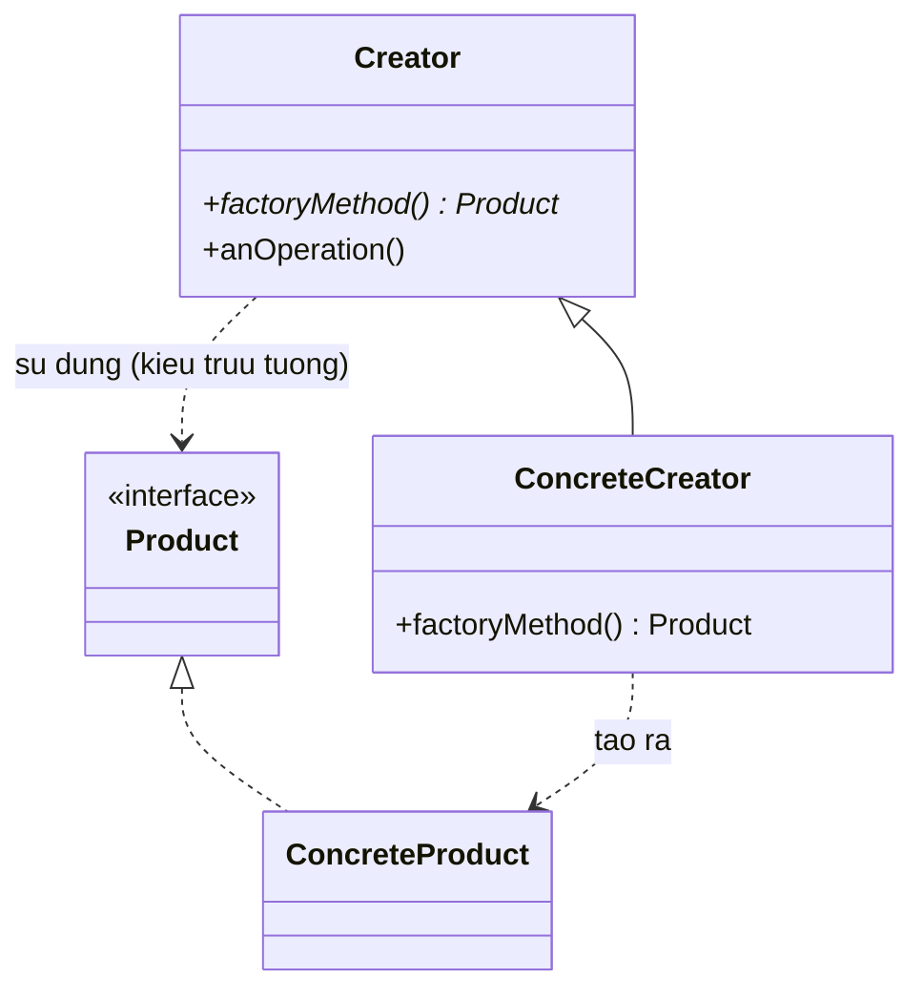

# Factory Method (Phương thức nhà máy)

## 1. Tên và phân loại
- **Tên:** Factory Method
- **Phân loại:** Creational (Mẫu khởi tạo) — thuộc nhóm mẫu **lớp** (class pattern).

## 2. Mục đích, ý định
Định nghĩa một **giao diện (interface) để tạo đối tượng**, nhưng **để các lớp con quyết định lớp cụ thể nào sẽ được khởi tạo**. Factory Method cho phép một lớp **trì hoãn việc khởi tạo** (instantiation) xuống cho các lớp con.

## 3. Bí danh
- **Virtual Constructor** (Hàm khởi tạo ảo).

## 4. Motivation (Động cơ)
Hãy tưởng tượng ta viết một **framework ứng dụng quản lý tài liệu** (`Application`) có thể mở/quản lý nhiều loại `Document`. Lớp `Application` biết **khi nào** cần tạo một tài liệu mới (lúc người dùng bấm "New"), nhưng **không biết** sẽ tạo loại tài liệu cụ thể nào — vì điều đó phụ thuộc ứng dụng cụ thể (ứng dụng vẽ tạo `DrawingDocument`, trình soạn thảo tạo `TextDocument`...).

Nếu trong `Application` ta viết thẳng `new TextDocument()` thì framework bị **trói cứng** vào một loại tài liệu cụ thể, không tái sử dụng được cho ứng dụng khác.

**Giải pháp Factory Method:** lớp `Application` khai báo một phương thức `createDocument()` (factory method) trả về kiểu trừu tượng `Document`. Mỗi ứng dụng cụ thể (lớp con của `Application`) **override** phương thức này để trả về loại tài liệu phù hợp. Nhờ đó `Application` chỉ làm việc với `Document` ở mức trừu tượng, còn "tạo loại nào" do lớp con quyết định.

## 5. Khả năng ứng dụng
Áp dụng Factory Method khi:

- Một lớp **không biết trước** lớp cụ thể của các đối tượng nó cần tạo.
- Muốn **lớp con tự quyết định** đối tượng được tạo ra.
- Muốn **khu trú (localize) tri thức** về việc lớp nào được khởi tạo vào một chỗ duy nhất, dễ thay đổi.

### ✅ Khi nào NÊN dùng
- Khi **không biết trước kiểu cụ thể** của đối tượng cần tạo lúc viết code lớp cha; kiểu đó do ngữ cảnh / lớp con / cấu hình quyết định.
- Khi muốn **mở rộng dễ dàng**: thêm một sản phẩm mới chỉ cần thêm một `ConcreteCreator` + `ConcreteProduct`, **không sửa** code đang chạy (tuân thủ nguyên lý Open/Closed).
- Khi muốn **tách rời (decouple)** code dùng sản phẩm khỏi code tạo sản phẩm — client chỉ phụ thuộc vào interface `Product`.
- Khi việc khởi tạo có **logic phức tạp** (chọn lớp con theo điều kiện) và muốn gom logic đó vào một phương thức rõ ràng.

### ❌ Khi nào KHÔNG nên dùng
- Khi chỉ có **một loại sản phẩm duy nhất** và **không có khả năng phát sinh thêm** → tạo trực tiếp bằng `new` cho đơn giản, đừng thêm tầng trừu tượng thừa.
- Khi việc thêm Factory Method làm **bùng nổ số lớp** (mỗi sản phẩm kéo theo một creator) mà lợi ích linh hoạt không tương xứng → cân nhắc **Simple Factory** (một phương thức `static` chọn theo tham số) cho gọn.
- Khi cần tạo **cả một họ (family) các sản phẩm liên quan** cùng lúc → dùng **Abstract Factory** sẽ phù hợp hơn.
- Khi đối tượng tạo ra giống nhau gần hết, chỉ khác vài tham số cấu hình → cân nhắc **Builder** hoặc **Prototype** thay vì đẻ ra nhiều lớp con.

> **Phân biệt nhanh:** *Simple Factory* (không phải mẫu GoF chính thức) dùng một phương thức chọn lớp theo tham số `switch/if`. *Factory Method* dùng **kế thừa + override** để lớp con quyết định. *Abstract Factory* tạo **nhiều sản phẩm cùng họ**.

## 6. Cấu trúc



Mô tả dạng văn bản:

```
   Creator (abstract)                 Product (interface)
   + anOperation()                    △
   + factoryMethod(): Product  - - -> │  (tra ve kieu Product)
        △                             │
        │ (override)            ConcreteProduct
   ConcreteCreator  - - - - - - - -> tao ConcreteProduct
   + factoryMethod(): Product
```

- `anOperation()` của `Creator` gọi `factoryMethod()` để lấy một `Product` mà **không cần biết** lớp cụ thể.

## 7. Các thành viên
- **Product** *(interface)* — định nghĩa giao diện của đối tượng mà factory method tạo ra.
- **ConcreteProduct** — lớp cụ thể hiện thực `Product`.
- **Creator** *(abstract)* — khai báo **factory method** trả về kiểu `Product`; có thể chứa cài đặt mặc định. Thường chứa các nghiệp vụ (`anOperation()`) gọi tới factory method để dùng sản phẩm.
- **ConcreteCreator** — **override** factory method để trả về một `ConcreteProduct` cụ thể.

## 8. Sự cộng tác
- `Creator` dựa vào lớp con của nó (`ConcreteCreator`) để định nghĩa factory method sao cho nó trả về đúng `ConcreteProduct`.
- Code nghiệp vụ trong `Creator` chỉ làm việc với `Product` ở mức interface, nên **độc lập** với loại sản phẩm cụ thể.

## 9. Các hệ quả mang lại
**Ưu điểm:**
- **Loại bỏ ràng buộc** giữa code và các lớp sản phẩm cụ thể (loose coupling) — client chỉ biết `Product`.
- **Tuân thủ Open/Closed:** thêm sản phẩm mới không phải sửa code hiện có.
- **Tuân thủ Single Responsibility:** gom logic tạo đối tượng vào một chỗ.
- Cung cấp **"hook" cho lớp con**: lớp con có cơ hội cung cấp phiên bản mở rộng của đối tượng.

**Nhược điểm:**
- **Tăng số lượng lớp**: mỗi sản phẩm mới thường kéo theo một creator con → cấu trúc phức tạp hơn.
- Có thể là **giải pháp thừa** cho bài toán đơn giản chỉ cần `new`.

## 10. Chú ý khi cài đặt
1. **Hai biến thể chính:**
   - `Creator` là **lớp trừu tượng** và *không* cung cấp cài đặt cho factory method → bắt buộc lớp con override.
   - `Creator` là lớp **cụ thể** và cung cấp **cài đặt mặc định** cho factory method (lớp con chỉ override khi cần).
2. **Factory method có tham số:** có thể nhận tham số (ví dụ một `enum`/`String`) để tạo nhiều loại sản phẩm trong cùng một phương thức.
3. **Tránh trùng lặp ở lớp con:** nếu mỗi lớp con chỉ override để đổi loại sản phẩm, cân nhắc dùng factory method **có tham số** hoặc kỹ thuật template kiểu generic.
4. **Đặt tên rõ ràng:** quy ước đặt tên `createX()`, `makeX()`, `newX()` để người đọc nhận ra ngay đây là factory method.

## 11. Mã nguồn minh họa
Ví dụ một hệ thống **hậu cần/vận chuyển (Logistics)**: lớp trừu tượng `Logistics` có nghiệp vụ `planDelivery()` dùng phương tiện `Transport`, nhưng **loại phương tiện** do lớp con quyết định qua factory method `createTransport()`.

Mã nguồn đầy đủ trong [src/](src/):
- [Transport.java](src/Transport.java) — interface `Product`.
- [Truck.java](src/Truck.java), [Ship.java](src/Ship.java) — `ConcreteProduct`.
- [Logistics.java](src/Logistics.java) — `Creator` trừu tượng (chứa factory method).
- [RoadLogistics.java](src/RoadLogistics.java), [SeaLogistics.java](src/SeaLogistics.java) — `ConcreteCreator`.
- [Main.java](src/Main.java) — demo.

```java
// Creator: khai bao factory method, code nghiep vu dung Product truu tuong
public abstract class Logistics {
    // Factory Method - lop con quyet dinh tao Transport nao
    public abstract Transport createTransport();

    // Nghiep vu: khong he biet lop Transport cu the
    public void planDelivery() {
        Transport t = createTransport();           // <- goi factory method
        System.out.print("Lap ke hoach giao hang: ");
        t.deliver();
    }
}

// ConcreteCreator: override de tao san pham cu the
public class RoadLogistics extends Logistics {
    @Override
    public Transport createTransport() {
        return new Truck();
    }
}
```

## 12. Ví dụ thực tế
- **java.util.Collection#iterator()** — mỗi loại collection trả về một `Iterator` cụ thể qua factory method.
- **java.lang.Object#toString()**? *(không)*; nhưng **java.text.NumberFormat#getInstance()**, **Calendar#getInstance()** là các factory method trả về thể hiện phù hợp theo locale.
- **javax.xml.parsers.DocumentBuilderFactory#newDocumentBuilder()**.
- **Spring** `BeanFactory#getBean()` — tạo bean theo định nghĩa.
- Các framework UI: phương thức tạo cửa sổ/tài liệu để lớp con (ứng dụng cụ thể) override.

## 13. Các mẫu liên quan
- **Abstract Factory:** thường được hiện thực **bằng** các Factory Method; khác biệt: Abstract Factory tạo *họ* nhiều sản phẩm liên quan, còn Factory Method tạo *một* sản phẩm.
- **Template Method:** Factory Method thường được gọi **bên trong** một Template Method (`planDelivery()` ở trên chính là một template gọi factory method).
- **Prototype:** thay vì kế thừa để tạo sản phẩm, Prototype tạo bằng cách **sao chép** đối tượng mẫu — không cần lớp con của Creator.
- **Simple Factory (idiom):** biến thể đơn giản dùng một phương thức `static` chọn lớp theo tham số; gọn hơn nhưng kém linh hoạt và vi phạm Open/Closed khi mở rộng.
