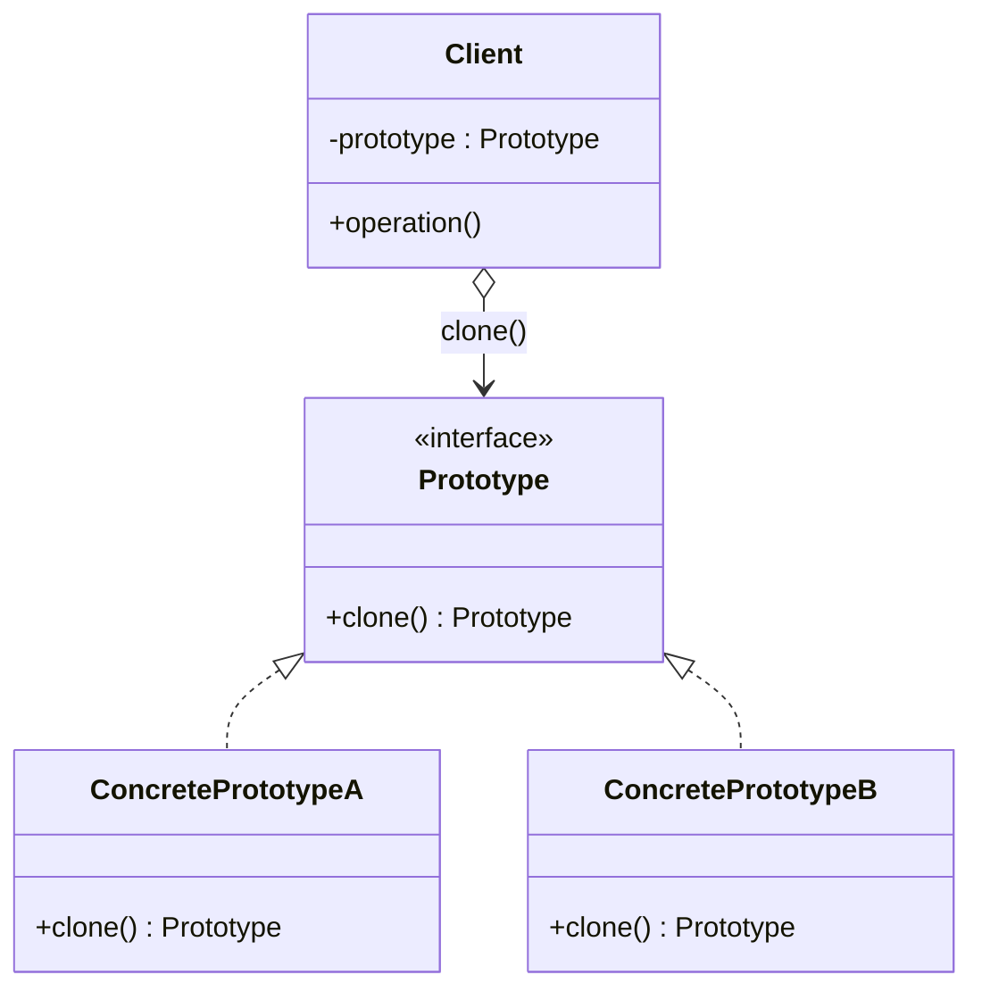

# Prototype (Nguyên mẫu)

## 1. Tên và phân loại
- **Tên:** Prototype
- **Phân loại:** Creational (Mẫu khởi tạo) — thuộc nhóm mẫu **đối tượng** (object pattern).

## 2. Mục đích, ý định
Xác định các loại đối tượng cần tạo bằng cách dùng **một thể hiện mẫu (prototype)**, và tạo đối tượng mới bằng cách **sao chép (clone)** thể hiện mẫu đó.

## 3. Bí danh
Không có bí danh phổ biến.

## 4. Motivation (Động cơ)
Giả sử ta làm **trình chỉnh sửa đồ họa**: người dùng có thể chèn nhiều hình (`Circle`, `Rectangle`...) với cấu hình phức tạp (màu, độ dày nét, hiệu ứng...). Khi người dùng nhấn "nhân bản (duplicate)", ta cần tạo một đối tượng **giống hệt** đối tượng đang chọn.

Nếu dùng `new` rồi gán lại từng thuộc tính, ta phải **biết lớp cụ thể** và **sao chép thủ công** mọi trường — dễ sót, và client bị trói vào lớp cụ thể. Một số đối tượng còn **tốn kém để khởi tạo** (đọc DB, tính toán nặng) nên tạo lại từ đầu là lãng phí.

**Giải pháp Prototype:** mỗi đối tượng cung cấp phương thức `clone()` tự sao chép chính nó. Client chỉ cần gọi `prototype.clone()` mà **không cần biết lớp cụ thể**, và việc sao chép tái sử dụng trạng thái đã có sẵn.

## 5. Khả năng ứng dụng
Áp dụng Prototype khi:

- Hệ thống cần **độc lập** với cách sản phẩm được tạo, kết hợp và biểu diễn.
- Lớp cần khởi tạo được **xác định lúc chạy** (ví dụ nạp động).
- Muốn **tránh xây dựng hệ phân cấp factory song song** với hệ phân cấp sản phẩm.
- Các thể hiện của lớp chỉ có **một vài tổ hợp trạng thái khác nhau** — tạo sẵn vài prototype rồi clone tiện hơn là tạo tay nhiều lần.

### ✅ Khi nào NÊN dùng
- Khi việc **tạo mới đối tượng tốn kém** (I/O, tính toán nặng) trong khi **sao chép** một mẫu có sẵn rẻ hơn.
- Khi muốn **tạo đối tượng mà không phụ thuộc lớp cụ thể** của nó — chỉ cần biết nó "clone được".
- Khi cần nhiều đối tượng **giống nhau gần hết, chỉ khác vài thuộc tính** → clone rồi chỉnh.
- Khi muốn **giảm số lớp con** so với cách dùng Factory Method (không cần một creator cho mỗi loại).

### ❌ Khi nào KHÔNG nên dùng
- Khi đối tượng **đơn giản, dễ tạo bằng `new`** → clone là thừa.
- Khi đối tượng có **đồ thị tham chiếu phức tạp / vòng lặp** khiến **deep copy** khó và dễ lỗi.
- Khi đối tượng chứa **tài nguyên không nên sao chép** (kết nối, file handle, khóa) → clone gây chia sẻ nhầm.
- Trong Java, `Cloneable`/`Object.clone()` có nhiều **cạm bẫy** (shallow copy, không gọi constructor) → cân nhắc **copy constructor** hoặc copy factory thay thế.

## 6. Cấu trúc



## 7. Các thành viên
- **Prototype** *(interface)* — khai báo phương thức `clone()`.
- **ConcretePrototype** — cài đặt `clone()` để tự sao chép chính nó.
- **Client** — tạo đối tượng mới bằng cách yêu cầu một prototype tự clone.

## 8. Sự cộng tác
- Client gọi `clone()` trên một prototype; prototype trả về một bản sao của chính nó. Client không cần biết lớp cụ thể.

## 9. Các hệ quả mang lại
**Ưu điểm:**
- **Thêm/bớt sản phẩm lúc chạy** bằng cách đăng ký/huỷ prototype.
- **Tạo đối tượng mà không ràng buộc lớp cụ thể**.
- **Giảm số lớp con** (không cần hệ phân cấp creator).
- **Cấu hình ứng dụng bằng các đối tượng động**: lắp ghép prototype rồi clone.

**Nhược điểm:**
- **Deep copy phức tạp** với đối tượng có tham chiếu lồng/vòng.
- Mỗi lớp phải **tự cài `clone()`** đúng (dễ sai với shallow vs deep).
- `Cloneable` của Java bị xem là thiết kế lỗi → cần cẩn trọng.

## 10. Chú ý khi cài đặt
1. **Shallow vs Deep copy:** sao chép nông chỉ copy tham chiếu (dùng chung đối tượng con); sao chép sâu copy cả đối tượng con. Chọn đúng theo ngữ nghĩa.
2. **Registry of prototypes:** giữ một "kho" các prototype mẫu (map theo khóa) để client lấy và clone — linh hoạt lúc chạy.
3. **Copy constructor (khuyến nghị trong Java):** thay vì `Cloneable`, cung cấp constructor `new Foo(Foo other)` rõ ràng, dễ kiểm soát deep copy.
4. **Khởi tạo lại sau clone:** một số trạng thái (ID, thời điểm tạo) nên đặt lại trên bản sao.

## 11. Mã nguồn minh họa
Ví dụ các hình vẽ (`Shape`) tự clone. Dùng **copy constructor** kết hợp interface `clone()` để deep copy an toàn.

Mã nguồn đầy đủ trong [src/](src/):
- [Shape.java](src/Shape.java) — interface Prototype.
- [Circle.java](src/Circle.java), [Rectangle.java](src/Rectangle.java) — ConcretePrototype.
- [Main.java](src/Main.java) — demo (gồm registry nhỏ).

```java
public interface Shape {
    Shape cloneShape();   // mỗi hình tự sao chép chính nó
    void draw();
}

public class Circle implements Shape {
    private int x, y, radius;
    private String color;

    public Circle(Circle src) {          // copy constructor (deep-ish)
        this.x = src.x; this.y = src.y;
        this.radius = src.radius; this.color = src.color;
    }

    @Override public Shape cloneShape() { return new Circle(this); }
}
```

## 12. Ví dụ thực tế
- **java.lang.Object#clone()** + interface **Cloneable**.
- **java.util.ArrayList#clone()**, **HashMap#clone()** (shallow copy).
- Sao chép cấu hình/khuôn mẫu đối tượng trong các trình thiết kế đồ họa, game (spawn quái từ prototype).
- **Spring** bean scope `prototype` (mỗi lần lấy bean tạo thể hiện mới — khác nghĩa "prototype" của GoF nhưng cùng tinh thần).

## 13. Các mẫu liên quan
- **Abstract Factory:** có thể dùng Prototype bên trong để tạo sản phẩm (clone nguyên mẫu thay vì new). Hai mẫu đôi khi cạnh tranh, đôi khi bổ trợ.
- **Composite & Decorator:** Prototype hữu ích để sao chép các cấu trúc cây phức tạp do hai mẫu này tạo.
- **Memento:** cũng liên quan đến việc chụp/khôi phục trạng thái đối tượng (nhưng mục đích khác).
