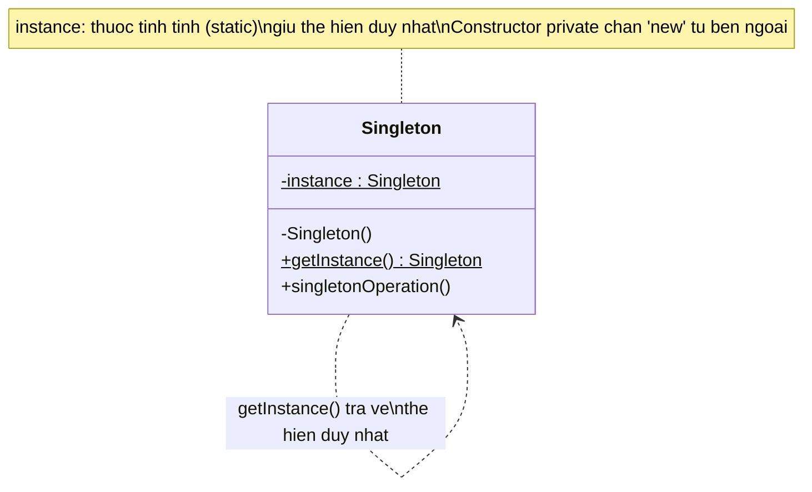

# Singleton (Mẫu đơn thể)

## 1. Tên và phân loại
- **Tên:** Singleton
- **Phân loại:** Creational (Mẫu khởi tạo) — thuộc nhóm mẫu **đối tượng** (object pattern).

## 2. Mục đích, ý định
Đảm bảo một lớp **chỉ có duy nhất một thể hiện (instance)** trong toàn bộ chương trình, đồng thời cung cấp một **điểm truy cập toàn cục** đến thể hiện đó.

## 3. Bí danh
Không có bí danh phổ biến. (Đôi khi được gọi không chính thức là "single instance".)

## 4. Motivation (Động cơ)
Trong nhiều hệ thống, có những đối tượng mà về mặt logic **chỉ nên tồn tại đúng một bản**:

- Một ứng dụng chỉ có **một trình quản lý cấu hình** (Configuration Manager) đọc file cấu hình.
- Một hệ thống chỉ có **một bộ ghi log** (Logger) ghi ra cùng một file.
- Một ứng dụng chỉ kết nối tới **một connection pool** cơ sở dữ liệu.

Nếu để code tự do tạo nhiều đối tượng `Logger`, ta sẽ gặp rắc rối: nhiều handle mở cùng một file, ghi đè lẫn nhau, tốn tài nguyên, trạng thái không nhất quán. Ta cần một cách **bắt buộc** chỉ có một thể hiện và mọi nơi trong chương trình đều truy cập đúng thể hiện đó.

Giải pháp của Singleton: cho **chính lớp đó tự chịu trách nhiệm** giữ thể hiện duy nhất của mình — đặt constructor là `private` để không ai bên ngoài `new` được, và cung cấp một phương thức tĩnh `getInstance()` trả về thể hiện duy nhất.

## 5. Khả năng ứng dụng
Áp dụng Singleton khi:

- Phải có **đúng một thể hiện** của một lớp, và thể hiện đó cần được truy cập từ một điểm chung đã biết.
- Thể hiện duy nhất đó cần có khả năng **mở rộng bằng kế thừa** (subclass), và client dùng thể hiện mở rộng mà không phải sửa code.
- Các đối tượng quản lý tài nguyên dùng chung: cấu hình, log, cache, connection pool, thread pool, registry...

### ✅ Khi nào NÊN dùng
- Đối tượng **bản chất chỉ tồn tại một bản** trong toàn hệ thống và việc tạo nhiều bản là vô nghĩa hoặc gây sai (ví dụ: trình quản lý cấu hình đọc một file, registry, bộ định danh ID toàn cục).
- Cần **kiểm soát chặt truy cập** tới một tài nguyên dùng chung **đắt đỏ** để khởi tạo (connection pool, thread pool, cache) — tạo một lần, dùng lại.
- Cần **một điểm truy cập toàn cục** nhưng muốn tránh biến global "trần"; Singleton bọc lại sau `getInstance()`.
- Thể hiện duy nhất đó **gần như không có trạng thái thay đổi** (stateless / chỉ đọc), nên việc chia sẻ chung không gây tác dụng phụ.

### ❌ Khi nào KHÔNG nên dùng
- **Chỉ vì muốn truy cập tiện cho nhanh** (dùng như biến toàn cục) — đây là lạm dụng phổ biến nhất, tạo coupling ẩn khắp nơi. → Hãy **truyền phụ thuộc qua tham số / Dependency Injection**.
- Đối tượng **có nhiều trạng thái thay đổi** và bị nhiều nơi ghi đồng thời → dễ sinh bug khó lần và lỗi đua dữ liệu (race condition).
- Trong **code cần unit test** dễ dàng: Singleton giữ trạng thái xuyên suốt giữa các test, khó mock/cô lập, các test ảnh hưởng lẫn nhau. → Dùng interface + DI để có thể thay bằng bản giả (mock/stub).
- Khi thực ra **có thể cần nhiều hơn một thể hiện về sau** (đa cấu hình, đa tenant, đa kết nối) — Singleton sẽ trói cứng "chỉ một", rất tốn công gỡ.
- Trong **môi trường phân tán / nhiều JVM**: "một thể hiện mỗi JVM" **không** đảm bảo duy nhất toàn cụm → cần giải pháp khác (DB, distributed lock...).

> **Quy tắc nhanh:** nếu câu trả lời cho *"Việc tồn tại 2 thể hiện có gây sai về mặt nghiệp vụ không?"* là **CÓ** → cân nhắc Singleton. Nếu chỉ là *"cho tiện truy cập"* → **đừng** dùng, hãy tiêm phụ thuộc (DI).

## 6. Cấu trúc

Sơ đồ lớp (UML) — GitHub render trực tiếp khối Mermaid dưới đây:



Mô tả dạng văn bản (phòng khi trình xem không render Mermaid):

```
┌─────────────────────────────┐
│          Singleton          │
├─────────────────────────────┤
│ - instance : Singleton      │  ← thuộc tính tĩnh giữ thể hiện duy nhất
├─────────────────────────────┤
│ - Singleton()               │  ← constructor private
│ + getInstance() : Singleton │  ← điểm truy cập toàn cục (static)
│ + singletonOperation()      │
└─────────────────────────────┘
        │
        └──── return instance (luôn cùng một đối tượng)
```

## 7. Các thành viên
- **Singleton**
  - Định nghĩa một phương thức tĩnh `getInstance()` cho phép client truy cập thể hiện duy nhất.
  - Tự chịu trách nhiệm tạo và lưu giữ thể hiện duy nhất của chính nó (qua thuộc tính tĩnh `instance`).
  - Có thể chứa các dữ liệu/trạng thái dùng chung và các phương thức nghiệp vụ (`singletonOperation()`).

## 8. Sự cộng tác
- Client **không bao giờ** gọi `new Singleton()` trực tiếp (vì constructor là `private`).
- Mọi client truy cập thể hiện **chỉ thông qua** `Singleton.getInstance()`.
- Lần gọi đầu tiên sẽ khởi tạo đối tượng; các lần sau trả về **cùng** đối tượng đã tạo → mọi client chia sẻ chung một trạng thái.

## 9. Các hệ quả mang lại
**Ưu điểm:**
- **Kiểm soát chặt chẽ** việc truy cập thể hiện duy nhất.
- **Giảm không gian tên toàn cục** (namespace): không cần biến global, thay bằng `getInstance()`.
- Cho phép **làm mịn (refine) bằng kế thừa**: có thể tạo subclass và cấu hình instance trả về lúc chạy.
- Cho phép **kiểm soát số lượng thể hiện** linh hoạt (nếu sau này cần nhiều hơn 1, dễ điều chỉnh).
- **Khởi tạo trễ (lazy)** — chỉ tạo khi thật sự cần.

**Nhược điểm:**
- Đóng vai trò gần như **biến toàn cục** → dễ tạo ràng buộc ẩn (hidden coupling) giữa các module.
- **Khó kiểm thử (unit test)**: trạng thái dùng chung tồn tại xuyên suốt, khó mock/cô lập.
- Vi phạm **Nguyên lý đơn trách nhiệm** (SRP): vừa quản lý vòng đời của chính nó, vừa làm nghiệp vụ.
- **Vấn đề đa luồng**: nếu cài đặt cẩu thả, nhiều thread có thể tạo nhiều thể hiện.

## 10. Chú ý khi cài đặt
1. **Constructor phải `private`** để chặn việc khởi tạo từ bên ngoài.
2. **An toàn đa luồng (thread-safety):** cài đặt lazy đơn giản (`if (instance == null)`) **không an toàn** khi nhiều thread chạy song song. Các cách khắc phục trong Java:
   - **Eager initialization:** `private static final Singleton INSTANCE = new Singleton();` — đơn giản, an toàn, nhưng tạo ngay cả khi không dùng.
   - **Double-Checked Locking** với từ khóa `volatile`.
   - **Initialization-on-demand holder** (lớp static lồng bên trong) — lazy + thread-safe, không cần `synchronized`.
   - **Enum Singleton** — cách Joshua Bloch khuyến nghị: an toàn đa luồng, chống serialization và reflection.
3. **Serialization:** khi deserialize có thể tạo ra thể hiện mới → cần định nghĩa `readResolve()` để trả về instance hiện có (hoặc dùng enum).
4. **Reflection:** có thể phá Singleton bằng cách gọi constructor private qua reflection → enum miễn nhiễm với điều này.

## 11. Mã nguồn minh họa
Ví dụ một `Logger` Singleton dùng kiểu **Initialization-on-demand holder** (lazy + an toàn đa luồng). Mã nguồn đầy đủ trong thư mục [src/](src/):
- [Logger.java](src/Logger.java) — lớp Singleton.
- [Main.java](src/Main.java) — chương trình demo chứng minh chỉ có một thể hiện.

```java
public final class Logger {
    // Constructor private: chặn new từ bên ngoài
    private Logger() {
        System.out.println(">> Khoi tao Logger (chi xay ra 1 lan)");
    }

    // Holder tĩnh: chỉ được nạp khi getInstance() được gọi lần đầu (lazy + thread-safe)
    private static class Holder {
        private static final Logger INSTANCE = new Logger();
    }

    public static Logger getInstance() {
        return Holder.INSTANCE;
    }

    public void log(String message) {
        System.out.println("[LOG] " + message);
    }
}
```

Trong `Main.java`, dù gọi `Logger.getInstance()` nhiều lần, ta luôn nhận **cùng một đối tượng** (so sánh `==` cho kết quả `true`).

## 12. Ví dụ thực tế
- **java.lang.Runtime** — `Runtime.getRuntime()` trả về một thể hiện duy nhất cho mỗi ứng dụng Java.
- **java.awt.Desktop** — `Desktop.getDesktop()`.
- **Spring Framework** — bean mặc định có scope `singleton` (một instance cho mỗi container).
- **Logger** trong các thư viện logging (ví dụ thể hiện cấu hình log dùng chung).
- **java.lang.System** — quản lý các tài nguyên hệ thống dùng chung (in/out/err).

## 13. Các mẫu liên quan
- **Abstract Factory, Builder, Prototype:** các factory/builder thường được hiện thực dưới dạng Singleton (chỉ cần một bộ tạo đối tượng).
- **Facade:** đối tượng Facade thường là Singleton vì chỉ cần một điểm truy cập tới hệ thống con.
- **State / Strategy:** các đối tượng state/strategy không trạng thái thường được dùng lại dưới dạng Singleton.
- **Phân biệt với Monostate (Borg):** Monostate cho phép tạo nhiều thể hiện nhưng tất cả chia sẻ chung trạng thái tĩnh; Singleton chỉ có đúng một thể hiện.
- **Lưu ý:** ngày nay nhiều người ưu tiên **Dependency Injection** thay cho Singleton "thủ công" để dễ kiểm thử hơn.
