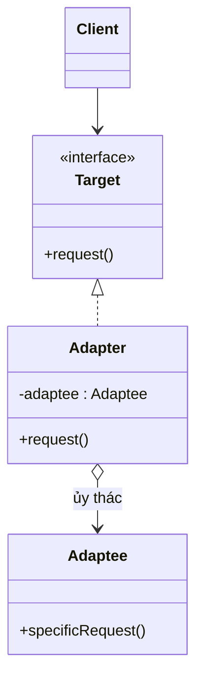

# Adapter (Bộ chuyển đổi)

## 1. Tên và phân loại
- **Tên:** Adapter
- **Phân loại:** Structural (Mẫu cấu trúc) — có **hai biến thể**: Adapter lớp (class adapter, dùng kế thừa) và Adapter đối tượng (object adapter, dùng kết hợp).

## 2. Mục đích, ý định
**Chuyển đổi giao diện** của một lớp thành một giao diện khác mà client mong đợi. Adapter cho phép các lớp **vốn không tương thích về giao diện** có thể làm việc cùng nhau.

## 3. Bí danh
- **Wrapper** (Lớp bọc).

## 4. Motivation (Động cơ)
Giả sử ứng dụng của ta dùng một interface chung `MediaPlayer` để phát nhạc. Nay ta muốn tích hợp một **thư viện bên thứ ba** phát định dạng nâng cao (`AdvancedPlayer`) nhưng nó có **giao diện khác** (`playMp4(file)`), không khớp `MediaPlayer.play(file)`.

Ta **không thể (và không nên) sửa** thư viện bên thứ ba. Cũng không muốn sửa toàn bộ client đang dùng `MediaPlayer`.

**Giải pháp Adapter:** tạo một lớp `MediaAdapter` **cài đặt `MediaPlayer`** (giao diện client mong đợi) và **bên trong ủy thác** cho `AdvancedPlayer`. Adapter "dịch" lời gọi `play()` thành `playMp4()`. Nhờ đó client tiếp tục dùng `MediaPlayer` mà vẫn tận dụng được thư viện mới.

## 5. Khả năng ứng dụng
Áp dụng Adapter khi:

- Muốn dùng một lớp đã có nhưng **giao diện của nó không khớp** với cái bạn cần.
- Muốn tạo một lớp **tái sử dụng** có thể làm việc với các lớp **chưa biết trước**, giao diện có thể không tương thích.
- (Object adapter) cần dùng **nhiều lớp con** nhưng không tiện kế thừa từng cái — adapter bọc lớp cha và thêm phần thiếu.

### ✅ Khi nào NÊN dùng
- Khi cần **tích hợp lớp/thư viện có sẵn** mà giao diện **không khớp** với phần còn lại của hệ thống, và **không sửa được** mã nguồn lớp đó.
- Khi muốn **tái sử dụng** code cũ/legacy trong hệ thống mới có interface khác.
- Khi muốn **cô lập** phần phụ thuộc bên thứ ba sau một interface ổn định (dễ thay thế về sau).

### ❌ Khi nào KHÔNG nên dùng
- Khi bạn **kiểm soát được cả hai phía** và có thể sửa giao diện cho khớp ngay từ đầu → đừng thêm adapter thừa.
- Khi cần làm **nhiều hơn là dịch giao diện** (thêm hành vi, kết hợp nhiều đối tượng) → cân nhắc **Facade** (đơn giản hóa) hoặc **Decorator** (thêm trách nhiệm).
- Khi số adapter chồng chất làm **rối luồng gọi** → cân nhắc tái thiết kế giao diện chung.

> **Phân biệt nhanh:** *Adapter* đổi **giao diện** của cái đã có (không đổi chức năng). *Decorator* **giữ nguyên giao diện** nhưng **thêm trách nhiệm**. *Facade* tạo **giao diện mới đơn giản** cho cả một hệ thống con. *Bridge* tách giao diện khỏi cài đặt **ngay từ thiết kế** (Adapter dùng cho cái đã lỡ tồn tại).

## 6. Cấu trúc

**Object Adapter (kết hợp — khuyến nghị):**



## 7. Các thành viên
- **Target** *(interface)* — giao diện mà Client mong đợi/sử dụng.
- **Client** — làm việc với các đối tượng qua giao diện `Target`.
- **Adaptee** — lớp đã có sẵn với giao diện **không tương thích**, cần được điều chỉnh.
- **Adapter** — cài đặt `Target` và **chuyển lời gọi** sang `Adaptee` (object adapter: chứa một tham chiếu Adaptee; class adapter: kế thừa Adaptee).

## 8. Sự cộng tác
- Client gọi `request()` trên `Adapter` (kiểu `Target`); `Adapter` chuyển thành lời gọi `specificRequest()` trên `Adaptee` và (nếu cần) chuyển đổi dữ liệu qua lại.

## 9. Các hệ quả mang lại
**Ưu điểm:**
- **Tái sử dụng** lớp có sẵn dù giao diện không khớp.
- **Tách biệt** client khỏi lớp được điều chỉnh (Single Responsibility, Open/Closed).
- **Object adapter** có thể bọc Adaptee và mọi lớp con của nó.

**Nhược điểm:**
- **Tăng độ phức tạp** (thêm lớp/đối tượng trung gian).
- **Class adapter** (kế thừa) bị giới hạn (Java đơn kế thừa) và trói Adapter vào một lớp Adaptee cụ thể.

## 10. Chú ý khi cài đặt
1. **Object adapter vs class adapter:** trong Java ưu tiên **object adapter** (kết hợp) vì linh hoạt hơn và không vướng đơn kế thừa.
2. **Hai chiều (two-way adapter):** có thể cài nhiều interface để cả hai phía dùng được.
3. **Mức độ "dịch":** adapter chỉ nên dịch giao diện; nếu phải thêm nhiều logic, cân nhắc mẫu khác.
4. **Pluggable adapter:** tham số hóa adapter để dùng cho nhiều adaptee.

## 11. Mã nguồn minh họa
Ví dụ: client dùng `MediaPlayer.play()`; `MediaAdapter` bọc `AdvancedPlayer` (thư viện ngoài, giao diện khác).

Mã nguồn đầy đủ trong [src/](src/):
- [MediaPlayer.java](src/MediaPlayer.java) — Target.
- [AdvancedPlayer.java](src/AdvancedPlayer.java), [Mp4Player.java](src/Mp4Player.java) — Adaptee.
- [MediaAdapter.java](src/MediaAdapter.java) — Adapter.
- [Main.java](src/Main.java) — Client demo.

```java
// Target: giao diện client mong đợi
public interface MediaPlayer { void play(String fileName); }

// Adapter: cài Target, ủy thác cho Adaptee có giao diện khác
public class MediaAdapter implements MediaPlayer {
    private final AdvancedPlayer advanced = new Mp4Player();
    @Override public void play(String fileName) {
        advanced.playMp4(fileName);   // dịch play() -> playMp4()
    }
}
```

## 12. Ví dụ thực tế
- **java.util.Arrays#asList()** — biến mảng thành `List`.
- **java.io.InputStreamReader / OutputStreamWriter** — adapter giữa byte stream và char stream.
- **javax.xml.bind.annotation.adapters.XmlAdapter**.
- **Arrays.asList**, **Collections.list(Enumeration)** — adapter giữa các API collection cũ/mới.
- Các lớp `*Adapter` trong Java Swing/AWT (`MouseAdapter`...) — biến thể đơn giản hóa interface.

## 13. Các mẫu liên quan
- **Bridge:** cấu trúc tương tự nhưng **mục đích khác** — Bridge tách giao diện/cài đặt **ngay từ đầu** để chúng biến đổi độc lập; Adapter sửa cho hai thứ **đã tồn tại** làm việc được với nhau.
- **Decorator:** giữ nguyên giao diện và thêm chức năng (Adapter đổi giao diện).
- **Facade:** định nghĩa giao diện mới đơn giản cho cả hệ thống con (Adapter làm cho một giao diện có sẵn khớp).
- **Proxy:** giữ nguyên giao diện và kiểm soát truy cập (không đổi giao diện như Adapter).
