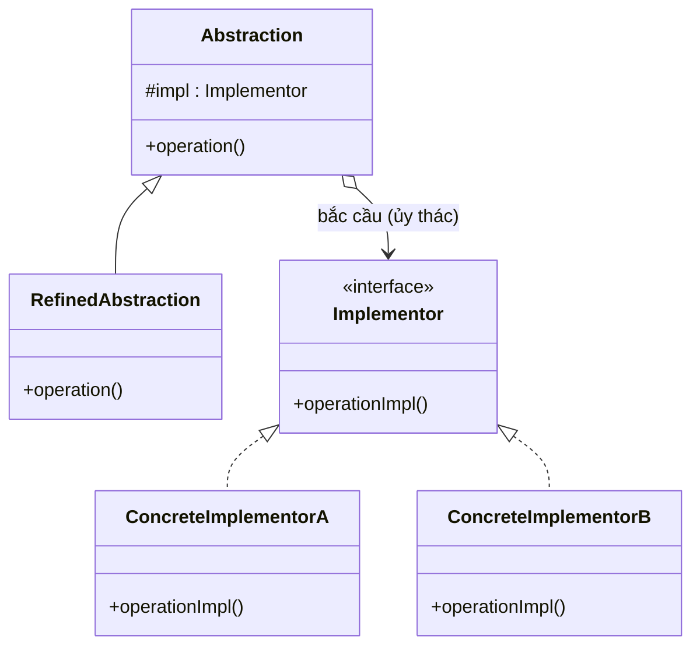

# Bridge (Cây cầu)

## 1. Tên và phân loại
- **Tên:** Bridge
- **Phân loại:** Structural (Mẫu cấu trúc) — thuộc nhóm mẫu **đối tượng** (object pattern).

## 2. Mục đích, ý định
**Tách rời (decouple)** một **trừu tượng (abstraction)** khỏi **phần cài đặt (implementation)** của nó, để cả hai có thể **biến đổi độc lập** với nhau.

## 3. Bí danh
- **Handle/Body**.

## 4. Motivation (Động cơ)
Giả sử ta thiết kế các loại **điều khiển từ xa (Remote)**: `BasicRemote`, `AdvancedRemote`... dùng cho nhiều **thiết bị**: `TV`, `Radio`...

Nếu dùng **kế thừa** để phủ mọi tổ hợp, ta sẽ phải tạo `BasicTvRemote`, `BasicRadioRemote`, `AdvancedTvRemote`, `AdvancedRadioRemote`... — **bùng nổ tổ hợp lớp** (M loại remote × N loại thiết bị = M×N lớp). Thêm một thiết bị mới phải thêm cả loạt lớp.

Vấn đề: ta đang trộn **hai chiều biến đổi độc lập** (loại remote và loại thiết bị) vào một cây kế thừa duy nhất.

**Giải pháp Bridge:** tách thành **hai phân cấp riêng**:
- **Abstraction** (`Remote`) — phần "điều khiển ở mức cao", giữ một tham chiếu tới...
- **Implementor** (`Device`) — phần "thiết bị" với các thao tác cơ bản.

`Remote` **ủy thác** công việc cho `Device`. Giờ M loại remote + N loại thiết bị = **M+N lớp** và mỗi chiều biến đổi độc lập.

## 5. Khả năng ứng dụng
Áp dụng Bridge khi:

- Muốn **tránh ràng buộc cố định** giữa trừu tượng và cài đặt (ví dụ chọn/đổi cài đặt lúc chạy).
- Cả **trừu tượng và cài đặt** đều cần **mở rộng độc lập** bằng kế thừa.
- Thay đổi cài đặt **không được ảnh hưởng** tới client (không phải biên dịch lại).
- Muốn **tránh bùng nổ số lớp** do nhiều chiều biến đổi (như ví dụ trên).

### ✅ Khi nào NÊN dùng
- Khi một lớp có **hai (hoặc nhiều) chiều biến đổi độc lập** (vd: hình dạng × cách vẽ; remote × thiết bị; báo cáo × định dạng xuất).
- Khi muốn **đổi phần cài đặt lúc chạy** mà không ảnh hưởng phía trừu tượng.
- Khi muốn **chia sẻ một cài đặt** giữa nhiều đối tượng và giấu chi tiết khỏi client.

### ❌ Khi nào KHÔNG nên dùng
- Khi chỉ có **một chiều biến đổi** → kế thừa đơn giản là đủ, Bridge làm phức tạp hóa thừa.
- Khi trừu tượng và cài đặt **gắn chặt tự nhiên**, ít khả năng tách → tách ra chỉ thêm tầng gián tiếp vô ích.
- Khi nhóm phát triển nhỏ và **độ phức tạp không đáng** so với lợi ích.

> **Phân biệt nhanh:** *Bridge* được thiết kế **trước (up-front)** để hai phía biến đổi độc lập. *Adapter* dùng **sau** để làm hai thứ đã tồn tại khớp nhau. Cấu trúc UML giống nhau, **ý định khác nhau**.

## 6. Cấu trúc



## 7. Các thành viên
- **Abstraction** (`Remote`) — định nghĩa giao diện trừu tượng mức cao; giữ tham chiếu tới `Implementor`.
- **RefinedAbstraction** (`AdvancedRemote`) — mở rộng giao diện của Abstraction.
- **Implementor** (`Device`) *(interface)* — định nghĩa giao diện cho các lớp cài đặt (thường là thao tác cơ bản, **không** trùng với Abstraction).
- **ConcreteImplementor** (`TV`, `Radio`) — cài đặt cụ thể của Implementor.

## 8. Sự cộng tác
- `Abstraction` chuyển các yêu cầu của client cho đối tượng `Implementor` của nó (ủy thác). "Cây cầu" chính là tham chiếu từ Abstraction tới Implementor.

## 9. Các hệ quả mang lại
**Ưu điểm:**
- **Tách rời giao diện và cài đặt**: chọn/đổi cài đặt lúc chạy.
- **Khả năng mở rộng tốt**: hai phân cấp mở rộng độc lập (tránh bùng nổ lớp).
- **Giấu chi tiết cài đặt** khỏi client (Open/Closed, Single Responsibility).

**Nhược điểm:**
- **Tăng độ phức tạp** ban đầu (nhiều lớp/tầng gián tiếp) — chỉ đáng khi thực sự có nhiều chiều biến đổi.

## 10. Chú ý khi cài đặt
1. **Chỉ một Implementor?** Vẫn có ích để tách biên dịch/giấu chi tiết, nhưng cân nhắc có thực sự cần.
2. **Tạo đúng ConcreteImplementor:** thường dùng Abstract Factory/Factory để quyết định cài đặt nào.
3. **Chia sẻ Implementor:** nhiều Abstraction có thể dùng chung một Implementor (kết hợp ý tưởng đếm tham chiếu).
4. **Phân tầng giao diện:** Implementor nên chứa **thao tác nguyên thủy**, Abstraction lắp ghép chúng thành thao tác mức cao.

## 11. Mã nguồn minh họa
Ví dụ: `Remote` (Abstraction) điều khiển `Device` (Implementor). Thêm `AdvancedRemote` và thêm `Radio` độc lập nhau.

Mã nguồn đầy đủ trong [src/](src/):
- [Device.java](src/Device.java) — Implementor.
- [TV.java](src/TV.java), [Radio.java](src/Radio.java) — ConcreteImplementor.
- [Remote.java](src/Remote.java) — Abstraction.
- [AdvancedRemote.java](src/AdvancedRemote.java) — RefinedAbstraction.
- [Main.java](src/Main.java) — demo.

```java
public class Remote {                    // Abstraction
    protected Device device;             // <- cây cầu tới Implementor
    public Remote(Device device) { this.device = device; }
    public void togglePower() {
        if (device.isEnabled()) device.disable();
        else device.enable();
    }
}
```

## 12. Ví dụ thực tế
- **JDBC** — `java.sql.Driver` là cầu nối giữa API JDBC (abstraction) và driver CSDL cụ thể (implementor).
- **java.util.logging / SLF4J** — API logging tách khỏi backend cài đặt (Logback, Log4j).
- **AWT** — các lớp `java.awt.*` (abstraction) và `peer` theo nền tảng (implementor).
- Trình điều khiển đồ họa: API vẽ tách khỏi cài đặt theo thiết bị/hệ điều hành.

## 13. Các mẫu liên quan
- **Adapter:** giống cấu trúc nhưng dùng để khớp hai thứ đã tồn tại; Bridge thiết kế trước để biến đổi độc lập.
- **Abstract Factory:** có thể tạo và cấu hình các Bridge (chọn Implementor phù hợp).
- **State / Strategy:** cũng ủy thác cho một đối tượng khác, nhưng mục đích là đổi hành vi, còn Bridge nhằm tách phân cấp.
