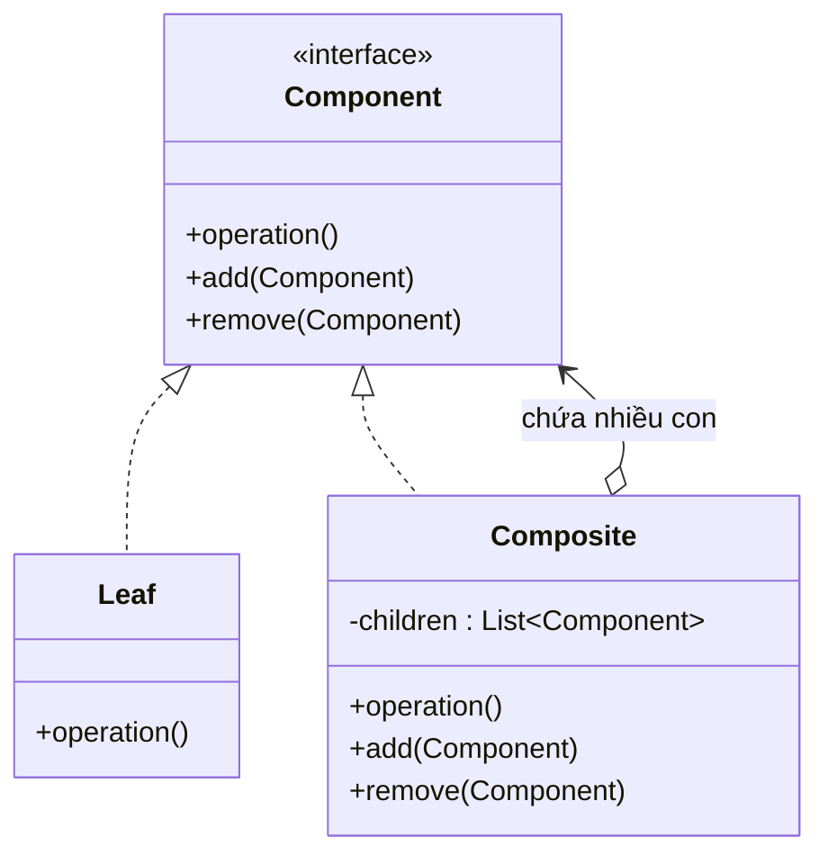

# Composite (Cấu trúc cây / Hợp thành)

## 1. Tên và phân loại
- **Tên:** Composite
- **Phân loại:** Structural (Mẫu cấu trúc) — thuộc nhóm mẫu **đối tượng** (object pattern).

## 2. Mục đích, ý định
Tổ chức các đối tượng thành **cấu trúc cây** để biểu diễn quan hệ **toàn thể - bộ phận (part-whole)**. Composite cho phép client **đối xử đồng nhất** với đối tượng đơn lẻ (leaf) và nhóm đối tượng (composite).

## 3. Bí danh
Không có bí danh phổ biến.

## 4. Motivation (Động cơ)
Hãy nghĩ tới **hệ thống tập tin**: có `File` (lá) và `Folder` (thư mục) — thư mục lại chứa file và thư mục con khác. Hoặc một **trình vẽ đồ họa**: một hình đơn (`Circle`) và một nhóm hình (`Group`) chứa nhiều hình con.

Nếu client phải **phân biệt** "đây là đối tượng đơn hay là nhóm" mỗi khi xử lý (tính kích thước, vẽ, di chuyển...), code sẽ đầy rẫy `if (isGroup) ... else ...` và rất khó bảo trì khi cây lồng nhiều tầng.

**Giải pháp Composite:** định nghĩa một interface chung `Component` cho **cả lá lẫn nhóm**. `Composite` (nhóm) chứa danh sách `Component` con và khi được yêu cầu làm gì đó (vd `getSize()`), nó **chuyển tiếp yêu cầu xuống các con** rồi tổng hợp. Client chỉ gọi `component.operation()` mà **không cần biết** đó là lá hay nhóm.

## 5. Khả năng ứng dụng
Áp dụng Composite khi:

- Muốn biểu diễn cấu trúc **toàn thể - bộ phận** dạng **cây phân cấp**.
- Muốn client **bỏ qua sự khác biệt** giữa đối tượng đơn và nhóm — xử lý đồng nhất.

### ✅ Khi nào NÊN dùng
- Khi dữ liệu/đối tượng có cấu trúc **cây lồng nhau** (file/thư mục, menu/mục con, hình/nhóm hình, tổ chức công ty).
- Khi muốn client **xử lý đồng nhất** lá và nhóm qua một interface chung → loại bỏ `if/else` kiểm tra kiểu.
- Khi muốn **đệ quy** thực hiện thao tác trên toàn cây một cách tự nhiên.

### ❌ Khi nào KHÔNG nên dùng
- Khi cấu trúc **không có tính phân cấp/đệ quy** → Composite là gượng ép.
- Khi lá và nhóm có hành vi **quá khác nhau**, ép chung một interface khiến interface bị "loãng" (nhiều phương thức vô nghĩa với lá, ví dụ `add()`/`remove()` trên lá).
- Khi cần **ràng buộc kiểu chặt** (chỉ một loại con nhất định) → interface chung làm mất kiểm soát kiểu lúc biên dịch.

> **Lưu ý thiết kế:** đặt `add()/remove()` ở đâu là đánh đổi giữa **trong suốt (transparency)** — đặt ở `Component` để mọi node giống nhau, nhưng lá phải xử lý lời gọi vô nghĩa; và **an toàn (safety)** — chỉ đặt ở `Composite`, nhưng client phải ép kiểu.

## 6. Cấu trúc



## 7. Các thành viên
- **Component** *(interface/abstract)* — khai báo giao diện chung cho mọi đối tượng trong cây; có thể khai báo các thao tác quản lý con (`add`, `remove`).
- **Leaf** — đối tượng lá (không có con); cài đặt hành vi nguyên thủy.
- **Composite** — node có con; lưu danh sách `Component` con và cài đặt thao tác bằng cách **chuyển tiếp xuống các con**.
- **Client** — thao tác với các đối tượng trong cây qua interface `Component`.

## 8. Sự cộng tác
- Client gửi yêu cầu qua `Component`. Nếu là `Leaf`, nó tự xử lý. Nếu là `Composite`, nó chuyển yêu cầu cho các con (thường có xử lý trước/sau) → **đệ quy** xuống toàn cây.

## 9. Các hệ quả mang lại
**Ưu điểm:**
- **Cây phân cấp** tùy ý sâu, xử lý đồng nhất lá và nhóm.
- **Đơn giản hóa client**: không cần phân biệt loại node.
- **Dễ thêm loại Component mới** (Open/Closed).

**Nhược điểm:**
- **Khó ràng buộc kiểu** các con của một Composite (interface chung quá tổng quát).
- Thiết kế có thể **quá tổng quát**: interface chứa cả thao tác chỉ hợp với composite (gây khó cho leaf).

## 10. Chú ý khi cài đặt
1. **Tham chiếu cha (parent):** lưu con trỏ tới cha giúp duyệt ngược và quản lý dễ hơn.
2. **Chia sẻ component:** dùng [[structural-flyweight|Flyweight]] để chia sẻ lá lặp lại, tiết kiệm bộ nhớ.
3. **Vị trí của add/remove:** chọn transparency (ở Component) hay safety (ở Composite) — đánh đổi đã nêu ở mục 5.
4. **Lưu danh sách con:** thường dùng `List`; cân nhắc thứ tự con nếu có ý nghĩa.
5. **Cache kết quả:** với cây lớn, có thể cache kết quả tổng hợp (vd tổng kích thước) và làm mất hiệu lực khi cây đổi.

## 11. Mã nguồn minh họa
Ví dụ **hệ thống tập tin**: `File` (Leaf) và `Folder` (Composite), tính tổng kích thước đệ quy.

Mã nguồn đầy đủ trong [src/](src/):
- [FileSystemNode.java](src/FileSystemNode.java) — Component.
- [FileLeaf.java](src/FileLeaf.java) — Leaf.
- [Folder.java](src/Folder.java) — Composite.
- [Main.java](src/Main.java) — demo.

```java
public class Folder implements FileSystemNode {     // Composite
    private final List<FileSystemNode> children = new ArrayList<>();
    public void add(FileSystemNode node) { children.add(node); }

    @Override public int getSize() {                // chuyển tiếp xuống con
        int total = 0;
        for (FileSystemNode c : children) total += c.getSize();
        return total;
    }
}
```

## 12. Ví dụ thực tế
- **java.awt.Container / Component**, **javax.swing.JComponent** — cây UI: panel chứa các control.
- **org.w3c.dom.Node** (cây DOM XML/HTML).
- **java.io.File** (mô hình hóa cây thư mục — dù không thuần Composite).
- Cây menu, cây tổ chức, biểu thức cú pháp (AST), cây cảnh (scene graph) trong game.

## 13. Các mẫu liên quan
- **Iterator:** dùng để duyệt cây Composite.
- **Visitor:** dùng để thực hiện thao tác trên toàn cây mà không sửa các lớp node.
- **Decorator:** thường đi cùng Composite (đều dựa trên cấu trúc đệ quy); Decorator thêm trách nhiệm cho một component, Composite gom nhiều component.
- **Flyweight:** chia sẻ các node lá lặp lại.
- **Chain of Responsibility:** liên kết cha-con của Composite có thể dùng cho chuỗi trách nhiệm.
