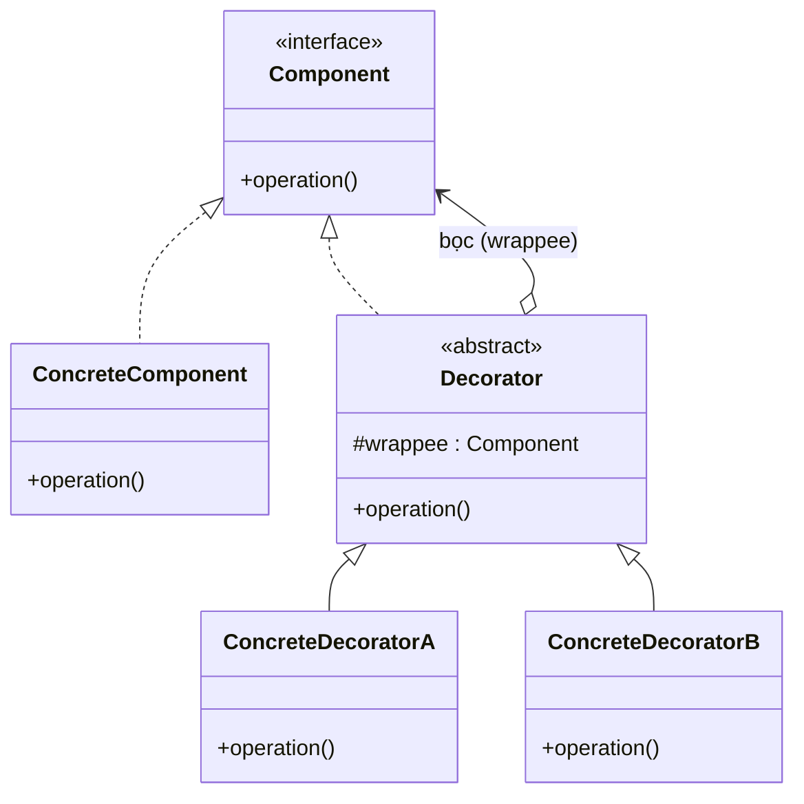

# Decorator (Trang trí)

## 1. Tên và phân loại
- **Tên:** Decorator
- **Phân loại:** Structural (Mẫu cấu trúc) — thuộc nhóm mẫu **đối tượng** (object pattern).

## 2. Mục đích, ý định
**Gắn thêm trách nhiệm (chức năng) cho một đối tượng một cách động (lúc chạy)**. Decorator cung cấp một giải pháp **linh hoạt thay cho kế thừa** để mở rộng chức năng.

## 3. Bí danh
- **Wrapper** (Lớp bọc).

## 4. Motivation (Động cơ)
Giả sử ta bán **đồ uống cà phê**: có cà phê gốc, rồi khách muốn thêm sữa, thêm kem, thêm syrup... Mỗi phần thêm làm thay đổi **mô tả** và **giá**.

Nếu dùng **kế thừa** để phủ mọi tổ hợp (`CoffeeWithMilk`, `CoffeeWithMilkAndCream`, `CoffeeWithCreamAndSyrup`...) thì **bùng nổ tổ hợp lớp** và không thể quyết định lúc chạy.

**Giải pháp Decorator:** mỗi phần thêm là một **lớp bọc (decorator)** cài cùng interface `Beverage` với đối tượng nó bọc, và **ủy thác** cho đối tượng bên trong rồi **bổ sung** hành vi (cộng thêm giá, thêm mô tả). Vì decorator cũng là `Beverage`, ta có thể **bọc lồng nhiều lớp** tùy ý lúc chạy: `new Milk(new Cream(new Coffee()))`.

## 5. Khả năng ứng dụng
Áp dụng Decorator khi:

- Muốn **thêm trách nhiệm cho từng đối tượng riêng lẻ** một cách động, **không ảnh hưởng** đối tượng khác.
- Muốn thêm chức năng có thể **gỡ bỏ** được.
- Khi mở rộng bằng **kế thừa không thực tế** (bùng nổ tổ hợp lớp, hoặc lớp bị `final`).

### ✅ Khi nào NÊN dùng
- Khi cần **thêm/bớt chức năng lúc chạy** cho từng đối tượng (nén, mã hóa, đệm I/O; topping đồ uống; viền/đổ bóng UI).
- Khi có **nhiều tổ hợp chức năng tùy chọn** mà kế thừa sẽ gây bùng nổ lớp.
- Khi muốn **tuân thủ Single Responsibility**: mỗi decorator lo đúng một việc, ghép lại linh hoạt.

### ❌ Khi nào KHÔNG nên dùng
- Khi chỉ có **một vài biến thể cố định** → kế thừa đơn giản hơn.
- Khi thứ tự bọc/nhiều lớp decorator khiến **khó debug** và khó hiểu luồng → cân nhắc thiết kế khác.
- Khi cần **thay đổi giao diện** (chứ không chỉ thêm hành vi) → đó là việc của **Adapter**, không phải Decorator.
- Khi decorator cần biết **đối tượng cụ thể** bên trong (phá vỡ tính trong suốt) → thiết kế đang sai.

> **Phân biệt nhanh:** *Decorator* **giữ nguyên giao diện**, **thêm trách nhiệm**. *Adapter* **đổi giao diện**. *Proxy* **giữ giao diện**, **kiểm soát truy cập** (không thêm chức năng nghiệp vụ). *Composite* gom nhiều con; Decorator chỉ bọc **một** con.

## 6. Cấu trúc



## 7. Các thành viên
- **Component** *(interface)* — giao diện chung cho đối tượng có thể được trang trí.
- **ConcreteComponent** — đối tượng gốc, có thể được thêm trách nhiệm.
- **Decorator** *(abstract)* — cài đặt `Component` và giữ một tham chiếu tới một `Component` (đối tượng bị bọc); chuyển tiếp yêu cầu cho nó.
- **ConcreteDecorator** — thêm trách nhiệm cụ thể (trước/sau khi chuyển tiếp).

## 8. Sự cộng tác
- Decorator chuyển tiếp yêu cầu cho `Component` bên trong, và **có thể thực hiện thêm hành động** trước/sau khi chuyển tiếp. Nhiều decorator có thể xếp chồng (bọc lồng).

## 9. Các hệ quả mang lại
**Ưu điểm:**
- **Linh hoạt hơn kế thừa**: thêm/bớt trách nhiệm lúc chạy, theo từng đối tượng.
- **Tránh lớp "nặng tính năng"** ở đỉnh phân cấp: trả tiền cho tính năng nào dùng.
- **Kết hợp tự do** nhiều decorator (Single Responsibility, Open/Closed).

**Nhược điểm:**
- **Nhiều đối tượng nhỏ** giống nhau → khó debug và đọc luồng bọc.
- **Khó gỡ một decorator** ở giữa chuỗi.
- Decorator và component **bằng nhau về kiểu** nhưng **không đồng nhất về danh tính** (`==` khác) — cẩn thận khi so sánh.

## 10. Chú ý khi cài đặt
1. **Interface tối giản:** Component nên nhẹ để dễ làm component và decorator.
2. **Lớp Decorator trừu tượng:** không bắt buộc nếu chỉ có một decorator; nhưng hữu ích khi có nhiều.
3. **Thứ tự bọc** có thể ảnh hưởng kết quả (vd nén rồi mã hóa khác mã hóa rồi nén).
4. **Trong suốt:** decorator nên giữ đúng giao diện để client không phân biệt được, có thể bọc tiếp.

## 11. Mã nguồn minh họa
Ví dụ đồ uống: `Coffee` gốc, bọc thêm `Milk`, `Whip` (kem), mỗi lớp cộng thêm giá và mô tả.

Mã nguồn đầy đủ trong [src/](src/):
- [Beverage.java](src/Beverage.java) — Component.
- [Coffee.java](src/Coffee.java) — ConcreteComponent.
- [CondimentDecorator.java](src/CondimentDecorator.java) — Decorator trừu tượng.
- [Milk.java](src/Milk.java), [Whip.java](src/Whip.java) — ConcreteDecorator.
- [Main.java](src/Main.java) — demo.

```java
public abstract class CondimentDecorator implements Beverage {
    protected final Beverage wrappee;          // đối tượng bị bọc
    protected CondimentDecorator(Beverage b) { this.wrappee = b; }
}

public class Milk extends CondimentDecorator {
    public Milk(Beverage b) { super(b); }
    @Override public String getDescription() { return wrappee.getDescription() + ", sua"; }
    @Override public double cost() { return wrappee.cost() + 5_000; }
}
```

## 12. Ví dụ thực tế
- **java.io** — `BufferedInputStream`, `DataInputStream`, `GZIPInputStream`... bọc `InputStream` (ví dụ kinh điển nhất của Decorator).
- **java.io.BufferedReader / Reader**, **java.util.Collections#unmodifiableList/synchronizedList** (bọc thêm hành vi).
- **javax.servlet.http.HttpServletRequestWrapper**.
- Trang trí UI (viền, cuộn) trong các toolkit đồ họa.

## 13. Các mẫu liên quan
- **Adapter:** đổi giao diện; Decorator giữ nguyên giao diện, thêm trách nhiệm.
- **Composite:** Decorator có thể xem như Composite suy biến (một con); thường dùng cùng nhau.
- **Strategy:** Decorator đổi "lớp vỏ" của đối tượng; Strategy đổi "ruột" thuật toán.
- **Proxy:** cùng cấu trúc bọc nhưng Proxy kiểm soát truy cập thay vì thêm chức năng.
