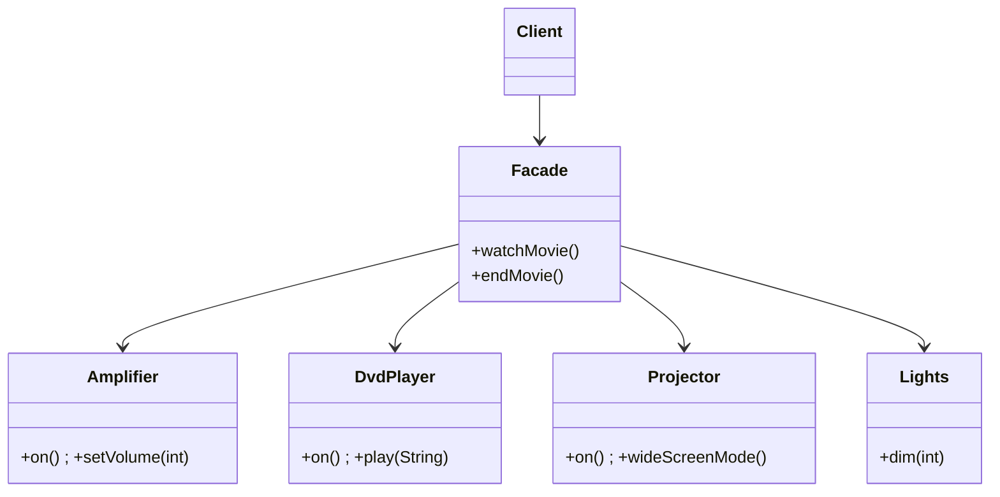

# Facade (Mặt tiền)

## 1. Tên và phân loại
- **Tên:** Facade
- **Phân loại:** Structural (Mẫu cấu trúc) — thuộc nhóm mẫu **đối tượng** (object pattern).

## 2. Mục đích, ý định
Cung cấp một **giao diện hợp nhất, đơn giản** cho một **tập hợp các giao diện** trong một hệ thống con (subsystem). Facade định nghĩa một giao diện ở mức cao giúp **dễ sử dụng** hệ thống con.

## 3. Bí danh
Không có bí danh phổ biến.

## 4. Motivation (Động cơ)
Giả sử ta có một **hệ thống rạp chiếu phim tại gia** gồm nhiều thành phần: ampli, đầu phát, máy chiếu, màn chiếu, đèn... Để "xem phim", client phải gọi đúng **trình tự** hàng loạt thao tác: bật ampli → chọn nguồn → hạ màn → bật máy chiếu → giảm đèn → phát phim...

Bắt client phải biết và gọi đúng trình tự của **tất cả** các lớp con khiến code client **phụ thuộc chặt** vào chi tiết hệ thống con, **khó dùng** và **khó bảo trì** khi hệ thống con thay đổi.

**Giải pháp Facade:** tạo một lớp `HomeTheaterFacade` cung cấp các phương thức đơn giản như `watchMovie()` / `endMovie()`. Bên trong, facade **điều phối** các lớp con theo đúng trình tự. Client chỉ cần gọi facade; vẫn có thể truy cập trực tiếp lớp con khi cần nâng cao.

## 5. Khả năng ứng dụng
Áp dụng Facade khi:

- Muốn cung cấp một **giao diện đơn giản** cho một hệ thống con phức tạp.
- Có **nhiều phụ thuộc** giữa client và các lớp cài đặt của hệ thống con — facade giúp **tách rời**.
- Muốn **phân tầng** hệ thống con: dùng facade làm điểm vào cho mỗi tầng.

### ✅ Khi nào NÊN dùng
- Khi hệ thống con **phức tạp, nhiều lớp**, và client chỉ cần một **tập thao tác phổ biến** đơn giản.
- Khi muốn **giảm phụ thuộc** giữa client và chi tiết bên trong (dễ thay đổi cài đặt mà không ảnh hưởng client).
- Khi muốn tạo **điểm vào rõ ràng** cho một thư viện/module/tầng.

### ❌ Khi nào KHÔNG nên dùng
- Khi hệ thống con vốn **đã đơn giản** → thêm facade chỉ là tầng thừa.
- Khi facade phình to thành **"God object"** ôm đồm mọi thứ → cần tách nhỏ.
- Khi client **thực sự cần kiểm soát chi tiết** từng lớp con → facade che mất khả năng đó (mặc dù vẫn nên cho phép truy cập trực tiếp khi cần).

> **Phân biệt nhanh:** *Facade* định nghĩa **giao diện mới đơn giản** cho cả hệ thống con (không thêm chức năng mới). *Adapter* làm cho **một** giao diện có sẵn **khớp** với cái client cần. *Mediator* điều phối **giao tiếp hai chiều** giữa các đối tượng đồng cấp; Facade chỉ là cổng **một chiều** vào hệ thống con.

## 6. Cấu trúc



## 7. Các thành viên
- **Facade** — biết các lớp con nào chịu trách nhiệm cho yêu cầu nào; **chuyển tiếp** yêu cầu của client tới đúng đối tượng hệ thống con (theo đúng trình tự).
- **Các lớp hệ thống con (Subsystem classes)** — thực hiện công việc thực sự; **không biết** về facade (không giữ tham chiếu ngược tới nó).
- **Client** — gọi facade thay vì gọi trực tiếp nhiều lớp con.

## 8. Sự cộng tác
- Client gửi yêu cầu cho `Facade`; facade chuyển tiếp tới các đối tượng hệ thống con phù hợp và có thể chuyển đổi/điều phối. Client không cần truy cập trực tiếp các lớp con (nhưng vẫn có thể nếu muốn).

## 9. Các hệ quả mang lại
**Ưu điểm:**
- **Che chắn** client khỏi sự phức tạp của hệ thống con → dễ dùng.
- **Giảm ghép nối (loose coupling)** giữa client và hệ thống con → dễ thay đổi cài đặt.
- **Không cấm** truy cập trực tiếp lớp con khi cần linh hoạt.

**Nhược điểm:**
- Facade có thể trở thành **điểm ghép nối tập trung** / "God object" nếu ôm đồm.
- Thêm một **tầng gián tiếp** (đôi khi không cần).

## 10. Chú ý khi cài đặt
1. **Giảm ghép nối thêm:** có thể cho Facade là một interface, client phụ thuộc interface đó (dễ test/đổi).
2. **Facade thường là [[creational-singleton|Singleton]]** (chỉ cần một cổng vào).
3. **Không thêm chức năng nghiệp vụ mới** trong facade — chỉ điều phối; nếu cần thêm hành vi, cân nhắc mẫu khác.
4. **Cho phép truy cập sâu** khi client cần: không "khóa" hoàn toàn hệ thống con.

## 11. Mã nguồn minh họa
Ví dụ **rạp phim tại gia**: `HomeTheaterFacade.watchMovie()` điều phối ampli, đầu DVD, máy chiếu, đèn.

Mã nguồn đầy đủ trong [src/](src/):
- [Amplifier.java](src/Amplifier.java), [DvdPlayer.java](src/DvdPlayer.java), [Projector.java](src/Projector.java), [Lights.java](src/Lights.java) — lớp hệ thống con.
- [HomeTheaterFacade.java](src/HomeTheaterFacade.java) — Facade.
- [Main.java](src/Main.java) — Client demo.

```java
public class HomeTheaterFacade {
    // ... giữ tham chiếu các lớp con ...
    public void watchMovie(String movie) {
        lights.dim(10);
        projector.on(); projector.wideScreenMode();
        amp.on(); amp.setVolume(7);
        dvd.on(); dvd.play(movie);    // điều phối đúng trình tự
    }
}
```

## 12. Ví dụ thực tế
- **javax.faces.context.FacesContext**, **java.net.URL** (che giấu nhiều lớp xử lý kết nối/giao thức).
- **SLF4J `LoggerFactory`** — cổng đơn giản vào hệ thống logging.
- **Spring `JdbcTemplate`** — facade đơn giản hóa JDBC (mở/đóng kết nối, xử lý lỗi).
- Các lớp `*Service` trong kiến trúc tầng — facade cho tầng nghiệp vụ.

## 13. Các mẫu liên quan
- **Abstract Factory:** có thể dùng cùng Facade để cung cấp giao diện tạo đối tượng hệ thống con mà giấu lớp cụ thể.
- **Mediator:** giống ở chỗ trừu tượng hóa giao tiếp, nhưng Mediator điều phối hai chiều giữa các đồng nghiệp; Facade là cổng một chiều vào hệ thống con.
- **Adapter:** Facade tạo giao diện mới; Adapter làm khớp giao diện có sẵn.
- **Singleton:** Facade thường được hiện thực là Singleton.
