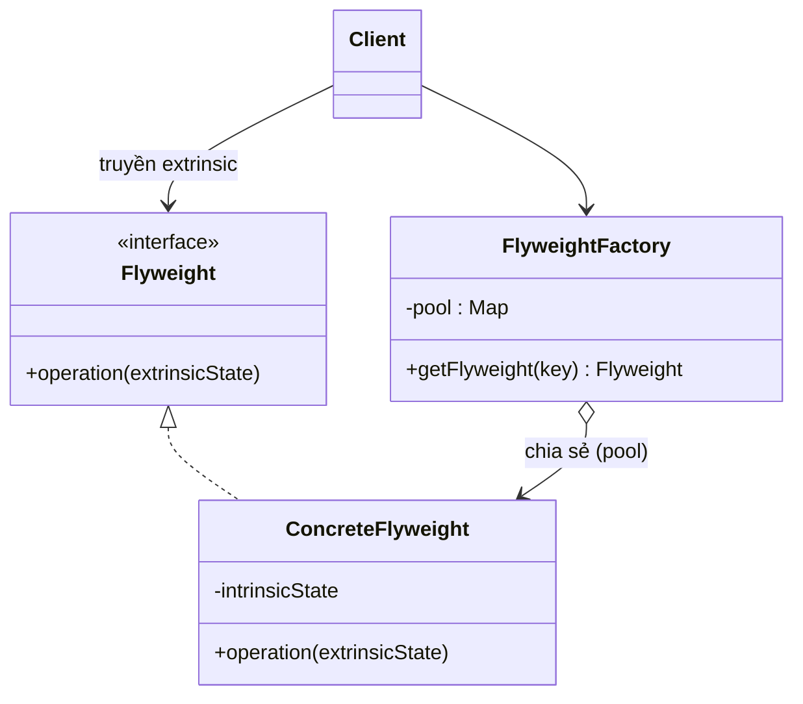

# Flyweight (Hạng nhẹ / Vật thể chia sẻ)

## 1. Tên và phân loại
- **Tên:** Flyweight
- **Phân loại:** Structural (Mẫu cấu trúc) — thuộc nhóm mẫu **đối tượng** (object pattern).

## 2. Mục đích, ý định
Dùng **cơ chế chia sẻ (sharing)** để hỗ trợ **số lượng lớn đối tượng nhỏ** một cách hiệu quả về bộ nhớ, bằng cách **tách trạng thái dùng chung (intrinsic)** ra khỏi **trạng thái riêng (extrinsic)**.

## 3. Bí danh
Không có bí danh phổ biến.

## 4. Motivation (Động cơ)
Giả sử ta viết **trình soạn thảo văn bản** biểu diễn mỗi **ký tự** là một đối tượng. Một tài liệu có hàng trăm nghìn ký tự → tạo hàng trăm nghìn đối tượng, mỗi cái lưu font, kích cỡ, hình dáng glyph... → **tốn bộ nhớ khủng khiếp**, dù thực ra chỉ có ~vài chục ký tự khác nhau (a-z, 0-9...).

Nhận xét: phần **"là ký tự gì + font/hình dáng"** (intrinsic) **giống nhau** và lặp lại rất nhiều; còn **vị trí** trong tài liệu (extrinsic) thì khác nhau.

**Giải pháp Flyweight:** chỉ tạo **một đối tượng dùng chung** cho mỗi loại ký tự (chia sẻ phần intrinsic), và **truyền phần extrinsic** (vị trí) **từ bên ngoài vào** mỗi khi cần. Một `FlyweightFactory` đảm bảo các flyweight được chia sẻ thay vì tạo mới.

## 5. Khả năng ứng dụng
Áp dụng Flyweight khi **tất cả** các điều sau gần đúng:

- Ứng dụng dùng **rất nhiều** đối tượng.
- Chi phí lưu trữ cao vì số lượng lớn đối tượng.
- Phần lớn trạng thái đối tượng có thể chuyển thành **extrinsic** (truyền từ ngoài).
- Sau khi tách extrinsic, nhiều nhóm đối tượng có thể **thay bằng vài đối tượng chia sẻ**.
- Ứng dụng **không phụ thuộc danh tính** từng đối tượng (vì các flyweight được dùng chung).

### ✅ Khi nào NÊN dùng
- Khi cần tạo **số lượng cực lớn** đối tượng tương tự và **bộ nhớ là vấn đề** (ký tự, ô bản đồ, hạt particle, cây cối trong game, icon).
- Khi có thể **tách rõ** trạng thái intrinsic (dùng chung) khỏi extrinsic (riêng từng ngữ cảnh).
- Khi nhiều đối tượng **chia sẻ phần lớn dữ liệu giống nhau**.

### ❌ Khi nào KHÔNG nên dùng
- Khi số lượng đối tượng **không lớn** → tối ưu này thừa, làm code phức tạp hơn vô ích.
- Khi **không tách được** intrinsic/extrinsic (mỗi đối tượng gần như khác nhau hoàn toàn).
- Khi việc **truyền extrinsic** mọi lúc làm code rối và chi phí CPU tăng vượt lợi ích bộ nhớ.
- Khi cần **danh tính riêng** cho mỗi đối tượng (flyweight bị chia sẻ nên không thể).

> **Lưu ý:** Flyweight đánh đổi **bộ nhớ ↔ thời gian/độ phức tạp**. Chỉ dùng khi đo đạc cho thấy bộ nhớ thực sự là nút thắt.

## 6. Cấu trúc



## 7. Các thành viên
- **Flyweight** *(interface)* — khai báo phương thức nhận và xử lý trạng thái **extrinsic**.
- **ConcreteFlyweight** — cài đặt Flyweight và lưu trạng thái **intrinsic** (dùng chung được, độc lập ngữ cảnh).
- **FlyweightFactory** — tạo và **quản lý kho (pool)** flyweight; đảm bảo chia sẻ: nếu đã có thì trả về, chưa có thì tạo.
- **Client** — giữ trạng thái **extrinsic** và truyền vào flyweight khi gọi thao tác.

## 8. Sự cộng tác
- Trạng thái intrinsic lưu trong ConcreteFlyweight; extrinsic do client lưu và **truyền vào** khi gọi `operation()`.
- Client **không tạo trực tiếp** ConcreteFlyweight mà lấy từ `FlyweightFactory` để đảm bảo chia sẻ.

## 9. Các hệ quả mang lại
**Ưu điểm:**
- **Tiết kiệm bộ nhớ** lớn khi có rất nhiều đối tượng tương tự.
- Giảm tổng số đối tượng cần lưu.

**Nhược điểm:**
- **Tăng độ phức tạp**: phải tách intrinsic/extrinsic và quản lý factory.
- **Đánh đổi CPU**: tính/truyền extrinsic có thể tốn thời gian.
- Khó dùng nếu cần danh tính riêng từng đối tượng.

## 10. Chú ý khi cài đặt
1. **Tách intrinsic/extrinsic** là bước then chốt — intrinsic phải bất biến và độc lập ngữ cảnh.
2. **Flyweight nên bất biến (immutable):** vì được chia sẻ, không được chứa trạng thái thay đổi theo ngữ cảnh.
3. **Quản lý pool:** factory thường dùng `Map` làm cache; cân nhắc dọn dẹp nếu pool lớn.
4. **Không phải mọi flyweight đều phải chia sẻ:** interface cho phép chia sẻ, nhưng có thể có flyweight không chia sẻ khi cần.

## 11. Mã nguồn minh họa
Ví dụ **rừng cây trong game**: hàng nghìn cây nhưng chỉ vài "loại cây" (`TreeType`: tên, màu, texture = intrinsic). Vị trí (x, y) là extrinsic.

Mã nguồn đầy đủ trong [src/](src/):
- [TreeType.java](src/TreeType.java) — ConcreteFlyweight (intrinsic + nhận extrinsic).
- [TreeTypeFactory.java](src/TreeTypeFactory.java) — FlyweightFactory.
- [Forest.java](src/Forest.java) — Client (lưu extrinsic).
- [Main.java](src/Main.java) — demo + đo số đối tượng được chia sẻ.

```java
public class TreeTypeFactory {
    private static final Map<String, TreeType> pool = new HashMap<>();
    public static TreeType get(String name, String color, String texture) {
        String key = name + "-" + color + "-" + texture;
        return pool.computeIfAbsent(key, k -> new TreeType(name, color, texture));
    }
}
```

## 12. Ví dụ thực tế
- **java.lang.Integer#valueOf(int)** — cache các Integer nhỏ (-128..127) là Flyweight; tương tự `Boolean`, `Character`, `Long`.
- **java.lang.String** — pool chuỗi literal (string interning).
- Render văn bản (glyph cache), bản đồ/ô lưới game, hệ thống hạt (particle systems).

## 13. Các mẫu liên quan
- **Composite:** Flyweight thường dùng để chia sẻ các node lá lặp lại trong cây Composite.
- **State / Strategy:** các đối tượng state/strategy không trạng thái thường được hiện thực dưới dạng Flyweight (chia sẻ).
- **Factory:** FlyweightFactory quản lý pool; thường kết hợp [[creational-singleton|Singleton]].
