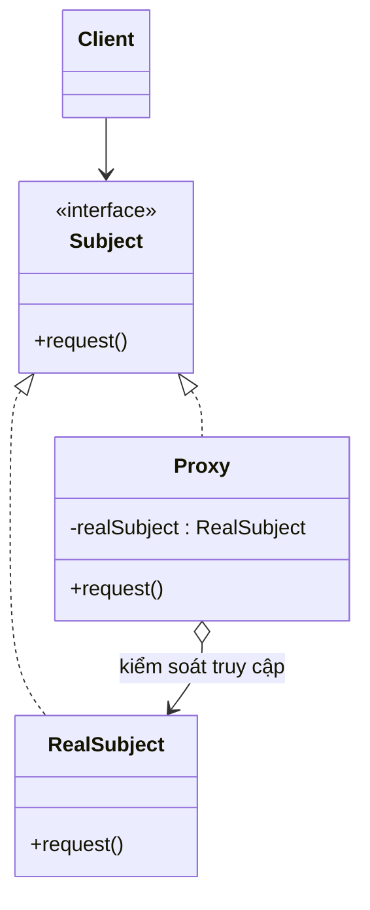

# Proxy (Người đại diện / Ủy nhiệm)

## 1. Tên và phân loại
- **Tên:** Proxy
- **Phân loại:** Structural (Mẫu cấu trúc) — thuộc nhóm mẫu **đối tượng** (object pattern).

## 2. Mục đích, ý định
Cung cấp một **đối tượng đại diện (surrogate/placeholder)** cho một đối tượng khác để **kiểm soát việc truy cập** tới đối tượng đó.

## 3. Bí danh
- **Surrogate** (Người thay thế).

## 4. Motivation (Động cơ)
Giả sử một tài liệu chứa nhiều **ảnh độ phân giải cao**. Nếu tải **toàn bộ ảnh** ngay khi mở tài liệu, việc mở sẽ **rất chậm và tốn bộ nhớ**, dù người dùng có thể không cuộn tới những ảnh đó.

**Giải pháp Proxy:** thay vì ảnh thật, đặt một **proxy ảnh (virtual proxy)** giữ chỗ. Proxy có **cùng giao diện** với ảnh thật; nó chỉ lưu thông tin nhẹ (tên file, kích thước). Chỉ khi ảnh **thực sự cần hiển thị**, proxy mới **tải ảnh thật** (lazy loading) và chuyển tiếp lời gọi. Client làm việc với proxy y như với ảnh thật, không biết khác biệt.

Ngoài "tải trễ", proxy còn dùng để: **kiểm soát quyền truy cập** (protection proxy), **gọi từ xa** (remote proxy), **đếm tham chiếu / cache / ghi log** (smart reference).

## 5. Khả năng ứng dụng
Áp dụng Proxy khi cần một tham chiếu **tinh vi hơn con trỏ thường** tới một đối tượng. Các loại phổ biến:

- **Remote proxy** — đại diện cục bộ cho đối tượng ở không gian địa chỉ/máy khác.
- **Virtual proxy** — tạo đối tượng đắt đỏ **theo nhu cầu** (lazy).
- **Protection proxy** — kiểm soát quyền truy cập theo vai trò.
- **Smart reference** — làm thêm việc khi truy cập: đếm tham chiếu, nạp tài nguyên, khóa, cache, log.

### ✅ Khi nào NÊN dùng
- Khi muốn **trì hoãn khởi tạo** đối tượng nặng cho tới khi thực sự cần (virtual proxy).
- Khi cần **kiểm soát/bổ sung** quanh việc truy cập: kiểm tra quyền, ghi log, đếm, cache, giới hạn tần suất (smart/protection proxy).
- Khi đối tượng ở **xa** (mạng) và muốn che giấu chi tiết giao tiếp (remote proxy — RMI, gRPC stub).
- Khi muốn thêm các việc trên **mà không sửa** đối tượng thật và **không đổi** giao diện với client.

### ❌ Khi nào KHÔNG nên dùng
- Khi **không cần kiểm soát truy cập** gì thêm → proxy chỉ là tầng gián tiếp thừa.
- Khi proxy làm **chậm/khó hiểu** luồng gọi mà lợi ích không đáng kể.
- Khi việc cần làm là **thêm chức năng nghiệp vụ** (đó là **Decorator**) hoặc **đổi giao diện** (đó là **Adapter**).

> **Phân biệt nhanh:** *Proxy* **giữ nguyên giao diện** và **kiểm soát truy cập** (thường tự quản lý vòng đời đối tượng thật). *Decorator* thêm **trách nhiệm/chức năng**. *Adapter* **đổi giao diện**. Cấu trúc giống nhau, ý định khác nhau.

## 6. Cấu trúc



## 7. Các thành viên
- **Subject** *(interface)* — giao diện chung cho `RealSubject` và `Proxy`, để proxy có thể thay thế đối tượng thật.
- **RealSubject** — đối tượng thật mà proxy đại diện.
- **Proxy** — giữ tham chiếu tới `RealSubject`; cài cùng `Subject`; **kiểm soát truy cập** và có thể chịu trách nhiệm tạo/xóa đối tượng thật.
- **Client** — làm việc qua `Subject`.

## 8. Sự cộng tác
- Proxy chuyển tiếp yêu cầu tới `RealSubject` khi thích hợp (tùy loại proxy), có thể làm thêm việc trước/sau (tạo đối tượng, kiểm tra quyền, log...).

## 9. Các hệ quả mang lại
**Ưu điểm:**
- **Kiểm soát truy cập** và thêm hành vi quanh đối tượng mà **không sửa** nó (Open/Closed).
- **Tối ưu**: lazy loading, cache, giảm chi phí (virtual proxy).
- **Che giấu** vị trí/độ phức tạp (remote proxy); **bảo mật** (protection proxy).

**Nhược điểm:**
- **Tăng độ phức tạp** và một tầng gián tiếp (có thể chậm hơn).
- Phản hồi có thể **trễ** (lần đầu nạp đối tượng thật).

## 10. Chú ý khi cài đặt
1. **Cùng giao diện:** proxy phải dùng chung `Subject` để client không phân biệt.
2. **Dynamic Proxy (Java):** dùng `java.lang.reflect.Proxy` + `InvocationHandler` để tạo proxy động, rất phổ biến (AOP, Spring, ORM).
3. **Quản lý vòng đời:** virtual proxy quyết định khi nào tạo/giải phóng RealSubject.
4. **An toàn luồng:** lazy init trong proxy cần cân nhắc đồng bộ nếu đa luồng.

## 11. Mã nguồn minh họa
Ví dụ **virtual proxy** cho ảnh: `ImageProxy` chỉ tải `RealImage` (tốn kém) khi `display()` lần đầu.

Mã nguồn đầy đủ trong [src/](src/):
- [Image.java](src/Image.java) — Subject.
- [RealImage.java](src/RealImage.java) — RealSubject (giả lập tải tốn kém).
- [ImageProxy.java](src/ImageProxy.java) — Proxy (lazy loading).
- [Main.java](src/Main.java) — demo.

```java
public class ImageProxy implements Image {
    private final String fileName;
    private RealImage real;           // chưa tạo vội

    public ImageProxy(String fileName) { this.fileName = fileName; }

    @Override public void display() {
        if (real == null) {           // chỉ tải khi thực sự cần
            real = new RealImage(fileName);
        }
        real.display();
    }
}
```

## 12. Ví dụ thực tế
- **java.lang.reflect.Proxy** + **InvocationHandler** — dynamic proxy chuẩn của JDK.
- **Spring AOP** — proxy quanh bean để thêm transaction, security, logging.
- **Hibernate/JPA lazy loading** — proxy cho thực thể chưa nạp.
- **Java RMI / gRPC stub** — remote proxy.
- **java.rmi.*** — đại diện đối tượng từ xa.

## 13. Các mẫu liên quan
- **Adapter:** đổi giao diện; Proxy giữ nguyên giao diện.
- **Decorator:** cấu trúc bọc giống nhau nhưng Decorator thêm chức năng, còn Proxy kiểm soát truy cập (và thường tự quản lý đối tượng thật).
- **Facade:** cung cấp giao diện mới đơn giản cho hệ thống con; Proxy đại diện cho **một** đối tượng với cùng giao diện.
