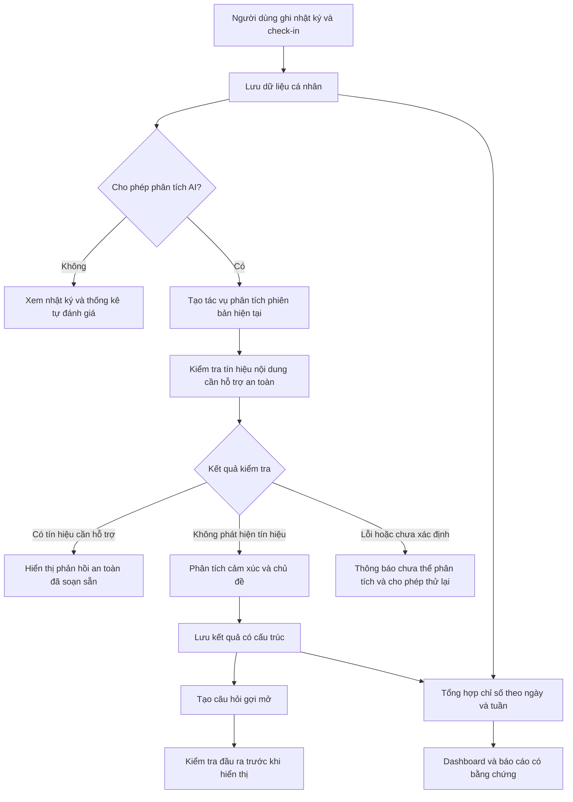

# ĐỀ XUẤT ĐỀ TÀI ĐỒ ÁN 2

## Thông tin chung

**Tên đề tài:** Xây dựng nền tảng nhật ký thông minh hỗ trợ theo dõi sức khỏe tinh thần và tự phản chiếu bằng trí tuệ nhân tạo.

**Tên tiếng Anh:** Development of an AI-Powered Journaling Platform for Mental Wellness Monitoring and Self-Reflection.

**Tên sản phẩm dự kiến:** MindTrace.

**Định hướng:** Phát triển ứng dụng web hỗ trợ người dùng ghi nhật ký, theo dõi tâm trạng, quan sát những khuynh hướng cảm xúc theo thời gian và nhận câu hỏi gợi mở phù hợp với nội dung đã ghi nhận.

**Cơ sở xây dựng:** Tài liệu [idea.md](./idea.md). Các giới hạn dữ liệu, cấu hình triển khai và chỉ tiêu đánh giá trong báo cáo này là đề xuất cho phiên bản đồ án, chưa phải kết quả đã triển khai hoặc đo kiểm.

**Ngày khảo sát tài liệu trực tuyến:** 09/09/2026.

## 1. Động lực nghiên cứu và lý do chọn đề tài

### 1.1. Bối cảnh và vấn đề đặt ra

Trong quá trình học tập và làm việc, sinh viên và người trẻ có thể trải qua nhiều trạng thái cảm xúc gắn với lịch thi, thời hạn công việc, giấc ngủ và các mối quan hệ. Việc nhớ lại những trải nghiệm này một cách có hệ thống thường đòi hỏi người dùng phải chủ động ghi chép và tổng hợp. Một nhận định như “dạo này thường xuyên mệt mỏi” chưa cho biết trạng thái đó xuất hiện vào những ngày nào, đi cùng sự kiện gì và có thay đổi qua từng tuần hay không.

Từ góc độ thiết kế sản phẩm, đề tài đặt ra nhu cầu kết hợp hai dạng thông tin: nội dung nhật ký thể hiện hoàn cảnh và suy nghĩ của người viết; các chỉ số tự đánh giá thể hiện tâm trạng, căng thẳng, năng lượng và giấc ngủ. Khi được tổ chức theo thời gian, những dữ liệu này có thể hỗ trợ người dùng xem lại trải nghiệm của mình bằng các biểu đồ, thống kê và nhận xét có dẫn chứng.

Ví dụ, người dùng có thể muốn biết: trong tháng vừa qua, những ngày có nhắc đến deadline có thường đi cùng điểm căng thẳng cao hay không; những ngày có hoạt động thể thao có điểm tâm trạng khác với những ngày còn lại như thế nào. Đây là các câu hỏi về mối liên hệ trong dữ liệu cá nhân. Hệ thống cần trình bày chúng như quan sát trên dữ liệu đã ghi nhận, tránh diễn giải thành bằng chứng chắc chắn về nguyên nhân.

Như vậy, bài toán được lựa chọn là xây dựng một công cụ hỗ trợ ghi nhận, tổng hợp và diễn giải dữ liệu cảm xúc cá nhân theo thời gian. Nhu cầu thực tế và mức độ phù hợp của công cụ sẽ được kiểm tra thông qua khảo sát và thử nghiệm người dùng trong quá trình thực hiện đồ án.

### 1.2. Động lực nghiên cứu

**Thứ nhất, hỗ trợ quá trình tự theo dõi liên tục.** Nhật ký và thông tin tự đánh giá tạo thành lịch sử để người dùng xem lại những thay đổi qua từng ngày, tuần và tháng. Đề tài hướng đến giảm công sức tổng hợp thủ công khi số lượng bài viết tăng lên.

**Thứ hai, khai thác nội dung văn bản tiếng Việt.** Điểm số tâm trạng cho biết đánh giá tổng quát, còn văn bản có thể bổ sung bối cảnh như học tập, công việc hoặc gia đình. Bài toán kỹ thuật là trích xuất thông tin có cấu trúc từ cách diễn đạt tự nhiên, bao gồm câu phủ định, từ viết tắt, nhiều cảm xúc đồng thời và cách nói phụ thuộc ngữ cảnh.

**Thứ ba, kết hợp phân tích định lượng với diễn giải dễ hiểu.** Các phép tính thống kê giúp xác định dữ liệu nào hỗ trợ một nhận xét; mô hình ngôn ngữ giúp trình bày nhận xét đó thành câu văn phù hợp. Việc kết hợp hai thành phần tạo cơ hội nghiên cứu cách giới hạn nội dung AI trong phạm vi bằng chứng thực tế.

**Thứ tư, nghiên cứu cách tích hợp AI có kiểm soát.** WHO nêu các rủi ro của mô hình AI tạo sinh trong lĩnh vực sức khỏe, bao gồm thông tin sai, thiên lệch, thiếu đầy đủ và nguy cơ đối với dữ liệu cá nhân. Đây là cơ sở để đề tài đặt giới hạn rõ ràng cho đầu ra AI và kiểm tra cả nội dung lẫn cách sử dụng dữ liệu. [Nguồn: WHO, hướng dẫn về AI và các mô hình đa phương thức lớn](https://www.who.int/tokelau/news/detail-global/18-01-2024-who-releases-ai-ethics-and-governance-guidance-for-large-multi-modal-models).

### 1.3. Lý do chọn đề tài

1. **Bài toán gần với nhóm người dùng có thể tiếp cận:** sinh viên và người trẻ là nhóm phù hợp để khảo sát nhu cầu ghi nhật ký, cách sử dụng biểu đồ và mức độ chấp nhận phản hồi AI.
2. **Có chiều sâu về kỹ thuật phần mềm:** sản phẩm cần quản lý tài khoản, phân quyền theo chủ sở hữu, xử lý dữ liệu thời gian, tích hợp dịch vụ AI, chạy tác vụ nền và trực quan hóa kết quả.
3. **Có nội dung nghiên cứu và đánh giá rõ ràng:** có thể đo chất lượng phân loại cảm xúc, độ chính xác của thống kê, mức độ có căn cứ của nhận xét và khả năng hoàn thành tác vụ của người dùng.
4. **Có thể triển khai theo từng mức độ:** phiên bản đầu tiên tập trung vào nhật ký, check-in, phân tích AI và báo cáo; các chức năng mở rộng được thực hiện sau khi phần cốt lõi ổn định.
5. **Có sản phẩm minh họa cụ thể:** quy trình từ ghi nhận đến báo cáo có thể trình diễn bằng dữ liệu mô phỏng nhiều tuần, giúp làm rõ đóng góp của từng thành phần.

### 1.4. Ý nghĩa dự kiến của đề tài

Về học thuật, đề tài vận dụng kiến thức phân tích yêu cầu, thiết kế cơ sở dữ liệu, phát triển web và xử lý ngôn ngữ tự nhiên vào một bài toán tích hợp. Nội dung nghiên cứu tập trung vào cách tổ chức dữ liệu, phối hợp AI với quy tắc nghiệp vụ và đánh giá kết quả trên dữ liệu tiếng Việt.

Về ứng dụng, sản phẩm dự kiến giúp người dùng lưu giữ trải nghiệm, xem lại các chỉ số tự đánh giá và nhận câu hỏi hỗ trợ suy ngẫm. Giá trị này được đánh giá bằng tính đúng đắn của hệ thống và phản hồi về trải nghiệm sử dụng; đồ án không đặt mục tiêu chứng minh hiệu quả điều trị hoặc cải thiện sức khỏe theo tiêu chuẩn lâm sàng.

## 2. Khảo sát hiện trạng các hệ thống tương đương và hệ thống đề xuất

### 2.1. Mục đích và phương pháp khảo sát

Khảo sát nhằm nhận diện các cách tiếp cận đã có trên thị trường, xác định chức năng nên kế thừa và lựa chọn trọng tâm phù hợp cho MindTrace. Ba sản phẩm được chọn là Daylio, Day One và Reflection, đại diện cho theo dõi tâm trạng, nhật ký số và nhật ký tích hợp AI.

Phương pháp sử dụng trong bản đề xuất là khảo sát tài liệu công khai trên website chính thức. Các thông tin dưới đây phản ánh mô tả của nhà cung cấp tại thời điểm truy cập; chưa phải kết quả kiểm thử trực tiếp, kiểm toán bảo mật hoặc đo độ chính xác AI. Tính năng có thể thay đổi theo nền tảng, gói sử dụng và thời điểm phát hành.

Các tiêu chí khảo sát gồm:

- Cách ghi nhận nhật ký, tâm trạng và hoạt động.
- Khả năng tổng hợp dữ liệu và hỗ trợ xem lại lịch sử.
- Vai trò của AI trong trải nghiệm sử dụng.
- Cơ chế riêng tư được nhà cung cấp công bố.
- Bài học có thể vận dụng vào phạm vi đồ án.

### 2.2. Các hệ thống được khảo sát

#### 2.2.1. Daylio

Daylio cho phép ghi nhận tâm trạng và hoạt động, bổ sung ghi chú, xem lịch sử và các biểu đồ tương quan. Sản phẩm còn có mục tiêu, nhắc nhở và xuất PDF/CSV. Nhà cung cấp công bố không gửi nội dung nhật ký lên máy chủ của Daylio. [Nguồn: Daylio](https://daylio.net/).

**Nhận xét phục vụ đề tài:** có thể học hỏi thao tác check-in ngắn gọn và cách liên kết tâm trạng với hoạt động. Tài liệu đã khảo sát chưa đủ để xác nhận khả năng phân tích đa cảm xúc từ nhật ký tiếng Việt bằng AI. Đồng thời, việc Daylio đã có thống kê tương quan cho thấy đây không phải tính năng mới riêng của MindTrace.

#### 2.2.2. Day One

Day One là sản phẩm nhật ký số có mã hóa đầu cuối cho nhật ký mới theo các điều kiện được nêu trong tài liệu. Nhà cung cấp cũng đã công bố tính năng AI xử lý nội dung bài viết. Khi sử dụng AI phía máy chủ, nội dung cần được giải mã trên thiết bị trước khi gửi đến dịch vụ AI. [Nguồn: Day One — mã hóa](https://dayoneapp.com/guides/day-one-sync/end-to-end-encryption-faq/), [tính năng AI](https://dayoneapp.com/guides/labs/ai-features/).

**Nhận xét phục vụ đề tài:** cần mô tả riêng việc bảo vệ dữ liệu lưu trữ và việc gửi nội dung để phân tích AI. Đề tài không thể lấy “có AI trong nhật ký” làm điểm khác biệt duy nhất.

#### 2.2.3. Reflection

Reflection giới thiệu nhật ký tích hợp AI, mẫu viết, tổng kết tuần/tháng và xuất dữ liệu. Tuy nhiên, trang khảo sát có thông tin chưa thống nhất: một số thẻ AI ghi “Coming soon”, trong khi FAQ mô tả khả năng đang được cung cấp. Vì vậy, báo cáo ghi nhận định hướng tính năng do nhà cung cấp công bố, chưa xác nhận trạng thái phát hành từng chức năng. [Nguồn: Reflection](https://www.reflection.app/).

**Nhận xét phục vụ đề tài:** cần tham khảo cách tổ chức viết có hướng dẫn và xem lại nhật ký; đồng thời phải phân biệt tính năng dự kiến với tính năng đã kiểm chứng khi trình bày sản phẩm của chính đồ án.

### 2.3. Bảng tổng hợp khảo sát

| Hệ thống | Trọng tâm thể hiện trong tài liệu công khai | Bài học áp dụng cho MindTrace |
| --- | --- | --- |
| [Daylio](https://daylio.net/) | Check-in, hoạt động và thống kê tương quan | Giảm thao tác nhập; làm rõ mẫu dữ liệu trên biểu đồ |
| [Day One](https://dayoneapp.com/guides/labs/ai-features/) | Nhật ký số có tích hợp AI | Minh bạch luồng dữ liệu khi bật AI |
| [Reflection](https://www.reflection.app/) | Viết có hướng dẫn và xem lại nhật ký; trạng thái một số tính năng cần kiểm chứng | Gắn phản hồi với quá trình tự suy ngẫm |
| MindTrace — đề xuất | Nhật ký tiếng Việt, check-in, nhận xét dài hạn kèm bằng chứng | Đánh giá khả năng tích hợp và chất lượng trên phạm vi dữ liệu đồ án |

### 2.4. Nhận định từ khảo sát và hướng giải quyết

Từ các tài liệu đã khảo sát, có thể nhận định rằng thị trường đã có nhiều thành phần gần với ý tưởng đề tài: ghi nhận tâm trạng, biểu đồ, nhật ký AI và tổng kết định kỳ. Vì vậy, hướng nghiên cứu phù hợp là xây dựng và đánh giá một tổ hợp chức năng phục vụ nhóm người dùng cụ thể, thay vì tuyên bố tạo ra một loại sản phẩm hoàn toàn mới.

Đây là **nhận định thiết kế của đề tài** từ phạm vi khảo sát hạn chế, không phải kết luận rằng toàn bộ sản phẩm hiện có đều thiếu các khả năng sau:

1. **Xử lý tiếng Việt theo bối cảnh mục tiêu:** sử dụng ví dụ gắn với học tập, công việc và đời sống của sinh viên, người trẻ.
2. **Tách dữ liệu tự đánh giá khỏi suy luận AI:** người dùng biết điểm nào do mình nhập, nhãn nào do mô hình suy đoán.
3. **Đưa bằng chứng vào nhận xét:** hiển thị khoảng thời gian, số ngày có dữ liệu, phép so sánh và liên kết tới bản ghi liên quan.
4. **Công khai giới hạn phân tích:** thông báo khi dữ liệu thưa, kết quả chưa chắc chắn hoặc dịch vụ AI chưa xử lý được.
5. **Có bộ đánh giá tái lập:** kiểm tra cùng một bộ dữ liệu và tiêu chí trước khi thay đổi mô hình hoặc quy tắc.

### 2.5. Hệ thống đề xuất: MindTrace

MindTrace được đề xuất dưới dạng ứng dụng web có giao diện thích ứng với máy tính và điện thoại. Người dùng ghi nhật ký bằng tiếng Việt, thực hiện check-in hằng ngày và chủ động lựa chọn việc sử dụng AI. Hệ thống lưu kết quả có cấu trúc, tổng hợp dữ liệu theo thời gian và tạo phản hồi giúp người dùng xem lại trải nghiệm.

Ba nhóm giá trị chính gồm:

- **Ghi nhận:** lưu nội dung, chỉ số tự đánh giá và hoạt động trong ngày.
- **Nhận diện:** hiển thị cảm xúc được AI gợi ý, chủ đề lặp lại và mối liên hệ quan sát được.
- **Tự phản chiếu:** đặt câu hỏi gợi mở, tổng kết tuần và đề xuất hành động nhỏ từ danh mục nội dung đã được rà soát.

#### 2.5.1. Luồng nghiệp vụ tổng quát

Kết quả “không phát hiện tín hiệu” chỉ mô tả hoạt động của bộ kiểm tra trên dữ liệu đầu vào, không xác nhận người dùng đang an toàn. Khi AI bị tắt, hệ thống không tự gửi nhật ký đến dịch vụ phân tích; mục “Tìm hỗ trợ” vẫn luôn truy cập được bằng thao tác chủ động.

#### 2.5.2. Kiến trúc chức năng dự kiến

| Thành phần | Trách nhiệm |
| --- | --- |
| Giao diện web | Nhập liệu, hiển thị lịch sử, dashboard, báo cáo và thiết lập riêng tư |
| Backend nghiệp vụ | Xác thực, phân quyền, quản lý bản ghi, áp dụng quy tắc và cung cấp API |
| Cơ sở dữ liệu | Lưu tài khoản, nhật ký, check-in, kết quả phân tích và báo cáo |
| Bộ xử lý tác vụ nền | Phân tích AI, tạo báo cáo và quản lý thử lại có giới hạn |
| Lớp tích hợp AI | Chuẩn bị dữ liệu tối thiểu, gọi mô hình, kiểm tra cấu trúc kết quả |
| Bộ thống kê | Tính các chỉ số, số mẫu và bằng chứng bằng quy tắc xác định |
| Bộ kiểm soát phản hồi | Điều hướng luồng an toàn và kiểm tra đầu ra trước khi công bố |

Phiên bản đầu sử dụng một backend chia module và một tiến trình xử lý tác vụ nền. Cách tổ chức này giúp quản lý rõ trách nhiệm mà vẫn phù hợp với quy mô đồ án.

## 3. Đối tượng và phạm vi nghiên cứu

### 3.1. Đối tượng nghiên cứu

Đối tượng nghiên cứu của đề tài gồm:

1. **Quy trình ghi nhật ký và tự theo dõi:** cách người dùng nhập, xem lại và diễn giải dữ liệu về trải nghiệm hằng ngày.
2. **Dữ liệu nhật ký tiếng Việt:** văn bản tự do, cảm xúc hỗn hợp, chủ đề đời sống và những trường hợp khó phân loại.
3. **Phương pháp phân tích văn bản:** phân loại sắc thái tổng quát, nhận diện nhiều cảm xúc, trích xuất chủ đề và kiểm tra tín hiệu cần phản hồi an toàn.
4. **Phương pháp tổng hợp dữ liệu thời gian:** tính chỉ số theo ngày/tuần, so sánh các nhóm ngày và truy xuất bằng chứng cho nhận xét.
5. **Cơ chế tích hợp AI:** phối hợp mô hình ngôn ngữ, quy tắc nghiệp vụ, kiểm tra đầu ra và quản lý lỗi.
6. **Thiết kế hệ thống bảo vệ dữ liệu cá nhân:** kiểm soát truy cập, lưu trữ, xóa dữ liệu và quản lý quyền sử dụng AI.

### 3.2. Đối tượng sử dụng và tác nhân hệ thống

| Tác nhân | Đặc điểm và nhu cầu | Quyền dự kiến |
| --- | --- | --- |
| Người dùng cá nhân | Sinh viên, người trẻ từ 18 tuổi, sử dụng tiếng Việt, muốn ghi nhật ký và theo dõi bản thân | Quản lý dữ liệu của mình, xem phân tích, xuất/xóa dữ liệu, bật/tắt AI |
| Quản trị viên | Người phụ trách vận hành bản thử nghiệm | Quản lý trạng thái tài khoản, cấu hình nội dung hỗ trợ, theo dõi lỗi và số liệu vận hành tổng hợp |
| Dịch vụ AI bên ngoài | Thành phần xử lý được backend gọi khi có quyền sử dụng phù hợp | Nhận phần nội dung cần cho tác vụ; không có quyền truy cập trực tiếp cơ sở dữ liệu |
| Bộ lập lịch và worker | Thành phần tự động nội bộ | Xử lý tác vụ trong phạm vi tài khoản, quyền và phiên bản dữ liệu tương ứng |

Giao diện quản trị không cung cấp chức năng đọc nhật ký cá nhân. Quyền hạ tầng đặc biệt, nếu cần để vận hành, phải được hạn chế riêng và ghi nhận truy cập; không đồng nhất việc ẩn nội dung trên giao diện với bảo đảm rằng máy chủ không thể giải mã dữ liệu.

### 3.3. Phạm vi chức năng

#### 3.3.1. Chức năng bắt buộc trong phiên bản đồ án

- Đăng ký, đăng nhập, đăng xuất và quản lý phiên truy cập.
- Tạo, đọc, sửa, xóa nhật ký văn bản; lọc theo thời gian và thẻ.
- Ghi nhận tâm trạng, căng thẳng, năng lượng, giấc ngủ và hoạt động theo ngày.
- Bật/tắt AI và quản lý sự đồng ý trước khi gửi dữ liệu phân tích.
- Phân tích sắc thái, nhiều cảm xúc và chủ đề của nhật ký tiếng Việt.
- Dashboard tuần/tháng và nhận xét dựa trên dữ liệu đủ điều kiện.
- Báo cáo tuần gồm thống kê, nội dung đáng chú ý và câu hỏi tự phản chiếu.
- Luồng phản hồi an toàn cho tín hiệu nguy cơ được phát hiện và mục tìm hỗ trợ.
- Xuất dữ liệu CSV; xóa nhật ký hoặc toàn bộ dữ liệu cá nhân.
- Chức năng quản trị tối thiểu cho tài khoản, danh mục hỗ trợ và lỗi tác vụ.

#### 3.3.2. Chức năng mở rộng khi còn nguồn lực

- Xuất báo cáo PDF có biểu đồ.
- Mục tiêu chăm sóc bản thân và theo dõi mức độ hoàn thành.
- Nhắc viết nhật ký theo giờ người dùng lựa chọn.
- RAG từ kho nội dung có nguồn gốc và quy trình rà soát rõ ràng.
- Đăng nhập qua nhà cung cấp OAuth.
- Tìm kiếm ngữ nghĩa trong nhật ký với phân quyền theo chủ sở hữu.

Chức năng mở rộng không được tính là điều kiện bắt buộc hoàn thành phiên bản cốt lõi. Nếu bổ sung, cần cập nhật tương ứng yêu cầu dữ liệu, giao diện và kiểm thử.

### 3.4. Giới hạn nghiên cứu

- Tập trung vào ứng dụng web trực tuyến; chưa phát triển ứng dụng di động native hoặc đồng bộ offline đầy đủ.
- Chỉ xử lý nhật ký văn bản tiếng Việt trong MVP; hình ảnh, âm thanh, thiết bị đeo và hồ sơ bệnh án nằm ngoài phạm vi.
- Sử dụng mô hình hoặc API có sẵn; chưa huấn luyện mô hình ngôn ngữ lớn từ đầu.
- Không đưa ra chẩn đoán, đơn thuốc, phác đồ điều trị hoặc quyết định chuyên môn y tế.
- Không vận hành dịch vụ tư vấn trực tiếp, giám sát khủng hoảng 24/7 hay tự động liên hệ người khác.
- Chưa thử nghiệm trên người dưới 18 tuổi; việc mở rộng nhóm sử dụng cần nghiên cứu riêng.
- Chỉ đánh giá kỹ thuật và tính dễ sử dụng trong quy mô thử nghiệm; không suy rộng thành hiệu quả lâm sàng hoặc tính đại diện cho toàn bộ dân số.
- Các mối liên hệ giữa cảm xúc và hoạt động được trình bày dưới dạng mô tả dữ liệu, không kết luận quan hệ nhân quả.

### 3.5. Phạm vi dữ liệu và phương pháp thực hiện

Đề tài dự kiến sử dụng dữ liệu mô phỏng làm nguồn chính cho phát triển và trình diễn. Bộ kiểm thử AI được xây dựng riêng với nhãn tham chiếu do con người rà soát. Dữ liệu thật chỉ được dùng khi người tham gia tự nguyện và hiểu rõ mục đích sử dụng; không yêu cầu cung cấp nhật ký riêng tư để tham gia thử nghiệm giao diện.

| Hoạt động | Quy mô dự kiến | Kết quả cần thu được |
| --- | --- | --- |
| Khảo sát nhu cầu | 15–30 người từ 18 tuổi | Nhu cầu ghi chép, tần suất sử dụng, thông tin muốn xem và mức độ chấp nhận AI |
| Phỏng vấn bổ sung | 3–5 người trong nhóm khảo sát | Làm rõ khó khăn khi nhập liệu và đọc báo cáo |
| Thử nghiệm khả dụng | 5–10 người, dùng tình huống và dữ liệu giả lập | Tỷ lệ hoàn thành tác vụ, thời gian thực hiện, lỗi và ý kiến cải tiến |
| Kiểm thử AI | Khoảng 300 đoạn tiếng Việt, có trường hợp khó và mẫu an toàn riêng | Kết quả phân loại, phân tích sai và chất lượng phản hồi |
| Kiểm thử xu hướng | Lịch sử mô phỏng 4–8 tuần cho nhiều tài khoản | Kiểm tra số mẫu, tính toán, thời gian và quyền sở hữu |

Đây là kế hoạch, chưa phải khảo sát đã hoàn thành. Báo cáo kết quả sau triển khai cần ghi rõ số người, số mẫu thực tế, cách chọn mẫu và các hạn chế phát sinh.

## 4. Mục tiêu đề tài và các yêu cầu hệ thống

### 4.1. Mục tiêu tổng quát

Xây dựng và đánh giá một nền tảng nhật ký thông minh có khả năng kết hợp dữ liệu tự đánh giá với phân tích văn bản tiếng Việt, giúp người dùng theo dõi trạng thái cảm xúc theo thời gian và nhận nội dung tự phản chiếu có căn cứ, đồng thời bảo đảm quyền kiểm soát dữ liệu cá nhân trong phạm vi thử nghiệm của đồ án.

### 4.2. Mục tiêu cụ thể

| Mã | Mục tiêu | Sản phẩm hoặc bằng chứng hoàn thành |
| --- | --- | --- |
| MT-01 | Khảo sát nhu cầu và phân tích hệ thống tương đương | Tài liệu khảo sát, yêu cầu và phạm vi đã xác định |
| MT-02 | Xây dựng chức năng ghi nhận và quản lý dữ liệu cá nhân | Luồng tài khoản, nhật ký và check-in hoạt động xuyên suốt |
| MT-03 | Tích hợp phân tích nhật ký tiếng Việt | Kết quả có cấu trúc, trạng thái tác vụ và báo cáo đánh giá AI |
| MT-04 | Phát triển thống kê và báo cáo có bằng chứng | Dashboard, báo cáo tuần, phép tính và bản ghi đối chiếu |
| MT-05 | Thực hiện cơ chế riêng tư và kiểm soát phản hồi | Kiểm thử phân quyền, đồng ý AI, xóa dữ liệu và tình huống an toàn |
| MT-06 | Đánh giá và hoàn thiện bản thử nghiệm | Báo cáo kiểm thử, phản hồi người dùng và hướng dẫn triển khai |

### 4.3. Yêu cầu chức năng hệ thống

Quy ước: **Bắt buộc** là yêu cầu của phiên bản cốt lõi; **Mở rộng** được thực hiện sau nếu còn nguồn lực. Các mã yêu cầu được sử dụng để liên kết thiết kế, triển khai và kiểm thử.

#### 4.3.1. Quản lý tài khoản và quyền sử dụng

| Mã | Chức năng | Mô tả và điều kiện chấp nhận | Mức độ |
| --- | --- | --- | --- |
| CN-01 | Đăng ký | Tạo tài khoản bằng email và mật khẩu; kiểm tra dữ liệu hợp lệ và email không trùng | Bắt buộc |
| CN-02 | Đăng nhập, đăng xuất | Tạo phiên hợp lệ; từ chối thông tin sai; đăng xuất làm mất hiệu lực phiên tương ứng | Bắt buộc |
| CN-03 | Thiết lập cá nhân | Cập nhật tên hiển thị, múi giờ và lựa chọn riêng tư; mặc định múi giờ Asia/Ho_Chi_Minh | Bắt buộc |
| CN-04 | Quản lý đồng ý AI | Hiển thị nội dung được gửi, mục đích và nhà cung cấp trước khi bật; ghi nhận thời điểm, phiên bản thông báo và việc rút lại đồng ý | Bắt buộc |
| CN-05 | Kiểm soát quyền sở hữu | Mọi thao tác trên nhật ký, check-in, báo cáo và bản xuất chỉ áp dụng với chủ sở hữu, kể cả khi gọi API trực tiếp | Bắt buộc |

Rút lại đồng ý phải ngăn tác vụ AI mới và hủy tác vụ chưa gửi. Với yêu cầu đã gửi đến nhà cung cấp, giao diện cần mô tả giới hạn hủy và xử lý dữ liệu theo chính sách thực tế của dịch vụ, không thông báo rằng việc rút lại đồng ý có thể thu hồi ngay mọi bản sao đã truyền đi.

#### 4.3.2. Nhật ký và check-in hằng ngày

| Mã | Chức năng | Mô tả và điều kiện chấp nhận | Mức độ |
| --- | --- | --- | --- |
| CN-06 | Tạo nhật ký | Nhập nội dung, ngày ghi nhận, tiêu đề tùy chọn và thẻ; lưu thành công độc lập với tình trạng dịch vụ AI | Bắt buộc |
| CN-07 | Xem và lọc nhật ký | Danh sách phân trang; xem chi tiết; lọc theo ngày và thẻ thuộc người dùng | Bắt buộc |
| CN-08 | Chỉnh sửa nhật ký | Lưu phiên bản mới; kết quả AI cũ được đánh dấu hết hiệu lực; tạo tác vụ mới khi có quyền AI | Bắt buộc |
| CN-09 | Xóa nhật ký | Xác nhận thao tác; xóa dữ liệu liên quan và xử lý lại báo cáo bị ảnh hưởng; tác vụ cũ không được tạo lại nội dung đã xóa | Bắt buộc |
| CN-10 | Check-in theo ngày | Nhập điểm tâm trạng, căng thẳng, năng lượng, chất lượng giấc ngủ; chỉ số ngoài tâm trạng có thể bỏ trống | Bắt buộc |
| CN-11 | Ghi nhận giấc ngủ và hoạt động | Nhập thời lượng ngủ tùy chọn và chọn hoạt động theo ngày để phục vụ so sánh | Bắt buộc |
| CN-12 | Câu hỏi mở đầu | Chọn câu hỏi từ danh mục soạn sẵn để bắt đầu viết; hoạt động cả khi tắt AI | Bắt buộc |

Mỗi tài khoản có tối đa một check-in cho một ngày địa phương nhưng có thể có nhiều bài nhật ký trong ngày. Hai loại bản ghi liên kết qua chủ sở hữu và ngày ghi nhận; thống kê theo ngày không nhân trọng số chỉ vì người dùng viết nhiều bài.

#### 4.3.3. Phân tích AI và câu hỏi tự phản chiếu

| Mã | Chức năng | Mô tả và điều kiện chấp nhận | Mức độ |
| --- | --- | --- | --- |
| CN-13 | Phân tích sắc thái | Trả về tích cực, tiêu cực, trung tính hoặc hỗn hợp; có trạng thái chưa xác định khi không đủ cơ sở | Bắt buộc |
| CN-14 | Nhận diện đa cảm xúc | Cho phép nhiều nhãn như vui, buồn, lo lắng, tức giận, cô đơn, căng thẳng, biết ơn, hy vọng | Bắt buộc |
| CN-15 | Trích xuất chủ đề | Gợi ý các chủ đề theo danh mục, ví dụ học tập, công việc, gia đình, quan hệ, giấc ngủ; phân biệt với thẻ do người dùng chọn | Bắt buộc |
| CN-16 | Tạo câu hỏi gợi mở | Hiển thị 1–2 câu hỏi ngắn gắn với bài viết; không tự đặt câu trả lời thay người dùng | Bắt buộc |
| CN-17 | Theo dõi tác vụ | Hiển thị đang chờ, đang xử lý, hoàn tất, thất bại hoặc hết hiệu lực; hỗ trợ thử lại có giới hạn | Bắt buộc |
| CN-18 | Phản hồi về kết quả AI | Người dùng đánh dấu nhãn không phù hợp; lưu phản hồi riêng, giữ nguồn gốc kết quả để phục vụ đánh giá | Bắt buộc |

AI không được ghi đè điểm tự đánh giá. Các điểm do mô hình sinh, nếu có, chỉ dùng như điểm số mô hình và không hiển thị như xác suất mắc bệnh hoặc xác suất cảm xúc đã được kiểm chứng. Hệ thống ưu tiên bỏ qua một nhận xét khi dữ liệu hoặc kết quả không đủ rõ.

#### 4.3.4. Dashboard, xu hướng và báo cáo

| Mã | Chức năng | Mô tả và điều kiện chấp nhận | Mức độ |
| --- | --- | --- | --- |
| CN-19 | Dashboard | Biểu đồ tâm trạng, căng thẳng, năng lượng, giấc ngủ và số ngày có dữ liệu; chọn khoảng tuần/tháng | Bắt buộc |
| CN-20 | Thống kê chủ đề và cảm xúc | Hiển thị tần suất từ kết quả AI còn hiệu lực; chỉ rõ số bài đã phân tích trên tổng số bài | Bắt buộc |
| CN-21 | Nhận xét theo thời gian | Áp dụng quy tắc đủ mẫu; hiển thị khoảng thời gian, phép tính và liên kết bản ghi liên quan | Bắt buộc |
| CN-22 | Báo cáo tuần | Tổng hợp thống kê và nội dung có căn cứ; tối đa 1–2 gợi ý nhỏ; tạo tự động và cho phép cập nhật sau thay đổi dữ liệu | Bắt buộc |
| CN-23 | Giải thích nhận xét | Người dùng mở phần bằng chứng để kiểm tra các ngày và chỉ số dẫn đến nhận xét | Bắt buộc |

**Quy tắc tổng hợp dự kiến:**

- Điểm trung bình tính trên các ngày có giá trị hợp lệ của chính chỉ số đó; ngày thiếu dữ liệu không được tính bằng 0.
- Tuần được xác định từ thứ Hai đến Chủ nhật theo múi giờ báo cáo đã lưu.
- Báo cáo luôn cho biết độ phủ, chẳng hạn “có check-in ở 4/7 ngày”. Chỉ tạo diễn giải xu hướng tuần khi có ít nhất 4 ngày có dữ liệu phù hợp; nếu ít hơn, chỉ trình bày thống kê mô tả và tình trạng thiếu dữ liệu.
- So sánh có/không có một hoạt động trong 28 ngày gần nhất cần tối thiểu 5 ngày hợp lệ ở mỗi nhóm. Một ngày chỉ được xếp vào nhóm “không có” khi người dùng đã xác nhận danh sách hoạt động trong ngày; chưa nhập không đồng nghĩa không thực hiện.
- Chủ đề xuất hiện trong nhiều bài cùng ngày chỉ được tính một lần khi nhận xét dùng đơn vị ngày. Thống kê theo bài phải ghi rõ đơn vị riêng.
- Với chênh lệch điểm, ưu tiên ghi giá trị tuyệt đối trên thang 1–10; tránh dùng phần trăm gây khó diễn giải.
- Các ngưỡng số mẫu trên là quy tắc sản phẩm để hạn chế nhận xét trên dữ liệu quá ít; chúng không phải bảo đảm về ý nghĩa thống kê hay kết luận y khoa.

Ví dụ minh họa: “Trong 28 ngày qua, điểm căng thẳng trung bình của 6 ngày có nhắc đến deadline là 7,2/10; ở 8 ngày có nhật ký đã phân tích nhưng không nhắc đến chủ đề này là 5,4/10.” Bằng chứng phải cho phép đối chiếu 14 ngày được dùng. Việc không nhắc đến deadline không có nghĩa ngày đó không có deadline.

Nếu AI bị tắt, người dùng vẫn có báo cáo thống kê từ check-in; phần diễn giải AI được bỏ qua. Báo cáo có bài viết bị đánh dấu cần hỗ trợ an toàn không được tự động biến nội dung đó thành lời khuyên thông thường; phần phản hồi liên quan sử dụng quy tắc an toàn tương ứng.

#### 4.3.5. Phản hồi an toàn và quyền riêng tư

| Mã | Chức năng | Mô tả và điều kiện chấp nhận | Mức độ |
| --- | --- | --- | --- |
| CN-24 | Kiểm tra tín hiệu cần hỗ trợ | Phối hợp quy tắc và bộ phân loại; có trạng thái chưa xác định; không chỉ kiểm tra một từ khóa rời rạc | Bắt buộc |
| CN-25 | Điều hướng phản hồi an toàn | Khi phát hiện tín hiệu nguy cơ cao, dùng mẫu phản hồi đã rà soát và dừng nhánh sinh lời khuyên thông thường | Bắt buộc |
| CN-26 | Mục tìm hỗ trợ | Luôn có đường dẫn trong giao diện; thông tin liên hệ có khu vực áp dụng, nguồn và ngày xác minh | Bắt buộc |
| CN-27 | Xuất dữ liệu | Người dùng chọn khoảng thời gian và loại dữ liệu; tải CSV chỉ thuộc tài khoản của mình | Bắt buộc |
| CN-28 | Xóa toàn bộ dữ liệu | Yêu cầu xác thực lại; thu hồi phiên, hủy tác vụ, xóa dữ liệu chính và dữ liệu dẫn xuất theo chính sách đã công bố | Bắt buộc |
| CN-29 | Xuất báo cáo PDF | Tạo tài liệu có biểu đồ, độ phủ dữ liệu và chú thích nguồn chỉ số | Mở rộng |

Phản hồi an toàn cần ngắn gọn, đồng cảm và hướng người dùng tới hỗ trợ từ con người. Hệ thống không tự gửi nhật ký, cảnh báo hoặc thông báo cho người thân, nhà trường hay bên thứ ba. Danh mục hỗ trợ chỉ hiển thị thông tin đã xác minh cho khu vực được hỗ trợ; không để mô hình tự tạo số điện thoại hoặc địa chỉ.

#### 4.3.6. Quản trị và mở rộng

| Mã | Chức năng | Mô tả và điều kiện chấp nhận | Mức độ |
| --- | --- | --- | --- |
| CN-30 | Quản lý trạng thái tài khoản | Quản trị viên khóa/mở tài khoản theo quy trình và có nhật ký thao tác; không xem nội dung nhật ký | Bắt buộc |
| CN-31 | Quản lý danh mục | Quản lý chủ đề, hoạt động, câu hỏi mẫu và tài nguyên hỗ trợ đã kiểm tra | Bắt buộc |
| CN-32 | Theo dõi vận hành | Xem số tác vụ, lỗi, thời gian xử lý và lượng sử dụng AI; không hiển thị văn bản riêng tư trong log | Bắt buộc |
| CN-33 | Mục tiêu và nhắc nhở | Người dùng chọn mục tiêu, đánh dấu hoàn thành và cấu hình nhắc nhở có thể tắt | Mở rộng |
| CN-34 | RAG | Truy xuất nội dung có nguồn, dùng phiên bản đã rà soát và gắn nguồn cho gợi ý liên quan | Mở rộng |

### 4.4. Yêu cầu dữ liệu

#### 4.4.1. Nguyên tắc tổ chức dữ liệu

Dữ liệu được chia thành dữ liệu người dùng nhập, dữ liệu AI suy luận, dữ liệu tổng hợp và dữ liệu vận hành. Các nhóm phải có nguồn gốc rõ ràng để truy vết, chỉnh sửa và xóa đúng phạm vi. Nhật ký, cảm xúc suy luận và báo cáo đều được xử lý như dữ liệu riêng tư.

Thiết kế sơ bộ mở rộng mô hình trong `idea.md` bằng thực thể check-in độc lập. Cách này hỗ trợ nhiều nhật ký trong một ngày và tránh ghi lặp các chỉ số hằng ngày.

#### 4.4.2. Các nhóm dữ liệu chính

| Thực thể | Trường dữ liệu dự kiến | Ràng buộc và ý nghĩa |
| --- | --- | --- |
| User | id, email, passwordHash, displayName, timezone, status, createdAt, updatedAt | Email duy nhất; không lưu mật khẩu gốc |
| AuthSession | id, userId, refreshTokenHash, expiresAt, revokedAt | Có thể thu hồi phiên; không lưu refresh token gốc |
| AIConsent | id, userId, purpose, provider, policyVersion, grantedAt, revokedAt | Lưu lịch sử đồng ý theo mục đích và nhà cung cấp |
| JournalEntry | id, userId, title, contentEncrypted, entryDate, timezoneAtEntry, revision, createdAt, updatedAt | Chủ sở hữu bắt buộc; revision tăng khi nội dung hoặc dữ liệu ảnh hưởng phân tích thay đổi |
| DailyCheckIn | id, userId, localDate, timezoneAtEntry, moodScore, stressScore, energyScore, sleepQuality, sleepHours, activitiesRecorded, createdAt, updatedAt | Duy nhất theo userId và localDate; phân biệt chưa nhập hoạt động với đã nhập danh sách rỗng |
| Tag và JournalTag | id, userId, name; journalEntryId, tagId | Thẻ cá nhân; không gắn thẻ thuộc tài khoản khác |
| Activity và CheckInActivity | id, code, label; checkInId, activityId | Danh mục hoạt động chuẩn; một hoạt động không lặp trong cùng check-in |
| AnalysisJob | id, userId, journalEntryId, sourceRevision, consentId, status, attemptCount, nextRetryAt, errorCode | Tác vụ chỉ xử lý phiên bản và quyền còn hợp lệ |
| JournalAnalysis | id, journalEntryId, sourceRevision, sentiment, emotionLabels, topicLabels, safetyStatus, modelVersion, promptVersion, analyzedAt | Chỉ kết quả của phiên bản hiện tại được dùng cho dashboard |
| AnalysisFeedback | id, userId, analysisId, feedbackType, suggestedLabels, createdAt | Phản hồi tách khỏi nhãn gốc do AI sinh |
| Reflection | id, analysisId, sourceRevision, contentEncrypted, validationStatus, createdAt | Chỉ hiển thị đầu ra đã vượt qua kiểm tra |
| WeeklyReport | id, userId, startDate, endDate, reportTimezone, coverage, metrics, narrativeEncrypted, sourceVersion, status, generatedAt | Báo cáo gắn khoảng thời gian và phiên bản dữ liệu |
| ReportEvidence | id, reportId, metricCode, sourceType, sourceId, sourceRevision, contribution | Truy vết dữ liệu tạo ra nhận xét; xử lý khi bản ghi nguồn đổi hoặc bị xóa |
| SupportResource | id, region, title, contact, sourceUrl, verifiedAt, status | Chỉ công bố nguồn hỗ trợ đã xác minh |
| SafetyEvent | id, userId, journalEntryId, sourceRevision, routeCode, detectorVersion, createdAt, expiresAt | Lưu tối thiểu thông tin điều hướng; không sao chép nguyên nhật ký |
| AuditLog | id, actorId, action, resourceType, resourceId, result, createdAt | Theo dõi thao tác hệ thống; không lưu nội dung bài viết hoặc bí mật xác thực |

Các trường chứa văn bản riêng tư và kết quả suy luận cần được bảo vệ khi lưu trữ. Hậu tố `Encrypted` trong bảng nhấn mạnh các trường văn bản chính; không có nghĩa các bảng còn lại được miễn yêu cầu bảo mật.

Nếu triển khai mục tiêu hoặc RAG, bổ sung `Goal`, `GoalProgress`, `KnowledgeDocument` và `KnowledgeChunk`, trong đó tài liệu tri thức cần lưu nguồn, phiên bản, ngày rà soát và trạng thái cho phép sử dụng. MVP chưa cần tạo embedding của nhật ký cá nhân.

#### 4.4.3. Quy tắc kiểm tra dữ liệu đầu vào

| Dữ liệu | Quy tắc đề xuất |
| --- | --- |
| Tiêu đề | Không bắt buộc; tối đa 150 ký tự |
| Nội dung nhật ký | Sau khi bỏ khoảng trắng đầu/cuối phải có nội dung; tối đa 10.000 ký tự Unicode; kiểm tra thêm giới hạn token trước khi gọi AI |
| Ngày ghi nhận | Là ngày hợp lệ; cho phép ghi bổ sung quá khứ; không cho ngày tương lai trong MVP |
| Tâm trạng | Số nguyên 1–10; 1 là rất thấp, 10 là rất tốt theo tự đánh giá |
| Căng thẳng | Số nguyên 1–10 hoặc bỏ trống; giá trị cao biểu thị căng thẳng cao |
| Năng lượng | Số nguyên 1–10 hoặc bỏ trống; giá trị cao biểu thị năng lượng cao |
| Chất lượng giấc ngủ | Số nguyên 1–10 hoặc bỏ trống; giá trị cao biểu thị chất lượng tốt |
| Thời lượng ngủ | Số từ 0 đến 24 giờ hoặc bỏ trống; hỗ trợ số thập phân |
| Thẻ | Tối đa 10 thẻ/bài, tối đa 40 ký tự/thẻ; loại bỏ thẻ trùng |
| Cảm xúc và chủ đề AI | Thuộc tập nhãn đã định nghĩa; từ chối cấu trúc sai, nhãn ngoài danh mục hoặc liên kết nguồn không tồn tại |
| Thời điểm hệ thống | Lưu timestamp UTC; lưu riêng ngày địa phương và múi giờ nghiệp vụ |

Các thang điểm trên là quy ước nhập liệu của sản phẩm, không phải thang đo chẩn đoán đã được chuẩn hóa. Nếu đổi múi giờ tài khoản, ngày của bản ghi cũ vẫn giữ nguyên theo lúc ghi nhận; không tự chuyển toàn bộ lịch sử sang ngày khác.

#### 4.4.4. Dữ liệu dùng cho phát triển và đánh giá AI

- Xây dựng khoảng 300 đoạn tiếng Việt, chia trước thành tập phát triển khoảng 200 mẫu và tập kiểm thử giữ lại khoảng 100 mẫu. Đây là quy mô khởi điểm, cần công bố phân bố nhãn thực tế.
- Bảo đảm có câu tích cực, tiêu cực, trung tính, cảm xúc hỗn hợp, tiếng lóng, phủ định, trích dẫn lời người khác và nội dung không đủ thông tin.
- Có ít nhất 30 mẫu cần điều hướng an toàn trong tập kiểm thử giữ lại, kèm các trường hợp dễ báo động nhầm; nếu cần, bổ sung mẫu để đáp ứng cả độ đa dạng nhãn và số lượng an toàn.
- Người gán nhãn làm theo hướng dẫn thống nhất; tối thiểu tập kiểm thử giữ lại được hai người gán nhãn độc lập và xử lý bất đồng. Nhãn này là tham chiếu kỹ thuật, không phải đánh giá lâm sàng.
- Nếu dùng AI hỗ trợ tạo dữ liệu giả lập, phải ghi rõ nguồn tạo và có con người kiểm tra; không dùng chính đầu ra của mô hình đang đánh giá làm đáp án chuẩn duy nhất.
- Không để các bản diễn đạt lại gần giống cùng một tình huống nằm ở cả tập phát triển và tập kiểm thử. Không dùng tập kiểm thử giữ lại để chỉnh prompt rồi tiếp tục báo cáo như kiểm thử độc lập.
- Dữ liệu thật được xử lý trong phạm vi đồng ý riêng cho nghiên cứu; đồng ý dùng tính năng AI không mặc nhiên là đồng ý sử dụng nhật ký làm dữ liệu nghiên cứu.

#### 4.4.5. Vòng đời dữ liệu và xóa dữ liệu

Phiên bản đồ án đề xuất chính sách sau, cần thể hiện đồng nhất trong thiết kế và giao diện:

1. Nhật ký tồn tại đến khi người dùng xóa hoặc yêu cầu xóa tài khoản. Nội dung nhạy cảm không được đưa vào cache dùng chung.
2. Tác vụ chỉ mang mã bản ghi và phiên bản; worker đọc dữ liệu sau khi kiểm tra quyền. Khi bản ghi bị xóa hoặc đồng ý bị rút lại, tác vụ chưa gửi phải bị hủy.
3. Khi xóa nhật ký, kết quả phân tích, phản hồi và bằng chứng liên quan bị xóa; báo cáo chứa dữ liệu đó bị vô hiệu hóa và tạo lại từ nguồn còn tồn tại.
4. Bản xuất tạo trên máy chủ, nếu có, hết hạn trong tối đa 1 giờ. Liên kết tải phải kiểm tra phiên và chủ sở hữu. Tệp đã được người dùng tải về nằm ngoài khả năng thu hồi của hệ thống.
5. Dữ liệu chính và dữ liệu dẫn xuất được xóa trong tối đa 24 giờ kể từ khi yêu cầu xóa toàn bộ đã xác nhận; quyền truy cập bị thu hồi ngay khi tiếp nhận yêu cầu.
6. Bản sao lưu mã hóa được luân phiên và hết hạn tối đa 30 ngày. Quy trình khôi phục phải áp dụng lại danh sách yêu cầu xóa để tránh khôi phục dữ liệu đã bị yêu cầu xóa.
7. Sự kiện an toàn được giới hạn thời gian lưu 30 ngày và bị xóa sớm hơn khi tài khoản hoặc bản ghi nguồn bị xóa. Log vận hành không chứa nhật ký; định danh liên quan được xóa hoặc vô danh hóa khi xử lý xóa tài khoản.
8. Thời gian lưu phía nhà cung cấp AI phải được xác minh trước khi chọn dịch vụ và thông báo theo chính sách thực tế; không tự gán thời hạn xóa của hệ thống cho bên cung cấp bên ngoài.

### 4.5. Yêu cầu giao diện, phần cứng và phần mềm

#### 4.5.1. Yêu cầu giao diện chung

Giao diện sử dụng tiếng Việt, bố cục rõ ràng, chữ dễ đọc và màu sắc nhẹ. Người dùng cần nhận biết ngay đâu là nội dung tự nhập, đâu là suy luận AI và đâu là thông báo trạng thái. Thông tin quan trọng không được truyền tải chỉ bằng màu sắc hoặc biểu tượng.

Các thao tác nhập liệu phải có nhãn, hướng dẫn thang điểm, kiểm tra lỗi gần trường nhập và phản hồi lưu thành công. Giao diện phải xử lý đầy đủ trạng thái chưa có dữ liệu, đang tải, tải lỗi, phân tích thất bại và dữ liệu không đủ để nhận xét.

| Màn hình | Nội dung chính | Yêu cầu trải nghiệm |
| --- | --- | --- |
| Giới thiệu và đăng ký | Mục đích sản phẩm, giới hạn, tạo tài khoản | Diễn đạt dễ hiểu; tách đồng ý dùng AI khỏi thao tác tạo tài khoản |
| Trang tổng quan | Check-in hôm nay, nhật ký gần nhất, báo cáo gần nhất | Có nút bắt đầu viết và check-in dễ tìm |
| Viết nhật ký | Nội dung, ngày, thẻ, câu hỏi mở đầu | Ưu tiên vùng viết; không xóa nội dung đang nhập nếu lưu thất bại; cảnh báo rời trang khi có thay đổi chưa lưu |
| Check-in | Các thang điểm, thời lượng ngủ và hoạt động | Giải thích rõ chiều của từng thang; cho phép bỏ qua trường tùy chọn |
| Lịch sử và chi tiết | Bài viết, bộ lọc, sửa/xóa, kết quả AI | Phân biệt nội dung gốc và kết quả phân tích; hiển thị đúng phiên bản |
| Dashboard | Biểu đồ và thống kê theo kỳ | Có số mẫu, chú giải, bảng dữ liệu thay thế và trạng thái thiếu dữ liệu |
| Báo cáo tuần | Tổng hợp, bằng chứng, câu hỏi gợi mở | Có thể mở bản ghi nguồn; ghi rõ ngày tạo và tình trạng hết hiệu lực |
| Quyền riêng tư | Đồng ý AI, xuất dữ liệu, xóa dữ liệu | Diễn giải hậu quả trước thao tác xóa; yêu cầu xác thực lại khi cần |
| Tìm hỗ trợ | Nội dung hướng dẫn và tài nguyên đã xác minh | Truy cập được từ mọi màn hình chính, kể cả khi AI lỗi hoặc bị tắt |
| Quản trị | Tài khoản, danh mục, tác vụ và lỗi | Không đưa nhật ký cá nhân vào bảng quản trị |

MVP cần sử dụng được ở độ rộng màn hình 360 px, 768 px và 1366 px. Các biểu mẫu và nút chính thao tác được bằng bàn phím, có trạng thái focus nhìn thấy được. Không dùng thông báo gây áp lực hoặc phán xét khi người dùng bỏ lỡ một ngày ghi nhật ký.

#### 4.5.2. Yêu cầu phần cứng

Các cấu hình dưới đây là **ước lượng phục vụ phát triển và thử nghiệm**, không phải cấu hình tối thiểu đã được benchmark. Giả định phần suy luận mô hình chạy qua API bên ngoài.

| Môi trường | Cấu hình dự kiến | Ghi chú |
| --- | --- | --- |
| Thiết bị người dùng | Máy tính hoặc điện thoại chạy trình duyệt được hỗ trợ, có Internet | Không yêu cầu GPU hoặc cài đặt phần mềm chuyên dụng |
| Máy phát triển | CPU khoảng 4 nhân, RAM 16 GB, SSD trống 20 GB | Dùng cho IDE, frontend, backend, cơ sở dữ liệu và container; điều chỉnh theo công cụ thực tế |
| Máy chủ thử nghiệm | 2 vCPU, RAM 4 GB, SSD 20–40 GB | Khởi điểm cho tải nhỏ; dung lượng sao lưu cần tính riêng |
| Phương án tăng tài nguyên | 4 vCPU, RAM 8 GB hoặc tách worker/database | Chỉ thực hiện khi đo kiểm cho thấy cấu hình ban đầu không đáp ứng |

Nếu chuyển sang tự chạy mô hình, cần khảo sát riêng dung lượng mô hình, RAM/VRAM, tốc độ suy luận và chi phí. Cấu hình máy chủ trên không phải đề xuất cho việc tự vận hành LLM.

#### 4.5.3. Yêu cầu phần mềm

Để thống nhất bản đề xuất, stack cơ sở được chọn theo hướng trong `idea.md`. Đây là lựa chọn triển khai dự kiến; phiên bản cụ thể sẽ được khóa trong cấu hình dự án khi bắt đầu xây dựng.

| Thành phần | Phương án đề xuất | Vai trò trong đề tài |
| --- | --- | --- |
| Frontend | React và TypeScript | Xây dựng giao diện web và quản lý tương tác |
| Backend | NestJS và TypeScript | Triển khai API, phân quyền và quy tắc nghiệp vụ |
| Cơ sở dữ liệu | PostgreSQL | Lưu dữ liệu quan hệ, kết quả phân tích và báo cáo |
| ORM | Prisma | Quản lý mô hình dữ liệu và migration |
| Xác thực | Access token ngắn hạn và refresh token có thể thu hồi | Quản lý phiên theo tài khoản |
| Tác vụ nền | BullMQ và Redis | Xử lý phân tích AI và báo cáo ngoài luồng lưu nhật ký |
| Biểu đồ | Recharts | Hiển thị các chỉ số và xu hướng |
| AI | API mô hình hỗ trợ tiếng Việt và kết quả có cấu trúc | Phân loại, gợi mở và diễn giải; nhà cung cấp được chọn sau đánh giá |
| Đóng gói | Docker và Docker Compose | Tạo môi trường phát triển, triển khai thử nghiệm có thể tái lập |
| Quản lý mã nguồn | Git | Theo dõi thay đổi và bàn giao |
| Kiểm thử | Công cụ kiểm thử unit/API, trình duyệt và tải phù hợp stack | Kiểm tra nghiệp vụ, tích hợp, trải nghiệm và hiệu năng |
| RAG nếu mở rộng | pgvector và kho nội dung đã rà soát | Truy xuất nội dung hỗ trợ có nguồn gốc |

Trước khi chốt thư viện và dịch vụ, cần kiểm tra tương thích phiên bản, giấy phép, chi phí và điều kiện xử lý dữ liệu. Không coi việc lựa chọn một công nghệ là bằng chứng rằng các yêu cầu bảo mật hoặc hiệu năng đã được đáp ứng.

Ứng dụng được kiểm tra trên các bản ổn định của Chrome, Edge và Firefox tại thời điểm nghiệm thu, cùng ít nhất một trình duyệt di động. Máy chủ thử nghiệm có HTTPS; bí mật cấu hình được cấp ở môi trường chạy, không đưa vào mã nguồn hoặc gói frontend.

### 4.6. Yêu cầu phi chức năng

#### 4.6.1. Bảo mật và quyền riêng tư

| Mã | Yêu cầu | Tiêu chí kiểm tra |
| --- | --- | --- |
| PCN-01 | Xác thực an toàn | Mật khẩu được băm bằng thuật toán chuyên dụng như Argon2id hoặc bcrypt; có giới hạn thử đăng nhập; không xuất mật khẩu/token vào log |
| PCN-02 | Phân quyền dữ liệu | Kiểm thử ít nhất hai tài khoản cho API đọc, sửa, xóa, báo cáo và xuất dữ liệu; truy cập chéo đều bị từ chối |
| PCN-03 | Bảo vệ dữ liệu truyền và lưu | HTTPS khi triển khai; mã hóa dữ liệu nhạy cảm và bản sao lưu; khóa giải mã tách khỏi bản sao dữ liệu, không lưu trong repository |
| PCN-04 | Bảo vệ phiên và đầu vào | Cookie chứa token, nếu sử dụng, có thuộc tính bảo vệ phù hợp; kiểm soát CSRF khi xác thực bằng cookie; mã hóa đầu ra HTML và kiểm tra dữ liệu phía server |
| PCN-05 | Giảm dữ liệu gửi AI | Chỉ gửi nội dung cần cho tác vụ; không gửi email, mật khẩu hoặc toàn bộ lịch sử theo mặc định; kiểm tra đồng ý trước khi gửi |
| PCN-06 | Riêng tư trong vận hành | Kiểm tra log backend, queue, lỗi và analytics không chứa nhật ký; giao diện quản trị không có chức năng đọc nội dung riêng tư |
| PCN-07 | Xóa dữ liệu nhất quán | Kiểm thử dữ liệu chính, kết quả AI, báo cáo, queue, tệp xuất và quy trình khôi phục sau yêu cầu xóa |

MVP sử dụng máy chủ được phép giải mã dữ liệu để thực hiện tác vụ mà người dùng đã cho phép. Vì vậy, báo cáo và giao diện chỉ cam kết các cơ chế thực sự triển khai; không gọi toàn bộ luồng phân tích AI là mã hóa đầu cuối. Kiểm tra giảm thông tin nhận diện trong nội dung tự do chỉ là biện pháp giảm thiểu, không bảo đảm ẩn danh hoàn toàn.

#### 4.6.2. Độ tin cậy và tính toàn vẹn

| Mã | Yêu cầu | Tiêu chí kiểm tra |
| --- | --- | --- |
| PCN-08 | Lưu nhật ký độc lập với AI | Khi mô phỏng AI mất kết nối, bài viết vẫn lưu và đọc lại được; trạng thái phân tích phản ánh lỗi |
| PCN-09 | Không ghi kết quả lỗi thời | Sửa/xóa bài trong lúc worker xử lý không làm kết quả cũ xuất hiện lại; kiểm tra revision trước khi ghi |
| PCN-10 | Tác vụ không tạo kết quả trùng | Thực thi lại cùng tác vụ không tạo nhiều kết quả đang có hiệu lực hoặc nhiều báo cáo cùng kỳ |
| PCN-11 | Khôi phục khi gián đoạn | Tác vụ chưa hoàn tất được phục hồi hoặc đánh dấu lỗi rõ ràng sau khi worker khởi động lại; có đối soát tác vụ từ cơ sở dữ liệu |
| PCN-12 | Sao lưu và phục hồi | Sao lưu hằng ngày trong môi trường thử nghiệm; thực hiện ít nhất một lần phục hồi trên môi trường tách biệt và đối chiếu dữ liệu |

Thời hạn tác vụ AI đề xuất là 60 giây cho mỗi lần gọi và tối đa 2 lần thử lại tự động với khoảng chờ tăng dần. Khi hết giới hạn, tác vụ chuyển trạng thái thất bại để người dùng quyết định thử lại. Việc thử lại phải kiểm tra quyền, phiên bản và tránh tính phí lặp không cần thiết.

#### 4.6.3. Hiệu năng và kiểm soát tài nguyên

Các ngưỡng dưới đây là mục tiêu nghiệm thu dự kiến. Báo cáo thực nghiệm phải ghi cấu hình máy, kích thước dữ liệu, công cụ đo và kết quả thực tế, kể cả khi chưa đạt mục tiêu.

| Mã | Yêu cầu | Mục tiêu dự kiến |
| --- | --- | --- |
| PCN-13 | Phản hồi API nghiệp vụ | p95 không quá 2 giây cho đọc/lưu nhật ký và check-in, không bao gồm thời gian AI hoặc tải tài nguyên giao diện |
| PCN-14 | Truy xuất dashboard | p95 không quá 3 giây cho truy vấn 90 ngày của một tài khoản |
| PCN-15 | Xử lý AI bất đồng bộ | Hiển thị trạng thái đã xếp hàng trong phản hồi lưu; mục tiêu 90% tác vụ đơn hoàn thành trong 60 giây ở điều kiện API bình thường |
| PCN-16 | Kiểm soát chi phí | Có giới hạn độ dài đầu vào, token đầu ra, số tác vụ đồng thời và hạn mức theo tài khoản; ghi nhận lượng sử dụng mà không lưu nội dung riêng tư |

Kịch bản tải nghiệp vụ dự kiến sử dụng 100 tài khoản mô phỏng, tổng 10.000 nhật ký và 10.000 check-in; chạy 20 người dùng ảo trong 10 phút, mỗi người chờ 1–3 giây giữa thao tác. Tỷ lệ tác vụ là 70% đọc, 20% ghi và 10% dashboard. Trong phép đo này, phản hồi AI được giả lập để tách hiệu năng ứng dụng khỏi độ trễ bên ngoài. Thời gian AI được đo riêng trên ít nhất 30 tác vụ với dịch vụ thật và điều kiện gọi được ghi lại.

#### 4.6.4. Chất lượng phân tích và phản hồi AI

| Mã | Yêu cầu | Phương pháp hoặc mục tiêu đánh giá |
| --- | --- | --- |
| PCN-17 | Phân loại sắc thái | Đo macro-F1 trên tập kiểm thử giữ lại; mục tiêu khởi điểm từ 0,75, kèm kết quả từng nhãn và số mẫu |
| PCN-18 | Nhận diện đa cảm xúc | Đo micro-F1, macro-F1 theo nhãn và phân tích nhãn khó; mục tiêu macro-F1 khởi điểm từ 0,65 |
| PCN-19 | Trích xuất chủ đề | Đo precision, recall và F1 theo danh mục; trình bày lỗi nhầm chủ đề và bỏ sót |
| PCN-20 | Phát hiện tín hiệu an toàn | Đo recall trên nhóm cần hỗ trợ và tỷ lệ báo động nhầm trên nhóm còn lại; mục tiêu recall từ 0,90 trên tập giữ lại, công bố số đếm và các ca bỏ sót |
| PCN-21 | Tính đúng của thống kê | Mọi phép tính trong bộ kiểm thử nghiệp vụ phải khớp kết quả tham chiếu tính độc lập |
| PCN-22 | Nhận xét có bằng chứng | Mỗi nhận xét định lượng phải có bằng chứng hợp lệ; kiểm thử không chấp nhận số liệu, ngày hoặc bản ghi do AI tự tạo |
| PCN-23 | Phản hồi phù hợp | Chấm tối thiểu 30 đầu ra theo tiêu chí bám sát nội dung, dễ hiểu, không chẩn đoán, không phán xét và không đưa hướng dẫn nguy hiểm |
| PCN-24 | Từ chối đầu ra không hợp lệ | Kết quả sai schema, không qua kiểm tra an toàn hoặc chứa chỉ dẫn trái quy tắc được giữ lại phía hệ thống và thay bằng thông báo phù hợp |

Các chỉ tiêu AI là mục tiêu nghiên cứu cho tập dữ liệu đồ án, không phải tỷ lệ chính xác được cam kết cho mọi người dùng. Recall đạt ngưỡng trên mẫu nhỏ không chứng minh đủ điều kiện dùng hệ thống để phát hiện khủng hoảng trong thực tế. Những trường hợp sai phải được đưa vào phần hạn chế và hướng cải tiến.

Nội dung nhật ký được xử lý như dữ liệu đầu vào, không phải chỉ dẫn thay đổi quy tắc hệ thống. Bộ kiểm thử cần có trường hợp văn bản yêu cầu mô hình bỏ qua quy tắc, tiết lộ dữ liệu hoặc tạo nhận xét không dựa trên bằng chứng. Quyền truy cập và kiểm tra đầu ra phải được thực thi bằng mã nguồn, không chỉ bằng prompt.

#### 4.6.5. Tính dễ sử dụng, tương thích và bảo trì

| Mã | Yêu cầu | Tiêu chí kiểm tra |
| --- | --- | --- |
| PCN-25 | Dễ sử dụng | Mục tiêu ít nhất 80% lượt thực hiện các tác vụ cốt lõi hoàn thành không cần người hướng dẫn; công bố số người và số lượt thử |
| PCN-26 | Khả năng tiếp cận | Kiểm tra bàn phím, focus, nhãn trường nhập, thông báo lỗi và thông tin thay thế cho biểu đồ |
| PCN-27 | Thích ứng màn hình | Các luồng cốt lõi không mất nút hoặc nội dung ở ba độ rộng đã nêu; không cuộn ngang toàn trang ngoài thành phần cho phép |
| PCN-28 | Dễ bảo trì | Module nghiệp vụ có trách nhiệm rõ; API có tài liệu; schema AI, prompt và quy tắc thống kê có phiên bản |
| PCN-29 | Dễ triển khai | Có hướng dẫn cấu hình, migration, nạp dữ liệu mẫu và chạy hệ thống từ mã nguồn |
| PCN-30 | Có thể thay thế dịch vụ AI | Lời gọi nhà cung cấp nằm sau lớp tích hợp; nghiệp vụ dùng cấu trúc kết quả nội bộ thống nhất |

### 4.7. Kế hoạch đánh giá mức độ hoàn thành

| Nhóm mục tiêu | Tình huống kiểm tra tiêu biểu | Minh chứng cần đưa vào báo cáo kết quả |
| --- | --- | --- |
| Quản lý dữ liệu | Tạo/sửa/xóa nhật ký, nhiều bài một ngày, check-in trùng ngày, nhập thiếu chỉ số | Danh sách ca kiểm thử và kết quả thực tế |
| AI | Một đoạn chứa nhiều cảm xúc, phủ định, trích dẫn, đầu vào không đủ thông tin | Tập kiểm thử, nhãn tham chiếu, chỉ số và phân tích lỗi |
| Xu hướng | Tuần thiếu dữ liệu, nhiều bài cùng ngày, nhóm so sánh ít mẫu, đổi múi giờ | Phép tính đối chiếu và ảnh dashboard minh họa |
| Quyền riêng tư | Tài khoản A truy cập dữ liệu B, rút đồng ý, xóa trong lúc worker chạy | Kết quả kiểm thử quyền và vòng đời dữ liệu |
| An toàn | Tín hiệu nguy cơ cao, trường hợp báo động nhầm, dịch vụ phân loại lỗi, prompt injection | Phản hồi quan sát được và các giới hạn còn tồn tại |
| Hiệu năng | Tải nghiệp vụ có kiểm soát, đo AI riêng, lỗi giới hạn API | Kết quả p95, tỷ lệ lỗi, độ trễ và cấu hình đo |
| Trải nghiệm | Đăng ký, check-in, viết, xem báo cáo, kiểm tra bằng chứng, xuất dữ liệu | Tỷ lệ hoàn thành tác vụ và phản hồi người dùng |

Chức năng cốt lõi được xem là hoàn thành khi luồng sử dụng hoạt động xuyên suốt, các ca kiểm thử nghiệp vụ và phân quyền bắt buộc đạt, dữ liệu thống kê đối chiếu đúng và các lỗi AI được xử lý rõ ràng. Chỉ tiêu nghiên cứu AI chưa đạt phải được báo cáo trung thực cùng nguyên nhân và hướng cải tiến, không được thay bằng số liệu giả định.

### 4.8. Kết quả và sản phẩm bàn giao dự kiến

1. Báo cáo khảo sát, phân tích yêu cầu và xác định phạm vi đề tài.
2. Tài liệu thiết kế gồm use case, mô hình dữ liệu, kiến trúc, API và các luồng xử lý chính.
3. Mã nguồn frontend, backend, worker và cấu hình triển khai thử nghiệm.
4. Cơ sở dữ liệu mẫu không chứa thông tin cá nhân thật.
5. Bộ dữ liệu đánh giá tiếng Việt, hướng dẫn gán nhãn và kết quả thực nghiệm.
6. Báo cáo kiểm thử chức năng, phân quyền, hiệu năng, chất lượng AI và trải nghiệm người dùng.
7. Hướng dẫn sử dụng, vận hành, sao lưu và khôi phục hệ thống.
8. Kịch bản trình diễn từ ghi nhật ký đến dashboard và báo cáo tuần có bằng chứng.

## 5. Tài liệu tham khảo

Các nguồn trực tuyến dưới đây được truy cập ngày 09/09/2026. Thông tin sản phẩm được sử dụng để mô tả hiện trạng theo công bố của nhà cung cấp; không coi nội dung quảng bá là kết quả đánh giá độc lập.

1. [Tài liệu ý tưởng nội bộ — idea.md](./idea.md).
2. [Daylio — Journal, Diary and Mood Tracker](https://daylio.net/).
3. [Day One — End-to-End Encryption FAQ](https://dayoneapp.com/guides/day-one-sync/end-to-end-encryption-faq/).
4. [Day One — AI Features](https://dayoneapp.com/guides/labs/ai-features/).
5. [Reflection — AI Journaling App](https://www.reflection.app/).
6. [World Health Organization — WHO releases AI ethics and governance guidance for large multi-modal models, 18/01/2024](https://www.who.int/tokelau/news/detail-global/18-01-2024-who-releases-ai-ethics-and-governance-guidance-for-large-multi-modal-models).

---

*Tài liệu trình bày đề xuất nghiên cứu và yêu cầu dự kiến. Khi phát triển báo cáo nghiệm thu, cần cập nhật khảo sát người dùng, công nghệ thực tế, số liệu kiểm thử và chức năng đã hoàn thành; giữ rõ sự phân biệt giữa kế hoạch, kết quả đo được và hướng mở rộng.*
